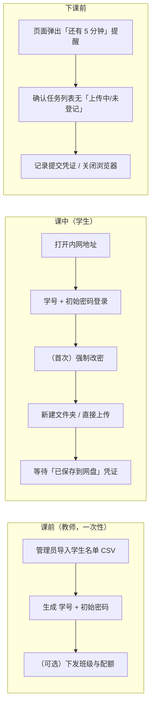
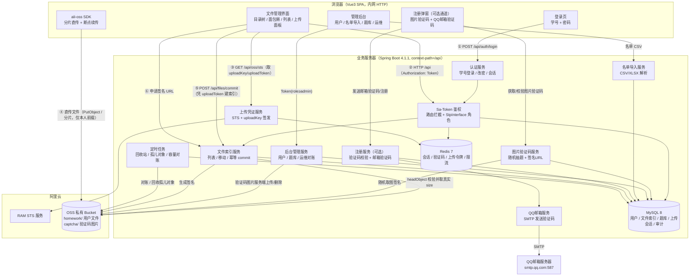
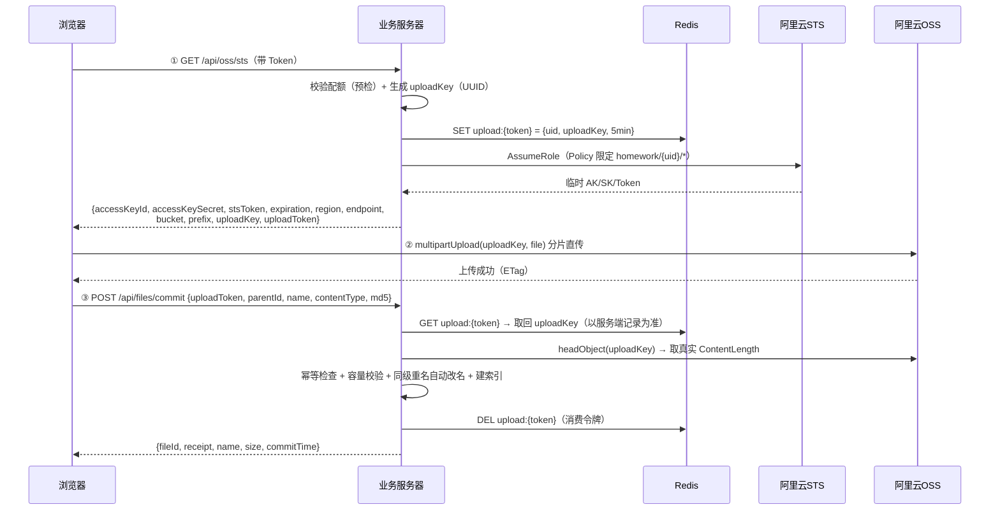
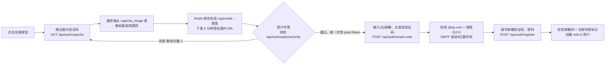
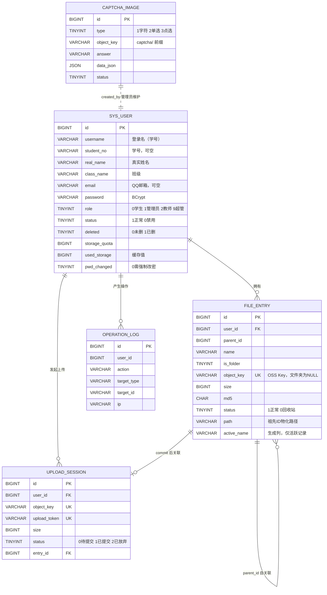
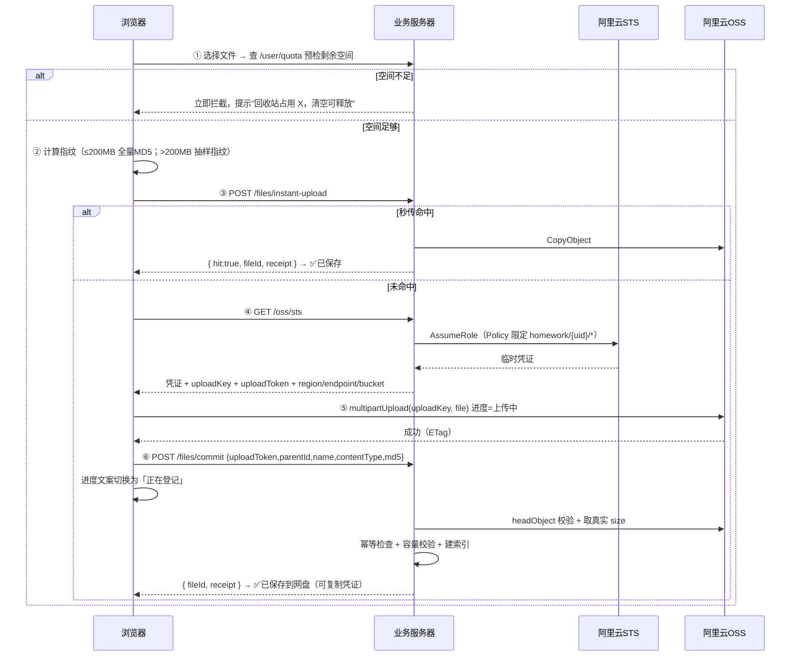

# 作业云盘 SHWorkCloud 开发文档（v2.0 机房场景版）

> 版本：v2.0
> 日期：2026-09-11
> 技术基线：**Spring Boot 4.1.1 + JDK 17 + Sa-Token 1.45.0 + MyBatis-Plus + MySQL 8 + Redis + 阿里云 OSS(STS 直传)**
> 关键词：机房场景、学号登录、名单批量导入、层级目录、多用户隔离、OSS 直传、Sa-Token 鉴权、幂等提交、QQ 邮箱注册（可选通道）、图片验证码、超级管理员后台
> 配套文档：`SHWorkCloud_项目评审报告.md`（v1.1 缺陷分析，本版据此修订）

---

## 目录

- [0. 文档说明](#0-文档说明)
  - [0.1 本版定位与适用范围](#01-本版定位与适用范围)
  - [0.2 变更记录](#02-变更记录)
  - [0.3 相对 v1.1 的关键修正](#03-相对-v11-的关键修正)
  - [0.4 约束与假设](#04-约束与假设)
  - [0.5 阅读约定](#05-阅读约定)
- [1. 项目概述](#1-项目概述)
  - [1.1 项目背景与场景分析](#11-项目背景与场景分析)
  - [1.2 典型使用流程](#12-典型使用流程)
  - [1.3 核心需求](#13-核心需求)
  - [1.4 非目标](#14-非目标)
  - [1.5 名词约定](#15-名词约定)
  - [1.6 角色与权限矩阵](#16-角色与权限矩阵)
- [2. 技术选型与总体架构](#2-技术选型与总体架构)
  - [2.1 技术栈](#21-技术栈)
  - [2.2 版本兼容矩阵](#22-版本兼容矩阵)
  - [2.3 总体架构图](#23-总体架构图)
  - [2.4 工程目录结构](#24-工程目录结构)
  - [2.5 配置分层与密钥管理](#25-配置分层与密钥管理)
- [3. 机房场景专项设计](#3-机房场景专项设计)
  - [3.1 场景约束](#31-场景约束)
  - [3.2 账号策略：学号登录为主，自助注册为辅](#32-账号策略学号登录为主自助注册为辅)
  - [3.3 学生名单批量导入](#33-学生名单批量导入)
  - [3.4 共享电脑的登录态隔离](#34-共享电脑的登录态隔离)
  - [3.5 同出口 IP 下的限流策略](#35-同出口-ip-下的限流策略)
  - [3.6 提交保障机制](#36-提交保障机制)
  - [3.7 弱网与大文件上传](#37-弱网与大文件上传)
  - [3.8 机房可用性检查清单](#38-机房可用性检查清单)
- [4. 核心设计](#4-核心设计)
  - [4.1 用户隔离模型](#41-用户隔离模型)
  - [4.2 层级目录模型](#42-层级目录模型)
  - [4.3 OSS 存储规划与生命周期](#43-oss-存储规划与生命周期)
  - [4.4 命名与路径安全](#44-命名与路径安全)
  - [4.5 认证与会话模型](#45-认证与会话模型)
  - [4.6 上传密钥签发与幂等提交](#46-上传密钥签发与幂等提交)
  - [4.7 容量配额模型](#47-容量配额模型)
  - [4.8 注册验证流程（可选通道）](#48-注册验证流程可选通道)
  - [4.9 验证码题库模型](#49-验证码题库模型)
- [5. 数据库设计](#5-数据库设计)
  - [5.1 ER 关系](#51-er-关系)
  - [5.2 建表 DDL](#52-建表-ddl)
  - [5.3 关键查询与索引说明](#53-关键查询与索引说明)
  - [5.4 同级唯一约束的解决方案](#54-同级唯一约束的解决方案)
  - [5.5 初始化数据](#55-初始化数据)
- [6. 后端开发](#6-后端开发)
  - [6.1 依赖清单（pom.xml）](#61-依赖清单pomxml)
  - [6.2 配置文件](#62-配置文件)
  - [6.3 Sa-Token 集成](#63-sa-token-集成)
  - [6.4 接口清单](#64-接口清单)
  - [6.5 关键代码](#65-关键代码)
  - [6.6 定时任务](#66-定时任务)
  - [6.7 统一返回与异常处理](#67-统一返回与异常处理)
- [7. 前端开发](#7-前端开发)
  - [7.1 路由与页面](#71-路由与页面)
  - [7.2 主工作区布局](#72-主工作区布局)
  - [7.3 上传流程](#73-上传流程)
  - [7.4 OSS 直传封装](#74-oss-直传封装)
  - [7.5 共享电脑的前端适配](#75-共享电脑的前端适配)
  - [7.6 注册弹窗（可选通道）](#76-注册弹窗可选通道)
  - [7.7 管理后台](#77-管理后台)
- [8. 权限与安全清单](#8-权限与安全清单)
- [9. 非功能性设计](#9-非功能性设计)
- [10. 测试与验收](#10-测试与验收)
- [11. 部署方案](#11-部署方案)
- [12. 开发计划](#12-开发计划)
- [13. 第二阶段规划：教师收作业闭环](#13-第二阶段规划教师收作业闭环)
- [14. 附录](#14-附录)

---

## 0. 文档说明

### 0.1 本版定位与适用范围

本文档是 SHWorkCloud 作业云盘的**唯一实现依据**（Single Source of Truth）。任何实现与本文档冲突时，以本文档为准；需要偏离时必须先修订本文档。

**适用范围**：中小学校 / 高校**学生机房**场景下的课堂文件保存与（阶段性）作业上交。目标用户是在机房共用还原卡电脑、使用内网地址访问、课时有限的师生。

**与 v1.1 的关系**：v1.1 面向"公网个人网盘"设计，其主线架构（OSS 直传 + 逻辑索引与物理存储解耦 + 物化路径）被完整保留；账号体系、机房适配、数据一致性约束、技术栈四个方面做了重写。逐条差异见 §0.3 与 §14.5。

### 0.2 变更记录

| 版本 | 日期 | 主要变更 | 修订人 |
|------|------|----------|--------|
| v1.0 | 2026-09-11 | 初版：网盘主线 + QQ 邮箱注册 + 图片验证码 + 超管后台 | — |
| v1.1 | 2026-09-11 | 补充图片验证码题库、后台用户管理 | — |
| **v2.0** | **2026-09-11** | **技术栈对齐工程现状（Boot 4.1.1 + Sa-Token）；新增机房场景专项设计（第 3 章）与提交保障；账号体系改为"学号登录为主 + 名单批量导入"；修复 3 处数据契约缺陷（同级唯一约束、commit 幂等、objectKey 签发）；补齐非功能、测试、验收章节** | 评审修订 |

### 0.3 相对 v1.1 的关键修正

只列**会改变实现**的项，完整勘误表见 §14.5。

| # | v1.1 的问题 | v2.0 的处理 | 章节 |
|---|-------------|-------------|------|
| 1 | 技术栈写 Boot 3.2 + JWT(JJWT)，工程实际是 Boot 4.1.1 + Sa-Token | 全文改为 Sa-Token 鉴权模型 | §2.1 §4.5 §6.3 |
| 2 | 仅 QQ 邮箱自助注册为唯一开户路径 | 改为**学号+密码为主**，自助注册为可开关的辅通道 | §3.2 §4.8 |
| 3 | `UNIQUE KEY (user_id,parent_id,name,status)` 在"删除→重传同名→再删除"时必现唯一键冲突 | 改用**虚拟生成列 + 唯一索引**，只约束活跃记录 | §5.4 |
| 4 | `file_entry` 无 `object_key` 唯一约束，`commit` 不幂等 → 重复计数、配额翻倍 | 加唯一索引 + `commit` 幂等返回 | §4.6 §6.5.4 |
| 5 | objectKey 由前端 `crypto.randomUUID()` 生成（内网 http 下 API 不存在，上传必崩） | 改为**服务端签发** `uploadKey/uploadToken`，size 以 OSS `headObject` 为准 | §4.6 §6.5.3 |
| 6 | 同级重名靠 `uk_sibling_name`，无回收站重命名方案 | 见 #3 | §5.4 |
| 7 | IP 级限流在机房同出口 IP 下会封杀全班 | 改为 `IP+账号` 组合，内网网段豁免，阈值放宽 | §3.5 |
| 8 | JWT 存 localStorage，共用电脑上会造成跨学生会话串号 | 改 `sessionStorage` + 空闲自动登出 + 退出彻底清理 | §3.4 §7.5 |
| 9 | `@RequireRole` 标在 Service 方法上，拦截器读不到 → 后台接口裸奔 | 改为 Sa-Token 路由拦截 + Controller 注解 | §6.3 |
| 10 | `refreshSTSToken` 返回 `securityToken`，ali-oss 需要 `stsToken` | 显式字段映射；region/endpoint 从接口下发 | §7.4 |
| 11 | "checkpoint 持久化，刷新页面可续传"与 ali-oss 实际行为不符 | 明确续传的真实边界 | §3.7 |
| 12 | `oss_url` 字段把 Bucket/Endpoint 固化进数据行 | 删除该字段，URL 运行时拼装 | §4.3 |
| 13 | 时区 UTC、`context-path: /api` 与文档路径冲突、`/marketplace` 残留 | 全链路北京时间；明确路径约定；清理残留 | §2.4 §6.2 |
| 14 | 无孤儿对象 / 未完成分片回收 | OSS 生命周期规则 + `upload_session` + 对账任务 | §4.3 §6.6 |
| 15 | 无备份、监控、容量成本、测试、验收 | 新增 §9 §10 | §9 §10 |
| 16 | 默认配额 10GB/人 | 机房场景默认 2GB，可调 | §9.1 |
| 17 | "作业云盘"无作业模型 | 第二阶段规划（表结构预留字段） | §13 |
| 18 | `email_verified` 恒为 1、无实际语义 | 删除该字段 | §5.2 |

### 0.4 约束与假设

本文档以下述前提成立；任一前提变化都会影响设计的适用性。

**环境前提**

1. 业务服务器与 MySQL、Redis 部署在校内网，**OSS 必须公网可达**（学生机器需能直连阿里云 OSS，机房需放行 `*.aliyuncs.com:443`）；
2. 学生机器通过**内网 IP + HTTP** 访问（如 `http://192.168.1.100:8081`），**没有 HTTPS 证书**——因此前端**禁止依赖任何仅在安全上下文可用的 Web API**（`crypto.randomUUID`、`crypto.subtle`、剪贴板 API 等）；
3. 学生机器装有**还原卡 / 冰点还原**，重启后本地文件与浏览器数据全部丢失；
4. 同一台机器在一个教学日内会被多个班级、多名学生**轮流使用**；
5. 全校或整个机房**共用一个公网出口 IP**；
6. 单节课有效操作时间按 **5~10 分钟**估算（其余时间用于听讲与操作练习）。

**业务前提**

7. 学生账号**以学校学籍名单为权威数据源**，由教师/管理员批量导入，而非学生自行注册；
8. QQ 邮箱注册为**可选辅通道**，仅在明确需要时开启（默认关闭）；
9. 学生之间的文件**完全隔离**；教师读取学生文件的能力属于第二阶段（§13）；
10. 单文件上限按 OSS 分片上限约束：`partSize × 10000`，即 5MB 分片时约 **48.8GB**（实际业务上限建议配为 2GB，见 §6.2 `app.upload.max-file-size`）。

**技术前提**

11. Bucket 为**私有**，不暴露任何永久公开 URL；
12. 服务端持有 RAM 子用户 AK/SK（仅用于签发 STS 与签名 URL），**永不返回给前端**；
13. 前端与后端通过 `/api` 前缀通信，Sa-Token Token 通过请求头 `Authorization` 传递。

### 0.5 阅读约定

| 约定 | 说明 |
|------|------|
| **对外路径** | 含 `server.servlet.context-path` 的完整 URL，即浏览器实际请求的路径 |
| **Controller 映射** | Spring `@RequestMapping` 中书写的内容，**不含 context-path** |
| 角色值 | 数据库 `sys_user.role` 的数字（权威）：`0` 学生 / `1` 管理员 / `2` 教师（机房管理员） / `9` 超级管理员 |
| 角色标识 | Sa-Token 中的字符串（派生）：`user` / `admin` / `teacher` / `super_admin` |
| 🔴 | 表示该处是 v1.1 的缺陷修正点，实现时不可回退 |
| ⚠️ | 表示易错点或限制条件 |

---

## 0.6 实现状态与已知差异

> 后端代码已按本文档实现，`mvn -o compile` 与 `mvn -o test`（163 个用例，1 个跳过）均通过。
> 下列偏差由**本机离线环境**（本地 Maven 仓库缺少部分 artifact）导致，已在代码注释中标注，
> 完整说明见 `README.md` §7。

| 项 | 文档写法 | 实际实现 | 原因与后续 |
|----|----------|----------|-----------|
| STS 调用 | `aliyun-java-sdk-sts` 的 `AssumeRoleRequest` | `aliyun-java-sdk-core` 的 `CommonRequest` 通用 RPC 调用 STS（`Sts/2015-04-01/AssumeRole`） | 本地无 `aliyun-java-sdk-sts`。补上依赖后可换回 `AssumeRoleRequest`，效果等价 |
| 会话存储 | `sa-token-redis-jackson` | Sa-Token 默认内存 DAO | 本地无该 artifact。**多实例部署前必须补上**，否则重启即全员掉线 |
| **排除 `sa-token-jackson`** | 未提及 | pom 里 `exclude` 掉 Sa-Token starter 传递来的 `sa-token-jackson`，并自建 `SaTokenJsonConfig` 注入**基于 Jackson 3** 的 `SaJsonTemplate` | 🔴 **真实故障**：Sa-Token 1.45 会扫描所有 jar 的 `META-INF/satoken/` 并立即 install 插件，`sa-token-jackson` 的 `install()` 引用 **Jackson 2** 的 `PolymorphicTypeValidator`；Boot 4 只有 **Jackson 3**（`tools.jackson`）→ `NoClassDefFoundError` → `SaBeanInject` 构造失败 → **应用启动即崩、systemd 无限重启**。Sa-Token 对插件异常是 fail-fast（不跳过坏插件），只能排除依赖。回归守卫见 `SaTokenStackTest` |
| 参数校验 | `spring-boot-starter-validation` 注解 | Service 层手写校验 + `PasswordValidator` | 本地无 hibernate-validator |
| 密码哈希 | Spring Security `BCryptPasswordEncoder` | Hutool `BCrypt`（同为 `$2a$10$` 格式，**互相兼容**，无需迁移） | 本地无 spring-security-crypto |
| 签名响应头 | `ResponseHeaderParameters` | `ResponseHeaderOverrides` | 🔴 文档原类名在 OSS SDK 3.17.4 中**不存在**，§6.5.7 已修正 |
| 名单导入配置键 | `app.import.*` | `app.student-import.*` | `import` 是 Java 保留字，无法作为配置字段名；本文档已同步 |
| ObjectKey 组成 | `.../{uuid32}.{ext}` | `.../{uuid32}`（不含扩展名） | 服务端签发时不信任前端提供的扩展名；显示名与后缀以 commit 的 `name` 为准 |
| 文件指纹字段名 | commit 请求里的 `fingerprint` | `md5` | 与数据库列名、秒传接口保持一致；本文档已同步 |
| **上传方式** | 浏览器持 STS 临时凭证 + ali-oss SDK 直传 | **服务端预签名 URL**：浏览器只拿 `uploadToken`，单次 PUT 或分片 PUT 都打到服务端签好的 URL | 🔴 内网 http 非安全上下文下 `crypto.subtle` 不可用，浏览器端无法自行签名；且本机离线装不上 ali-oss。预签名方案**浏览器完全接触不到 AK/SK**，安全面更小，字节流仍是浏览器→OSS 直达 |
| `uploadToken` 有效期 | 300 秒 | **7200 秒** | 500MB 在机房共享出口带宽下可能要十几分钟；凭证中途失效会让已上传的分片作废 |
| 自助注册 | 默认关闭（辅通道） | **默认开启**，且图片验证码改为可选 | 用户要求"能自行注册登录"；图片验证码依赖题库，强制要求会让全新部署无法注册 |
| 个性属性 | 仅 nickname / avatar | 增加 **signature / gender / birthday**，`PUT /user/profile` 改为**部分更新** | 不传的键不改动，避免"只改昵称把头像清空"的数据丢失 |
| 下载回本地 | 只有签名 URL | 增加 **`GET /files/{id}/download`** 服务端流式下载（支持 `Range`） | 调用方只连业务服务器即可下载，且可断点续传 |
| 前端 | 文档要求交付 Vue 前端 | **不交付前端**，仅提供 REST 接口 | 需求方只负责后端；前端章节降级为参考实现 |
| OSS `Content-Type` 签名 | 未说明 | `/oss/put-url` 与 `/oss/multipart/part-urls` 返回签名时用的 `contentType`，客户端必须原样发送 | OSS V1 签名把 Content-Type 计入待签字符串，不一致会 SignatureDoesNotMatch |
| **OSS 客户端强制 HTTPS** | 未说明 | `OssClientConfig` 用 `ClientBuilderConfiguration.setProtocol(Protocol.HTTPS)` 显式指定 https，并把 endpoint 的协议前缀与结尾斜杠规范化掉 | 🔴 **真实故障**：`aliyun-sdk-oss` 的 `ClientConfiguration` 默认 `Protocol.HTTP`，于是 `generatePresignedUrl` 签出来的直传地址是 `http://`；前端部署在 https 页面后，浏览器以**混合内容（Mixed Content）**为由直接拦掉 XHR，前端只报"网络错误，上传中断"、OSS 侧只看到失败请求，两头都像"网络问题"。同时服务端自身调 OSS 也会走明文。回归守卫：`OssClientHttpsTest` |
| **注册登录名字符集** | 未说明 | `AccountRules` 强制 `^[0-9A-Za-z]+$`、≤20 字符；非法输入<b>直接报错</b>，不再静默改写 | 原实现是 `replaceAll("[^A-Za-z0-9_]","")` 静默抹字符：填「张三」被抹成空串 → 退化成 `u12345`，用户以为注册成功却登不上（找不到账号）。同时把「仅数字与大小写字母」定为不变量：邮箱派生路径的清洗也去掉下划线，保证落库登录名一律满足该模式 |
| **后台代改用户资料** | 后台只有状态/配额/密码/角色/删除 | 新增 `PUT /admin/users/{id}`（仅超管），可改 `realName`/`studentNo`/`className`/`email`/`nickname`；**部分更新**语义；学号与邮箱做唯一性校验 | 名单导入只能建号不能改错别字；学号同时是登录名（`selectByLogin` 匹配 username 或 student_no），撞车会让人登到错误账号，必须唯一 |
| **验证码题库在线阅览** | 未说明 | 后台题库列表由裸实体改为 `AdminVo.CaptchaItemVo`，每项下发 **1 小时有效的签名 `imageUrl`**；前端 `el-image` + `preview-src-list` 点击放大 | 图片在私有 Bucket 且 `captcha/` 前缀不在用户 STS Policy 内，前端无法自拼可访问地址。原来只能看 `dataJson` 文本，等于**看不到题目图片**。单张签名失败只置 null，不让整页 500 |
| **docx / pptx 内嵌图片在线阅览** | R18 只说"提取正文" | 新增 `GET /files/{id}/embedded-images`：从 zip 的 `word/media/`（pptx 为 `ppt/media/`）取出位图，以 **data URL** 返回；前端在预览弹窗正文下方渲染图片画廊（点击可翻看放大） | 正文提取解析 `document.xml` 时会连标签带图片一起剥掉，**图文作业在"在线阅览"里只剩干巴巴几行字**。用 data URL 而非上传 OSS：预览是只读行为，不应产生新对象（否则又要配套对账清理）。只收 `FileViewType.isRasterImage` 白名单内的位图，emf/wmf 矢量图与 svg 计入 `skipped`；单张 2MB / 累计 8MB / 40 张三重上限 |
| **后台导航与弹性排版** | 未说明 | `AdminLayout` 的侧栏导航由 `<el-menu router>` 改为 `router-link`；侧栏在 ≤1024px 变顶部横向标签条；新增 `.sc-form-grid` / `.sc-field` / `.sc-toolbar` 等弹性工具类，去掉写死的 `width: 260px` / `max-width: 620px` / `:column="3"` | 🔴 `<el-menu router>` 内部要先取到 `globalProperties.$router` 且 `indexPath` 非空才跳转，否则**静默 return**（不跳转、不报错、`@select` 也不触发），表现正是"导航点了没反应"。`router-link` 是本项目顶栏已在用、确定可用的机制。原排版全为固定像素值，窄屏会横向溢出、按钮被挤出可视区 |
| **自定义头像** | 文档只有 `avatar` 文本字段（用户填 URL） | 改为**服务端上传到 OSS**（`avatar/{userId}/{uuid}.{ext}`），DB 只存 `avatar_key` | 需求：仅 JPG/PNG、≤5MB、存 OSS；换头像要能定位并删除旧对象，填 URL 做不到 |
| **删除即清 OSS** | 只有彻底删除才删 OSS | 新增 `app.recycle.enabled=false` 时「删除即彻底删除」；删除用户/头像/题目也同步删 OSS | 需求：保证 OSS 容器整洁 |
| **OSS 对账** | 无 | 新增 `OssReconcileService` + 每日任务，扫 `homework/`、`avatar/`、`captcha/` 三个前缀清理无引用对象（24 小时宽限） | 远程删除可能失败、进程可能被强杀，必须有兜底才谈得上"整洁" |
| **旧版 `.doc` 在线阅览** | 未提及（v1.1 隐含"二进制格式不支持"） | 引入 `poi` **核心包**，用 `POIFSFileSystem` 打开 OLE2 容器，再自写 FIB + piece table 解析取正文；`FileViewType` 把 `doc` 归入 `office` | `.doc` 是 OLE2 复合文档，没有 zip+xml 那种轻量解法。解析 `.doc` 的 HWPF 在 `poi-scratchpad` 里，本机离线取不到该 artifact；而容器层（CFB 的 FAT/MiniFAT/DIFAT 链）容易写错，交给 POI 核心包里的 `poifs` 最稳妥。旧版 `.ppt`（二进制）沿用 `none` |

**尚未实现**：教师收作业闭环（§13）、前端全部代码、监控告警接入、备份恢复演练、
60 并发压测，以及需要在 OSS 控制台手工配置的生命周期规则（§4.3）。

---
## 1. 项目概述

### 1.1 项目背景与场景分析

为师生提供一个类似 Windows 文件资源管理器的在线作业网盘：学生登录后可以在自己的空间内新建文件夹、上传/下载文件、按层级分类管理；教师可批量管理账号与名单。

文件实体存储在**阿里云 OSS**，业务服务器数据库只保存**对象 Key（ObjectKey）**与**文件在网盘中的层级索引**，从而实现：

- 大文件直传不占用业务服务器带宽；
- 网盘中的"目录位置"与 OSS 中的"物理位置"完全解耦，移动/重命名只改数据库，不搬运 OSS 对象；
- 各用户数据逻辑隔离，互不可见。

**机房场景的三个核心痛点**（这是 v2.0 相比 v1.1 的主要增量）：

| 痛点 | 现实表现 | v2.0 的对策 |
|------|----------|-------------|
| **时间紧** | 一节课留给"存文件"的时间只有几分钟，且下课强制关机 | 预置账号（名单导入）免注册；两步式提交反馈；提交凭证；下课倒计时提醒（§3.2 §3.6） |
| **机器共用** | 一台机器一天数十人轮流用，还原卡清空本地数据，忘记退出会导致下一位学生进入上一位的网盘 | `sessionStorage` + 空闲自动登出 + 退出彻底清理 + 常驻身份提示（§3.4） |
| **网络共享** | 全校共用一个公网出口 IP，IP 级限流会误伤全班；内网无 HTTPS，部分 Web API 不可用 | 限流改 `IP+账号` 维度并豁免内网网段；禁用安全上下文相关 API（§3.5 §3.8） |

### 1.2 典型使用流程



### 1.3 核心需求

| 编号 | 需求 | 说明 |
|------|------|------|
| R1 | 账号体系 | **用户可自行注册登录**（QQ 邮箱验证码，默认开启）；同时保留学号 + 初始密码的名单导入路径；首次登录强制改密 |
| R2 | 用户隔离 | 每个用户只能看到/操作自己的文件，服务端以登录态中的 userId 强制鉴权 |
| R3 | 层级目录 | 多级文件夹、面包屑导航、文件夹树，深度上限 20 层 |
| R4 | 文件管理 | 上传（含文件夹上传）、下载、预览、重命名、移动、复制（可选）、删除、回收站 |
| R5 | OSS 存储 | 文件通过 STS 临时凭证从浏览器**直传**阿里云 OSS；**objectKey 由服务端签发** |
| R6 | 索引落库 | 数据库保存 ObjectKey 与该文件在网盘中的目录索引；`commit` 幂等 |
| R7 | 增值能力 | 按类型筛选、搜索（前缀匹配）、容量统计、MD5 秒传 |
| R15 | **自定义头像** | 用户可上传/更换/清除头像：仅 **JPG/PNG**、**≤5MB**、存阿里云 OSS；换头像时服务端**删除 OSS 上的旧对象** |
| R17 | **图片管理** | 支持 jpg/jpeg/png/gif/webp/bmp 图片的识别、分类筛选与**相册视图**（跨目录摊平、按时间倒序、自带签名预览地址） |
| R18 | **文件在线阅览** | 图片/PDF/视频/音频**流式预览**（支持 `Range`，视频可拖进度条）；文本与 **doc/docx/pptx** **提取正文**在线阅读（`.doc` 走 OLE2 容器 + FIB/piece table，无需 `poi-scratchpad`）；`viewType` 由服务端下发，前端不必自维护白名单。旧版 `.ppt` 仍为 `none` |
| R16 | **OSS 整洁性** | 删除文件/用户/头像/题目时同步删除 OSS 对象；每日对账清理无引用对象，保证 Bucket 不堆积垃圾 |
| R8 | 上传可靠性 | 分片上传、断点续传（会话内）、失败分类提示、孤儿对象回收 |
| R9 | 提交保障 | 两阶段进度反馈、提交凭证、离开页面拦截、下课倒计时提醒 |
| R10 | 机房适配 | 同出口 IP 限流豁免、共用电脑登录态隔离、空闲自动登出、无安全上下文 API 依赖 |
| R11 | 回收站 | 软删除进回收站、还原、彻底删除（联动 OSS）；自动清理策略 |
| R12 | 角色与后台 | 学生 / 教师 / 管理员 / 超管四级；后台用户管理、名单导入、容量调整、密码重置、运维对账 |
| R13 | 可选：邮箱注册 | 仅 `@qq.com`；图片验证码 + 邮箱验证码双重校验；限频次、有有效期；默认关闭 |
| R14 | 可选：验证码题库 | 图片存 OSS `captcha/` 前缀，答案与标注数据存库；管理员可上传/编辑/启停/删除 |

### 1.4 非目标

以下内容**明确不在 v2.0 范围内**，请勿据此提需求：

| 非目标 | 原因 / 去向 |
|--------|-------------|
| 教师布置作业、批改、成绩、打包下载 | 第二阶段，见 §13（表结构已预留字段） |
| 文件在线编辑 / OnlyOffice 集成 | 超出范围 |
| 文件分享链接 / 公开提取码 | 学校场景无需求，且增加越权面 |
| 多端同步客户端（Windows/手机 App） | 超出范围，Web 足够 |
| 实时协作 / 评论 / 消息通知 | 超出范围 |
| 内容合规审核、病毒扫描 | 建议校内网 + 文件类型白名单缓解（§8），完整方案不在本期 |
| 跨用户秒传（同一份课件多人共用只存一份） | 涉及隐私与引用计数，列为 §9.6 优化项，本期在本人文件内匹配 |

### 1.5 名词约定

| 名词 | 含义 |
|------|------|
| 文件索引（file_entry） | 数据库中的一条记录，描述"某个文件/文件夹在谁的、哪个目录下、叫什么名字" |
| ObjectKey | OSS 对象的物理存储路径，如 `homework/1001/202609/a1b2c3.pdf` |
| 直传 | 浏览器拿到 STS 临时凭证后直接把文件 PUT/分片上传到 OSS，不经过业务服务器 |
| uploadKey | **服务端签发的** ObjectKey，前端必须使用它，不得自行生成 |
| uploadToken | **一次性**上传令牌（Redis，5 分钟），`commit` 时凭它取回 uploadKey 并消费 |
| 秒传 | 文件 MD5 已存在于**本人**文件时，服务端在 OSS 内 CopyObject 生成新对象，只建索引、不传字节 |
| commit | 直传完成后调用服务端建立索引的动作；是"文件真正进入网盘"的唯一标志 |
| 提交凭证 | commit 成功后返回的可读字符串（如 `20260911-143052-8f3a`），供学生/教师核对 |
| 图片验证码 | 注册防机刷手段；图片实体存 OSS `captcha/` 前缀，答案/坐标存 `captcha_image` 表 |
| 同级唯一 | 同一父目录下活跃文件不可重名，由生成列唯一索引保证 |
| 还原卡 / 冰点还原 | 机房机器重启后本地磁盘恢复初始状态的技术，会导致浏览器本地存储丢失 |
| 安全上下文 | 浏览器中 `https://` 或 `http://localhost` 才有 `window.crypto` 等 API 的环境；内网 http 站点**不属于**安全上下文 |
| 角色（role） | 用户角色：`0` 学生、`1` 管理员、`2` 教师（机房管理员）、`9` 超级管理员 |

### 1.6 角色与权限矩阵

| 能力 | 学生(0) | 教师(2) | 管理员(1) | 超管(9) |
|------|:-------:|:-------:|:---------:|:-------:|
| 管理自己的网盘文件 | ✅ | ✅ | ✅ | ✅ |
| 查看/修改个人信息 | ✅ | ✅ | ✅ | ✅ |
| 批量导入学生名单 | ❌ | ✅ | ✅ | ✅ |
| 查看学生列表（不含文件） | ❌ | ✅ | ✅ | ✅ |
| 重置学生密码 | ❌ | ✅ | ✅ | ✅ |
| 禁用/启用账号 | ❌ | ❌ | ✅ | ✅ |
| 调整容量配额 | ❌ | ❌ | ✅ | ✅ |
| 容量对账重算 | ❌ | ❌ | ✅ | ✅ |
| 验证码题库管理 | ❌ | ❌ | ✅ | ✅ |
| 任命/撤销管理员 | ❌ | ❌ | ❌ | ✅ |
| 删除账号 | ❌ | ❌ | ❌ | ✅ |
| 运维对账 / 会话清场 | ❌ | ❌ | ❌ | ✅ |
| 修改系统关键配置 | ❌ | ❌ | ❌ | ✅ |

规则：

1. **数字 role 是权威**，Sa-Token 角色标识由 `StpInterface` 派生（§6.3.1）；
2. 角色只从服务端会话解析，**不接受任何前端传参**；
3. 教师与管理员**只能操作数据库层面的用户信息，不得直接访问学生 OSS 前缀**；需要读取学生文件的能力属于第二阶段，且必须经由 §13 的作业关系授权，而不是靠角色；
4. 超级管理员账号由系统启动时初始化，**不可删除、不可禁用、不可降级**；首次登录强制改密。

---

## 2. 技术选型与总体架构

### 2.1 技术栈

| 层 | 技术 | 版本 | 说明 |
|----|------|------|------|
| 前端 | Vue 3 + Vite + TypeScript | Vue 3.4+ / Vite 5+ | 单页应用 |
| UI | Element Plus | 2.7+ | 文件列表、对话框、面包屑、上传进度 |
| 状态/路由 | Pinia + Vue Router + Axios | — | 登录态、路由守卫、请求拦截 |
| OSS 上传 | ali-oss（官方 JS SDK） | 6.x | STS 直传、分片上传、断点续传 |
| 哈希 | spark-md5 | 3.x | Web Worker 中计算文件指纹（用于秒传） |
| 后端 | Spring Boot | **4.1.1** | Spring Framework 7 |
| JDK | Java | 17（建议升 21） | Boot 4 基线为 17 |
| ORM | MyBatis-Plus | **3.5.16+**（`spring-boot4-starter`） | 🔴 必须用 boot4 坐标 |
| 数据库 | MySQL | 8.0（InnoDB / utf8mb4） | 用户表、文件索引表、题库表、上传会话、审计日志 |
| 缓存 | Redis | 7 | Sa-Token 会话、验证码、上传令牌、限流计数 |
| Redis 客户端 | **Jedis** | 随 Boot 4 管理 | 🔴 与 `application.yaml` 的连接池配置键必须一致 |
| 鉴权 | **Sa-Token** | **1.45.0+** | 🔴 替代 v1.1 的 JWT(JJWT) 方案 |
| 分页 | MyBatis-Plus `PaginationInnerInterceptor` | — | 已在 `MybatisPlusConfig` 注册 |
| 工具 | Hutool | 5.8.38 | JSON、日期、集合切分（**用 `ListUtil.split` 替代 Guava 的 `Lists.partition`**） |
| 邮件 | Spring Mail（JavaMail） | — | 经 QQ 邮箱 SMTP 发送验证码（辅通道用） |
| 对象存储 | 阿里云 OSS + RAM/STS | `aliyun-sdk-oss` 3.17.4 + `aliyun-java-sdk-sts` | 私有 Bucket + 临时凭证直传 |

> **如团队更熟悉 Python**：可等价替换为 FastAPI + SQLAlchemy，表结构、OSS Key 规则、接口契约保持不变；但 §6.3 的鉴权模型需换成对应的 Session 框架。

### 2.2 版本兼容矩阵

🔴 **这一节是 v1.1 最大的技术风险点，务必逐条核对。**

| 组件 | 选用版本 | 兼容性依据与注意事项 |
|------|----------|---------------------|
| Spring Boot | 4.1.1 | 基线 Spring Framework 7，Jakarta EE 11，**默认 Jackson 3（`tools.jackson`）** |
| JDK | 17（可用）；建议 21 | Boot 4 最低 17；21 LTS 可启用虚拟线程，对 IO 密集的上传/下载接口有收益 |
| MyBatis-Plus | **`mybatis-plus-spring-boot4-starter` 3.5.16** | MyBatis-Plus **3.5.13 起新增 spring-boot4 支持**，3.5.14 起由 BOM 统一管理该坐标，3.5.15 声明支持 Boot 4.0.0，**3.5.16 才把 `mybatis-spring` 升到 4.0.0**。使用 `spring-boot3-starter` 在 Boot 4 下属明确风险（典型症状为 `Invalid value type for attribute 'factoryBeanObjectType'`）。参考 [MyBatis-Plus 更新日志](https://baomidou.com/resources/changlog/) |
| Sa-Token | 1.45.0+ | 官方 **v1.45.0 发布说明即"适配 SpringBoot4"**。升级前用一次冒烟启动验证 |
| Jackson | Boot 4 自带 Jackson 3 | ⚠️ **不要**再手动引入 Jackson 2 的 `com.fasterxml.jackson.core:jackson-databind`，否则两套 JSON 库并存会导致 `LocalDateTime` 序列化格式不一致 |
| Redis 客户端 | Jedis | ⚠️ pom 中若排除了 `lettuce-core` 并引入 `jedis`，则 `application.yaml` 的连接池配置键**必须是** `spring.data.redis.jedis.pool.*`；写 `lettuce.pool.*` 会静默不生效 |
| Apache POI | `poi` 核心包 5.2.5（只此一个） | 只为 `.doc` 解析 OLE2 容器（`org.apache.poi.poifs`）。**不要**引入 `poi-scratchpad`（HWPF 在那个包里，本项目不用它），也不要引入 `poi-ooxml` —— docx/pptx 走自写的 zip+xml 提取器。离线环境下该核心包的传递依赖（commons-codec / log4j-api 等）由 Boot 父 pom 覆盖到已缓存版本 |
| 阿里云 SDK | `aliyun-sdk-oss` 3.17.4 + `aliyun-java-sdk-sts` | ⚠️ v1.1 的 `DefaultAcsClient`/`AssumeRoleRequest` 属于 **STS SDK**，只引 `aliyun-sdk-oss` 无法编译 |

### 2.3 总体架构图



### 2.4 工程目录结构

🔴 v1.1 的包名 `com.example.cloud` 与工程实际不符，本版统一为实际包名。同时把设计文档移出 `resources`（避免被打进 jar）。

```
SHWorkCloud/
├── docs/                                    # 🔴 设计文档移到这里（原 src/main/resources/standard/）
│   ├── SHWordCloud_Standard_v2.0.md         # 本文档
│   ├── SHWorkCloud_项目评审报告.md
│   └── SHWordCloud_Standard.md              # v1.1 存档
├── pom.xml
├── src/main/resources/
│   ├── application.yaml                     # 公共配置（无密钥）
│   ├── application-local.yaml.example       # 本地模板（真实文件进 .gitignore）
│   ├── application-prod.yaml                # 生产配置（全部 ${ENV}）
│   ├── init_sql/                            # 已有目录（当前为空），DB 初始化脚本放这里
│   │   ├── init.sql                         # 一键初始化：建库 + 建表 + 索引 + 自检
│   │   └── migration_v2.1.sql               # 增量迁移（老库升级用）
├── src/main/java/com/leaqutra/shworkcloud/
│   ├── ShWorkCloudApplication.java
│   ├── common/
│   │   ├── R.java                           # 统一返回
│   │   ├── ErrorCode.java                   # 错误码枚举（§14.1）
│   │   ├── BizException.java
│   │   └── GlobalExceptionHandler.java
│   ├── config/
│   │   ├── OssProperties.java               # 🔴 由 OSSConfig 扩展：region/keyPrefix/baseUrl/sts.*
│   │   ├── RedisConfig.java                 # 🔴 补序列化器配置（当前是空类）
│   │   ├── MybatisPlusConfig.java           # 已有
│   │   ├── SaTokenConfigure.java            # 🔴 路由拦截（删除 /marketplace）
│   │   ├── StpInterfaceImpl.java            # 🔴 新增：角色提供者
│   │   └── WebMvcConfig.java                # CORS / 参数解析器
│   ├── security/
│   │   └── LoginUser.java                   # 登录上下文（基于 StpUtil）
│   ├── controller/
│   │   ├── AuthController.java              # 映射 /auth/**（不含 /api）
│   │   ├── UserController.java              # 映射 /user/**
│   │   ├── FileController.java              # 映射 /files/**
│   │   ├── RecycleController.java           # 映射 /recycle/**
│   │   ├── OssController.java               # 映射 /oss/**
│   │   └── admin/
│   │       ├── AdminUserController.java     # 映射 /admin/users/**
│   │       ├── AdminImportController.java   # 映射 /admin/students/**
│   │       ├── AdminCaptchaController.java  # 映射 /admin/captchas/**
│   │       └── AdminOpsController.java      # 映射 /admin/ops/**
│   ├── service/
│   │   ├── AuthService.java
│   │   ├── StsService.java                  # STS + uploadKey/uploadToken 签发
│   │   ├── FileService.java                 # 列表/移动/重命名/幂等 commit
│   │   ├── QuotaService.java
│   │   ├── CaptchaService.java
│   │   ├── EmailCodeService.java
│   │   ├── StudentImportService.java
│   │   ├── AdminUserService.java
│   │   ├── AdminCaptchaService.java
│   │   └── job/
│   │       ├── RecycleCleanJob.java
│   │       ├── OrphanObjectJob.java
│   │       └── StorageReconcileJob.java
│   ├── mapper/
│   ├── entity/                              # SysUser / FileEntry / CaptchaImage / UploadSession / OperationLog
│   └── dto/
└── homework-web/                            # 前端（独立目录或独立仓库）
    ├── src/
    │   ├── api/                             # axios 封装（http.ts + 各模块 api）
    │   ├── stores/                          # pinia: user / uploader
    │   ├── router/
    │   ├── views/
    │   │   ├── LoginView.vue
    │   │   ├── FileManagerView.vue
    │   │   ├── ChangePasswordView.vue       # 🔴 新增：首登强制改密
    │   │   └── admin/
    │   │       ├── AdminLayout.vue
    │   │       ├── UserManageView.vue
    │   │       ├── StudentImportView.vue    # 🔴 新增
    │   │       └── CaptchaManageView.vue
    │   ├── components/
    │   │   ├── FileBreadcrumb.vue
    │   │   ├── FileTable.vue
    │   │   ├── FolderTree.vue
    │   │   ├── MoveDialog.vue
    │   │   ├── UploadPanel.vue
    │   │   ├── SessionBadge.vue             # 🔴 新增：常驻身份提示
    │   │   └── RegisterDialog.vue
    │   ├── utils/
    │   │   ├── uploader.ts                  # 预签名直传（单次 PUT + 分片 + 断点续传）
│   │   ├── md5.ts                       # 纯 TS MD5（内网 http 下无 crypto.subtle）
│   │   ├── format.ts                    # 容量/时间格式化
│   │   └── uuid.ts                      # 非安全上下文下的 UUID 兜底
│   ├── workers/md5.worker.ts            # 分块计算指纹，避免卡死主线程
│   ├── composables/useIdleLogout.ts     # 空闲自动登出（机房共用电脑）
    │   │   ├── uuid.ts                      # 🔴 非安全上下文下的 UUID 兜底
    │   │   └── md5.worker.ts                # 🔴 明确 Worker 文件位置
    │   └── types/
    └── vite.config.ts
```

### 2.5 配置分层与密钥管理

🔴 **v1.1 的工程实现把数据库密码、QQ 邮箱授权码、OSS AK/SK 明文写在 `application.yaml` 并已 `git add`。这是必须立即处理的安全事件（详见评审报告 P0-1）。本版强制按下述方式组织配置。**

**三层配置**

| 文件 | 是否入库 | 内容 |
|------|:--------:|------|
| `application.yaml` | ✅ | 无密钥的公共配置（端口、context-path、MyBatis-Plus、上传限额、Sa-Token 行为、频控阈值） |
| `application-local.yaml` | ❌ gitignore | 本地开发密钥（数据库密码、邮箱授权码、OSS AK/SK） |
| `application-prod.yaml` | ✅ | 生产配置，**全部值取自 `${ENV}` 环境变量** |
| `application-local.yaml.example` | ✅ | 模板，列出所有需要填写的键（值留空） |

`.gitignore` 追加：

```gitignore
# 本地密钥配置（禁止入库）
application-local.yaml
application-local.yml
application-local*.yaml
.env
.env.*
!.env.example
*.p12
*.jks
*.log
logs/
```

**密钥清单**

| 环境变量 | 用途 | 轮换周期 |
|----------|------|----------|
| `DB_PASSWORD` | MySQL 密码 | 90 天 |
| `REDIS_PASSWORD` | Redis 密码 | 90 天 |
| `STS_AK` / `STS_SK` | 服务端调用 STS / 签名的 RAM 子用户 AK/SK | 90 天 |
| `MAIL_USERNAME` / `MAIL_AUTH_CODE` | QQ 邮箱发件账号与授权码 | 授权码变更时 |
| `ADMIN_INIT_PASSWORD` | 超管初始密码（首登强制改密） | 每次重新初始化 |

**防泄漏卡口（必须做）**

1. `gitleaks` / `git-secrets` 加入 pre-commit 钩子与 CI，**不能只靠 `.gitignore`**；
2. CI 中加一步 `grep -rn "LTAI\|password:.*[^}]" src/main/resources/application.yaml` 之类的粗筛；
3. 提供 `application-local.yaml.example` 并在 README 中说明填写步骤。

> ⚠️ **已泄露的凭证必须轮换，不能只删文件**：只要执行过 `git add`，就应按"已泄露"处理——`.git/objects` 与 IDE 的 Local History 中仍有副本。

---

## 3. 机房场景专项设计

> 🔴 **本章是 v2.0 的核心增量。** v1.1 完全没有考虑机房场景，导致实现后会出现"全班无法注册""学生互相进入对方网盘""上传功能整体崩溃"等上线即暴露的问题。本章每一条都对应一个已在评审中确认的缺陷。

### 3.1 场景约束

| 约束 | 现实情况 | 设计影响 |
|------|----------|----------|
| **还原卡 / 冰点还原** | 机器重启后 C 盘复原，浏览器缓存、下载目录、桌面文件全部清空 | 任何"存到本地"的方案都无意义；依赖本地持久化的续传/缓存不可靠；**必须在下课前完成 commit** |
| **多人共用一台机器** | 一台机器一个教学日内被多个班级数十名学生轮流使用 | 登录态、上传断点、表单内容会跨用户残留 → §3.4 |
| **同出口 IP** | 全校/全机房共用一个公网 IP | 纯 IP 维度限流会误伤全班 → §3.5 |
| **课时短（40~45 分钟）** | 真正用于存文件的时间约 5~10 分钟 | 注册流程必须绕开；交互步骤要压缩到 3 步内 → §3.2 |
| **内网 HTTP 无证书** | `http://192.168.x.x:8081` | Web Crypto、剪贴板等 API 不可用 → §3.8 |
| **弱网 / 断网** | 机房交换机质量参差，大文件易中断 | 需要真实可用的重试与续传 + 失败原因分类 → §3.7 |
| **下课强制关机** | 时间到直接断电，无优雅退出 | 必须有服务端确认的提交凭证 → §3.6 |
| **学生可能没有 QQ 邮箱** | 部分学生不用 QQ 或用家长邮箱 | 强制 `@qq.com` 注册会把一部分学生挡在门外 → §3.2 |

### 3.2 账号策略：学号登录为主，自助注册为辅

**主路径（默认启用）：名单导入 + 学号登录**

```
管理员/教师导入 CSV 名单
        ↓
系统生成账号：username = 学号，初始密码 = 统一规则或随机
        ↓
学生用「学号 + 初始密码」登录 → 强制跳转改密页（pwd_changed = 0）
        ↓
改密完成 → 进入网盘
```

优点：**零注册成本**、账号与学籍一致（教师可按学号核对）、配额与班级可批量下发、完全绕开邮件与验证码，机房 45 分钟课时内不会成为瓶颈。

**统一初始密码规则（可配置）**，两种模式二选一：

| 模式 | 规则 | 适用 |
|------|------|------|
| 统一初始密码（推荐） | `app.student-import.default-password` 配置固定值（如 `Sh@2026`），首次登录强制改密 | 老师课上统一口述，最省时间 |
| 按学号派生 | 如 `学号后 6 位 + 固定后缀`，系统按规则生成 | 不想公开统一密码时 |

> ⚠️ 两种模式都必须配合 `pwd_changed=0` 强制改密，否则全班长期共用同一密码，任何人可登录他人账号。

**辅路径（默认关闭）：QQ 邮箱自助注册**

- 由 `app.register.enabled` 开关控制（**默认 `true`，即用户可自行注册**）；
- 仅在**公网访问**（非内网网段）或明确需要时开启，走 §4.8 的图片验证码 + 邮箱验证码流程；
- 关闭时 `POST /api/auth/register` 返回 `40122`（自助注册未开放），前端隐藏"注册"入口。

### 3.3 学生名单批量导入

**接口**：`POST /api/admin/students/import`（`multipart/form-data`，角色 ≥ 教师）

**模板列定义**（`GET /api/admin/students/import-template` 下载）：

```csv
学号,姓名,班级,初始密码,容量GB
20260001,张三,高一(3)班,,2
20260002,李四,高一(3)班,,2
```

| 列 | 必填 | 说明 |
|----|:----:|------|
| 学号 | ✅ | 唯一，作为登录名；已存在时按 `import.strategy` 处理 |
| 姓名 | ✅ | 存入 `real_name` |
| 班级 | ❌ | 存入 `class_name`；也可在页面上统一指定 |
| 初始密码 | ❌ | 留空则用统一规则生成 |
| 容量GB | ❌ | 留空则用 `app.quota.default-bytes` |

**导入策略** `app.student-import.strategy`：

| 值 | 行为 |
|----|------|
| `skip`（默认） | 学号已存在则跳过，返回跳过明细 |
| `update` | 更新姓名/班级/配额，**不动密码与既有文件** |
| `fail` | 遇重复即整批回滚 |

**处理要求**

1. **整批事务 + 逐行校验**：任一行校验失败则该行记入失败明细，默认不影响其他行（`strategy=fail` 时整批回滚）；
2. **编码兼容**：CSV 需兼容 Excel 导出的 **UTF-8 BOM** 与 **GBK**（校内旧系统常见 GBK），解析前探测编码；
3. **大小与行数限制**：≤ 5MB、≤ 2000 行（一节课导入全校名单不现实，按班导入）；
4. **幂等**：同一份名单重复导入不应产生重复账号（依赖 `skip` 与唯一索引）；
5. **返回结构**：`{ total, success, skipped, failed, failures: [{ row, studentNo, reason }] }`，前端以表格展示可下载的失败明细；
6. **审计**：导入操作写入 `operation_log`（操作人、文件名、行数、结果）。

**账号生命周期**

| 场景 | 处理 |
|------|------|
| 学生转班/改名 | `strategy=update` 重新导入，只更新 `real_name`/`class_name` |
| 学生毕业 | 管理员**逻辑删除**（`deleted=1`）并踢下线；文件保留 90 天后由任务清理，或管理员手动清理 |
| 批量重置密码 | `POST /api/admin/users/reset-password-batch`，重置后 `pwd_changed=0` 强制再改密 |
| 学生忘记密码 | 教师/管理员在后台重置（无需邮箱）；这是**没有邮箱时唯一的找回路径**，必须实现 |

### 3.4 共享电脑的登录态隔离

> 🔴 v1.1 要求把 Token 存 **localStorage**。机房一台机器一天被数十人使用，学生 A 忘记退出就下课关机，学生 B 打开页面会**直接进入 A 的网盘**——可浏览、下载、删除 A 的全部文件。这是必然发生的隐私事故。

**六项措施（全部必须实现）**

| # | 措施 | 实现要点 |
|---|------|----------|
| 1 | Token 存 **`sessionStorage`** 而非 `localStorage` | 关闭标签页即失效；同一标签页内刷新仍保持登录。Sa-Token 的 token 由前端在请求头 `Authorization` 携带，存储位置完全由前端决定 |
| 2 | **空闲自动登出** | Sa-Token `active-timeout: 1800`（30 分钟无操作自动失效）。同时前端用 `visibilitychange` + 空闲计时器在 **20 分钟**时弹出"即将自动退出，点此继续"，到期调用 `/auth/logout` 并跳登录页 |
| 3 | **退出登录彻底清理** | `POST /auth/logout`（Sa-Token `StpUtil.logout()`）+ 清 `sessionStorage`、`localStorage`、**IndexedDB 中的上传断点**、清 Pinia 状态、清 `File` 对象引用 |
| 4 | **常驻身份提示** | 顶栏固定显示 `头像 | 姓名 | 学号`，字重加粗，让学生一眼看到"现在是谁登录着"（`SessionBadge.vue`） |
| 5 | **上传断点按 userId 分区** | IndexedDB/localStorage 的 key 形如 `upload:ckpt:{userId}:{fileKey}`；进入网盘时**主动清理其他 userId 的断点记录**，避免下一个学生看到上一个学生的续传任务 |
| 6 | **机房一键清场（可选）** | 超管/管理员可调用 `POST /api/admin/ops/sessions/flush`，按 `last_login_ip` 网段批量踢出指定机房的所有会话，用于下课后收尾 |

**登录页额外要求**

- 登录页**不预填**上一次的学号（避免 `autocomplete` 残留让他人猜到）；
- 密码框 `autocomplete="new-password"`，并在登录成功后 `form.reset()`；
- 登录页显眼位置提示"**公用电脑请在下课前点击右上角「退出」**"。

### 3.5 同出口 IP 下的限流策略

> 🔴 v1.1 用 `reg:limit:ip:{ip}` 计数，1 小时上限 20 次。机房全班共用一个出口 IP，**第 21 个学生开始全班无法注册**，且越重试越糟。这是功能性阻断。

**限流维度对照表**

| 场景 | v1.1（错误） | v2.0（正确） |
|------|--------------|--------------|
| 发送邮箱验证码 | `ip:{ip}` 1 小时 20 次 | `ip:{ip}:{email}` 组合 + 内网豁免；纯 IP 阈值放宽到 200/小时 |
| 获取图片验证码 | 未提及 | `ip:{ip}` 300/小时；内网豁免 |
| 登录失败 | §8 只写"Redis 计数" | `login:{username}` 5 次锁 10 分钟；`ip:{ip}` 100/小时（内网豁免）；**锁定维度以账号为主** |
| 文件上传凭证签发 | 未提及 | `uid:{userId}` 120/小时 |
| 通用 API | 无 | `uid:{userId}` 令牌桶（如 20 QPS 突发 40） |

**内网网段豁免实现**

```java
// app.security.internal-networks 配置，如 10.0.0.0/8,172.16.0.0/12,192.168.0.0/16
public boolean isInternal(String ip) {
    return internalCidrs.stream().anyMatch(cidr -> cidr.contains(ip));
}

private void checkRateLimit(String email, String ip, String scene) {
    // 1) 内网访问：仅保留"同一账号"维度的最小频控，避免误伤全班
    if (isInternal(ip)) {
        if (Boolean.TRUE.equals(redis.hasKey("rl:" + scene + ":60s:" + email))) {
            throw new BizException(ErrorCode.SEND_TOO_FREQUENT);
        }
        redis.opsForValue().set("rl:" + scene + ":60s:" + email, "1", Duration.ofSeconds(60));
        return;                       // 不做 IP 维度计数
    }
    // 2) 公网访问：账号 + IP 双向计数
    long byEmail = incrWithTtl("rl:" + scene + ":1h:" + email, Duration.ofHours(1));
    long byPair  = incrWithTtl("rl:" + scene + ":1h:" + ip + ":" + email, Duration.ofHours(1));
    if (byEmail > 5 || byPair > 3) throw new BizException(ErrorCode.SEND_LIMIT_EXCEEDED);
}
```

> ⚠️ **取真实客户端 IP 时必须防伪造**：只有在**可信反向代理（Nginx）**之后才读 `X-Forwarded-For`，且取**第一跳**；直连部署时使用 `request.getRemoteAddr()`。若不加限制地信任 `X-Forwarded-For`，攻击者可通过伪造该头**绕过全部限流**。Nginx 侧必须用 `proxy_set_header X-Forwarded-For $proxy_add_x_forwarded_for;` 并**覆盖**而非追加客户端传值。

### 3.6 提交保障机制

> 🔴 v1.1 的流程在"进度条到 100%"就结束了。但 **OSS 上传完成 ≠ 服务端建索引完成**（`commit` 是独立请求）。下课直接关机的学生以为存上了，回宿舍发现文件没了，且 OSS 上留下孤儿对象（§4.3）。

**五项措施**

| # | 措施 | 说明 |
|---|------|------|
| 1 | **两阶段进度** | 进度条区分 `上传中 x%`（OSS 直传）与 `正在登记`（commit 请求中）。只有拿到 `fileId` 才显示 ✅ **已保存到网盘** |
| 2 | **提交凭证** | `commit` 成功返回 `receipt`（如 `20260911-143052-8f3a`）。前端在完成列表展示可复制的凭证，教师可按凭证核对 |
| 3 | **离开页面拦截** | 存在"上传中"或"已上传未登记"任务时，`beforeunload` 弹出确认；同理，路由切换时拦截 |
| 4 | **下课倒计时提醒** | 前端可配置"下课时间"（或读取 `/api/user/profile` 下的课程时段），在剩余 5 分钟时弹窗："还有 5 分钟，请确认文件已保存"；若存在未完成任务，提醒文字改为醒目的红色警示 |
| 5 | **失败原因分类** | 禁止只弹"上传失败"。必须区分：网络中断（可续传，提供"继续"按钮）/ 配额不足（提供"清理回收站"入口）/ 登录过期（跳登录并**暂存待上传队列**）/ OSS 拒绝（提示联系管理员） |

**提交失败的三条兜底路径**

1. `commit` 网络失败 → 前端自动重试 3 次（指数退避），仍失败则把 `{uploadToken, parentId, name, size, contentType, md5}` **暂存到 `sessionStorage`**，页面刷新后自动重试；
2. `uploadToken` 已过期（>5 分钟）→ 提示"凭证已过期，需重新上传"，同时由后端清理该 orphan 对象（§6.6）；
3. 断网无法恢复 → 提示学生**记录提交凭证或选择"导出待上传清单"**，并明确告知"文件尚未保存成功"。

> ⚠️ 兜底不能依赖本地持久化：还原卡机器重启后 `sessionStorage` 也没了。**唯一可靠的保障是让学生在下课前看到 ✅ 已保存到网盘。**

### 3.7 弱网与大文件上传

**分片与并发策略**

| 参数 | 建议值 | 说明 |
|------|--------|------|
| `partSize` | 5MB（<500MB 文件）；10MB（≥500MB） | OSS 最多 10000 片；5MB 分片上限约 48.8GB |
| `parallel` | **2** | ⚠️ 机房交换机共享带宽，并发过高会让全班一起变慢。**不要用默认的 3+**，且单机同时上传任务数限制为 **2** |
| `timeout` | 60s | 弱网下放长，避免误判失败 |
| `retryMax` | 3 | 单分片自动重试 3 次 |
| 单文件上限 | 2GB（`app.upload.max-file-size`） | 超过直接前端拦截，避免占用全班带宽 |

**断点续传的真实边界**（🔴 v1.1 描述有误）

> **支持**：同一浏览器会话（页面未刷新）内暂停 / 继续 / 失败重试续传。
>
> **部分支持**：页面刷新后，用户**重新选择同一文件**，前端按 `(name, size, lastModified)` 匹配已存的断点记录，调用 `client.resumeMultipartUpload(name, uploadId)` 继续。
>
> **不支持**：刷新后"无需重选文件自动续传"。ali-oss 的 `Checkpoint` 内含 `File` 引用，无法完整序列化进 `localStorage`，**必须由用户重新选择文件才能重建续传上下文**。

**秒传的指纹策略**（🔴 优化项）

| 文件大小 | 指纹算法 | 理由 |
|----------|----------|------|
| ≤ 200MB | 全量 MD5（Web Worker 中计算） | 准确，秒传可靠 |
| > 200MB | 抽样指纹：`MD5(前1MB + 后1MB + size + name)` | 机房电脑性能弱，对 1GB 视频算全量 MD5 可能耗时数十秒，秒传的收益抵不过等待成本 |
| > 2GB | 跳过秒传，直接分片上传（且被单文件上限拦截） | — |

> ⚠️ 抽样指纹会降低秒传命中的准确性（极小概率误判）。折中做法：抽样指纹**只用于预判**，命中后服务端在 `CopyObject` 前后用 `ETag`（OSS 对分片上传的 ETag 不是纯 MD5，需注意）或再次 `headObject` 校对 `Content-Length`，不一致则以真实上传为准。

### 3.8 机房可用性检查清单

**上线前必须在真实机房环境逐条验证**（本地 `localhost` 开发**测不出**前四项）：

- [ ] 在 `http://192.168.x.x:8081` 下完成一次完整上传（验证不依赖 `crypto.randomUUID`/`crypto.subtle`）
- [ ] 在无 HTTPS 的页面确认登录、上传、下载、预览全部可用
- [ ] 还原卡机器重启后，页面不残留任何登录态与上传断点
- [ ] 学生 A 登录 → 关闭浏览器 → 重新打开 → **不会**自动进入 A 的会话
- [ ] 40 名学生（同出口 IP）在 5 分钟内全部登录成功，无一被限流误伤
- [ ] 上传 500MB 文件过程中拔网线 10 秒，恢复后能续传或给出明确的"可续传"提示
- [ ] 上传 8GB 文件（超出单文件上限）被前端**立即**拦截并给出明确提示
- [ ] 上传过程中强制关机，重启后 24 小时内该孤儿对象被运维任务回收
- [ ] Chrome / Edge 各测一遍；确认不支持 IE/360 兼容模式时给出友好提示页
- [ ] 项目已加入**禁用 API 检查**：全仓搜索 `crypto.randomUUID`、`crypto.subtle`、`navigator.clipboard`、`Notification`，确认无未兜底调用

---

## 4. 核心设计

### 4.1 用户隔离模型

1. **OSS 物理隔离**：每个用户的 ObjectKey 统一以 `homework/{userId}/` 为前缀，STS 下发时通过 Policy 把该用户的可写范围**限制在自己的前缀内**；
2. **数据库逻辑隔离**：`file_entry` 每行都带 `user_id`；所有查询/更新/删除 SQL 都必须携带 `WHERE user_id = ?`；
3. **服务端强制**：userId 只从 Sa-Token 会话解析（`StpUtil.getLoginIdAsLong()`），**绝不接收前端传入的 userId**；管理后台接口与用户自助接口分开鉴权；
4. **下载鉴权**：私有 Bucket 不暴露永久公开链接，每次下载由服务端校验归属后生成 10 分钟有效的签名 URL；
5. **教师/管理员不越权**：后台接口只操作数据库层面的用户信息，**不提供"浏览任意学生文件"的能力**；第二阶段教师读取作业的授权来源是作业关系（§13），不是角色。

### 4.2 层级目录模型：逻辑索引与物理存储解耦

- **文件夹只存在于数据库索引中**，OSS 里不创建空目录对象；
- **文件在 OSS 中是扁平的 ObjectKey**（按用户 + 月份 + UUID 组织），与网盘里看到的目录层级无关；
- 用户在网盘里移动、重命名文件时，**只 UPDATE 数据库索引**，OSS 对象不动；
- 层级关系以 `parent_id`（邻接表）为**权威**，同时冗余 `path` 物化路径加速子树查询。

```
网盘里用户看到的逻辑结构（file_entry 表）：
我的网盘/
├── 数学/
│   └── 第一章作业.docx
└── 英语/
    └── listening.mp3

OSS 里的实际物理结构（扁平 Key）：
homework/1001/202609/8f3a....docx
homework/1001/202609/c21d....mp3
```

**`path` 字段的约定（🔴 v1.1 未说明，本版明确）**

| 项 | 约定 |
|----|------|
| 格式 | 祖先 ID 物化路径，如 `/12/35/`，**只含 ID 不含名称**（改名不影响 path，这是选择 ID 路径而非名称路径的原因） |
| 根目录 | `'/'` |
| 权威性 | `parent_id` 是权威；`path` 是**可用 `parent_id` 重算的冗余字段**，只作查询加速 |
| 一致性 | 增删文件夹与移动文件夹时，`parent_id` 与子树 `path` 的更新**必须在同一事务内**完成 |
| 深度上限 | 20 层，**服务端强制校验**（新建与移动时都要校验，不能只靠前端） |
| 索引限制 | ⚠️ `path` 为 `VARCHAR(1000)`，索引只能取前缀 `path(191)`。深度 ≤ 20 层时 `'/' + 20×(最长 20 位 ID + '/')` ≈ 420 字符，**前缀索引足够覆盖子树查询**；这正是"深度上限必须服务端强制"的另一个理由 |
| 重算入口 | 提供 `POST /api/admin/ops/rebuild-paths`（超管），按 `parent_id` 递归重算全表 `path`，用于修复漂移 |

### 4.3 OSS 存储规划与生命周期

**Bucket 规划**

| 项 | 值 | 说明 |
|----|----|------|
| Bucket | 由配置项 `aliyun.oss.bucket-name` 指定 | ⚠️ **不要硬编码**；工程当前为 `sakura-4826`，华北 2 |
| 读写权限 | **私有** | 不暴露任何永久公开 URL |
| 存储类型 | 标准存储 | 作业需频繁访问，不用低频 |
| 冗余 | 同城冗余（ZRS） | 成本略高，可靠性更好 |

**ObjectKey 前缀规划**

| 用途 | 前缀规则 | 写入方 | STS 权限 |
|------|----------|--------|----------|
| 用户文件 | `homework/{userId}/{yyyyMM}/{uuid32}.{ext}` | 浏览器直传 | ✅ 仅本人前缀 |
| 自定义头像 | `avatar/{userId}/{uuid32}.{jpg\|png}` | 仅服务端 AK/SK | ❌ 完全不对用户开放 |
| 验证码图片 | `captcha/{yyyyMM}/{uuid32}.{ext}` | 仅服务端 AK/SK | ❌ 完全不对用户开放 |
| 第二阶段：作业收件箱 | `inbox/{courseId}/{studentNo}/{uuid32}.{ext}` | 浏览器直传 | 按课堂令牌动态授权（§13） |

示例：

```
# 用户文件
homework/1001/202609/9b2f7c1a4e6d4f8a9023bcde5678ff01.pdf
homework/1002/202609/a1d2e3f4c5b6a7d8e9f0a1b2c3d4e5f6/homework.png
# 验证码图片
captcha/202609/7c31e0aa5bd24f9b8e1f6a2d4c0b9e22.jpg
```

**关键约定**

1. 同名文件不依赖 OSS Key 区分，统一用 UUID；网盘显示名保存在数据库 `name` 字段；
2. **ObjectKey 由服务端签发**（§4.6），前端不得自行生成；
3. 秒传复制出的对象使用**新的 UUID Key**，与源对象互不影响（代价是 OSS 实际占用翻倍，配额按逻辑文件累计，属预期行为）；
4. `captcha/` 前缀**不向普通用户的 STS Policy 开放任何权限**；
5. 🔴 **不存 `oss_url` 字段**：私有 Bucket 的规范 URL 访问必然 403，且会把 Bucket/Endpoint 固化进数据行，将来换域名需全表刷新。URL 一律由 `object_key` + 配置在运行时拼装。

**OSS 生命周期规则（⚠️ 必须配置，这是 v1.1 完全遗漏的隐性成本来源）**

| 规则 | 配置 | 作用 |
|------|------|------|
| 未完成分片清理 | `AbortIncompleteMultipartUpload: DaysAfterInitiation = 3` | 机房断电/强制关机会留下未完成分片，OSS **持续收费**且不出现在对象列表中。3 天自动中止 |
| 回收站对象转低频 | 前缀 `homework/`，无（可选） | 回收站保留期内访问少，可视情况转低频存储 |
| 孤儿对象兜底过期 | 前缀 `homework/tmp/`（若引入临时区）7 天过期 | 兜底清理 |
| 版本控制 | **建议开启** | 对"学生误删/误覆盖"场景价值极高（可恢复）；代价是存储成本上升，可按业务权衡 |

**孤儿对象与回收站清理**

| 场景 | 成因 | 处理 |
|------|------|------|
| 孤儿对象 | 直传成功后 `commit` 失败（关浏览器/断网/下课关机） | `upload_session` 记录 + 每日对账任务（§6.6）超过 24 小时无索引 → 删对象 |
| 未完成分片 | 分片上传中断未 `AbortMultipartUpload` | OSS 生命周期规则（3 天） |
| 回收站过期 | 软删除后超过保留期 | 定时任务扫描 `status=0 且 delete_time < now-30d` → 删 OSS 对象 + 删索引 + 返还容量 |

### 4.4 命名与路径安全

- 文件名长度 ≤ 255（**按字符计数，与数据库 `VARCHAR(255)` 的语义一致**）；
- 过滤 `< > : " / \ | ? *` 及 ASCII 控制字符（`\x00-\x1F`）；去除首尾空格与结尾的点（Windows 语义）；
- 保留名拦截（Windows 兼容）：`CON PRN AUX NUL COM1-9 LPT1-9`；
- 同一父目录下活跃文件禁止重名（由生成列唯一索引保证，§5.4），重名上传自动追加 `(1)`、`(2)`…；
- 文件夹层级深度 ≤ 20 层（服务端强制）；
- 服务端对所有传入的 `parentId` 校验：**必须存在、属于当前用户、是文件夹、`status=1`**；
- 移动时校验目标不是自身、不是自身子孙（`path` 前缀判断），且移动后深度不超限；
- **OS 保留前缀**：网盘根目录下保留 `我的作业`（第二阶段用）等系统目录名，用户不可创建同名文件夹（可配置）。

### 4.5 认证与会话模型

🔴 **v1.1 用 JWT(JJWT) + `ThreadLocal` 的 `UserContext`；v2.0 统一用 Sa-Token。**

**模型**

```
登录 → StpUtil.login(userId) → 生成 token 返回前端
     → 前端每次请求携带 Authorization: <token>
     → Sa-Token 拦截器校验 → StpUtil.getLoginIdAsLong() 即为 userId
     → 需要角色的接口 → StpInterfaceImpl 从数据库取 role 并映射为角色标识
```

**关键配置语义**

| 配置 | 值 | 说明 |
|------|----|------|
| `token-name` | `Authorization` | 前端请求头字段名 |
| `timeout` | `14400`（4 小时） | 🔴 从 30 天缩短。机房共用电脑，长效 token 风险过高 |
| `active-timeout` | `1800`（30 分钟无操作失效） | 🔴 机房必需，配合前端 20 分钟提醒 |
| `is-concurrent` | `true` | 同一账号允许多端登录（学生可能同时用机房与宿舍设备） |
| `is-share` | `false` | 每次登录生成新 token，便于审计与单独踢出 |
| `token-style` | `uuid` | 不携带业务信息，避免解析泄露 |
| `is-log` | 生产 `false` | 生产环境不打印 token 相关日志 |

**账号状态与即时失效（🔴 v1.1 缺失）**

| 事件 | 处理 |
|------|------|
| 管理员禁用账号 | `sys_user.status=0` + `StpUtil.kickout(userId)` 踢下线 + `StpUtil.disable(userId, -1)` 封禁 |
| 管理员重置密码 | `pwd_changed=0` + `StpUtil.kickout(userId)`（强制重新登录并改密） |
| 逻辑删除账号 | `deleted=1` + `StpUtil.kickout(userId)` |
| 请求拦截时的二次校验 | 拦截器中对已登录请求做一次**账号状态检查**（Redis 缓存 60 秒，避免每请求查库），`status != 1 || deleted = 1` 则 `StpUtil.logout()` 并返回 `40117` |
| 教师改班级/改名 | 不影响会话，但缓存需失效 |

> ⚠️ **为什么必须做状态检查**：Sa-Token 的 token 一旦签发，在 `timeout` 内默认有效。仅靠"禁用时踢一次"无法覆盖"踢出后学生又重新登录"的情况——`StpUtil.disable` 能拦住重新登录，二者需配合使用。

**登录接口的失败处理**

| 情况 | 行为 |
|------|------|
| 账号或密码错误 | 返回 `40116`，**不区分**"账号不存在"与"密码错误"（避免账号枚举）；`login_fail_count + 1` |
| 连续失败 5 次 | `locked_until = now + 10min`，返回 `40118`；锁定期内即使密码正确也拒绝 |
| 登录成功 | `login_fail_count = 0`，`locked_until = NULL`，更新 `last_login_time`/`last_login_ip` |
| 账号被禁用 | 返回 `40117`，不泄露"密码是否正确" |
| `pwd_changed = 0` | 登录**成功**但响应体标记 `mustChangePassword: true`，前端强制跳改密页；改密接口以外的业务接口由服务端拦截（返回 `40119`） |

### 4.6 上传密钥签发与幂等提交

> 🔴 **这是 v1.1 最需要修正的数据契约。** v1.1 让前端用 `crypto.randomUUID()` 拼 ObjectKey（内网 http 下该 API 不存在，上传必崩），且服务端信任前端传来的 `size`，`commit` 也没有幂等检查（重复提交会重复计费）。

**完整时序**



**服务端签发流程（`GET /api/oss/sts`）**

```
1. userId = StpUtil.getLoginIdAsLong()
2. 配额预检：free = quota - used；free < app.upload.min-free-bytes → 返回 40010
3. uploadKey = "homework/{userId}/{yyyyMM}/{uuid32}"     ← 服务端生成
4. uploadToken = uuid32
5. Redis SET upload:{uploadToken} = JSON{userId, uploadKey, createTime} EX 300
6. 也写入 upload_session 表（用于孤儿对账，status=PENDING）
7. AssumeRole，Policy 收窄到 acs:oss:*:*:{bucket}/{prefix}/{userId}/*
8. 返回凭证 + uploadKey + uploadToken（⚠️ 绝不返回任何服务端 AK/SK）
```

**`commit` 的七步校验（顺序不可调整）**

| 步 | 校验 | 失败错误码 |
|----|------|-----------|
| 1 | `uploadToken` 存在且属于当前用户 | `40061` |
| 2 | 取出服务端记录的 `uploadKey` —— **忽略任何前端传入的 objectKey** | `40061` |
| 3 | `uploadKey` 前缀必须等于 `homework/{userId}/` | `40060` |
| 4 | `headObject(uploadKey)` 确认对象真实存在 | `40050` |
| 5 | **以 `headObject` 返回的 `Content-Length` 作为权威 `size`**，不信任前端 | — |
| 6 | **幂等**：`upload_session` 若已是 `COMMITTED`，直接返回已建索引的 `fileId` | — |
| 7 | 容量校验（`SELECT ... FOR UPDATE` 行锁）+ 同级重名解析 | `40010` / `40020` |

**幂等的两层保障**

1. **`upload_session` 状态机**：`PENDING → COMMITTED`，`commit` 前检查状态，已 `COMMITTED` 直接返回 `fileId`；
2. **数据库唯一索引**：`file_entry.object_key` 唯一，即使并发重复提交也只会成功一条，另一条捕获 `DuplicateKeyException` 后转为"返回已有 id"。

**秒传（`POST /api/files/instant-upload`，语义与 v1.1 的 `instant-check` 不同）**

| 项 | 约定 |
|----|------|
| 语义 | 尝试秒传；**成功即在服务端完成 CopyObject 并建索引**，直接返回新 `fileId` |
| 匹配范围 | **仅当前用户自己的文件**（`WHERE user_id=? AND md5=? AND size=? AND status=1`），保护隐私 |
| 响应 | `{ hit: true, fileId, receipt }` 或 `{ hit: false }` |
| 一致性 | CopyObject 前先在 `upload_session` 落 `PENDING` 记录，commit 失败可由对账任务回收（避免产生孤儿对象） |
| 前端 | 按 `hit` 判断；命中后**必须刷新容量显示**（v1.1 遗漏） |
| 配额 | 秒传同样消耗配额（逻辑文件计数），需做容量校验 |

### 4.7 容量配额模型

| 项 | 约定 |
|----|------|
| 默认配额 | **2GB/人**（🔴 v1.1 是 10GB，机房场景明显过大，见 §9.1 成本测算） |
| `used_storage` 定位 | **缓存值**，权威值是 `SELECT SUM(size) FROM file_entry WHERE user_id=? AND status=1` |
| 计入容量的对象 | 活跃文件（`status=1`）+ **回收站文件（`status=0`）** ← ⚠️ 回收站仍占容量，UI 必须提示 |
| 不计入 | 文件夹（size=0）、已物理删除 |
| 预检接口 | `GET /api/user/quota` → `{quota, used, free, recycleUsed}` |
| 预检时机 | ① 前端选择文件后立即校验；② `GET /api/oss/sts` 时服务端再校验；③ `commit` 时最终校验（**保留，这是安全边界**） |
| 并发安全 | `commit` 内用 `SELECT ... FOR UPDATE` 锁用户行，串行化同一用户的并发提交 |
| 对账 | 每日 `StorageReconcileJob` 重算 `used_storage`，偏差 > 1MB 时修正并告警；提供 `POST /api/admin/users/{id}/recalc-storage` 手动触发 |

### 4.8 注册验证流程（可选通道）

> **默认启用**（`app.register.enabled = true`）。图片验证码是否需要由
> `app.register.require-image-captcha` 决定，**默认 `false`** ——
> 图片验证码依赖管理员先维护题库，若强制要求会让「全新部署 + 题库为空」时注册全部失败。

整体为"**图片验证 → 发送邮件码 → 提交注册**"三步，任何一步失败都中断：



**关键约束**

1. **仅 QQ 邮箱**：正则 `^\d{5,11}@qq\.com$`；如需 foxmail 别名，在配置 `app.register.email-pattern` 中放开；
2. 图片验证码答案只存 Redis 会话（`cap:session:{captchaId}`），服务端比对；签名 URL 5 分钟过期；**单题最多错 3 次即作废重新出题**；
3. 图片验证通过后签发**一次性、5 分钟有效**的 `captchaPassToken`（Redis `cap:pass:{token}`）；
4. `POST /api/auth/email-code` 必须携带并**消费** `captchaPassToken`，防止绕过图片验证直接刷邮件；消费成功后写 `cap:pass:used:{email}`（5 分钟），作为"该邮箱已通过图片验证"的标记；
5. 邮箱验证码 6 位数字，Redis `reg:code:{email}`，有效期 10 分钟；频控按 §3.5（**内网豁免 IP 计数**）；
6. **注册提交时**（🔴 修正 v1.1 的契约不一致）：
   - 请求体为 `{email, emailCode, password, username?}` —— **不再要求传 `captchaPassToken`**（它在发邮件码时已消费）；
   - 校验 `cap:pass:used:{email}` 是否存在 → 不存在说明未走完图片验证，返回 `40103`；
   - 校验并**一次性消费**邮箱验证码；
   - 校验邮箱未被注册 → 创建 `role=0` 用户，`pwd_changed=1`；
   - 删除 `cap:pass:used:{email}`；
7. 注册类公开接口同样要做**账号 + IP** 双向限流（§3.5）。

### 4.9 验证码题库模型

- 题库表 `captcha_image`：一行 = 一张验证码图片及其答案数据；
- 图片实体在 OSS `captcha/` 前缀下，数据库只存 `object_key`（🔴 不再存 `oss_url`）；
- 支持多题型，用 `type` 区分，`answer` 存标准答案，`data_json` 存结构化标注：

| type | 题型 | answer 示例 | data_json 示例 |
|------|------|------------|----------------|
| 1 | 字符输入（图中字符） | `K7P2` | `null` |
| 2 | 单选（图中是什么） | `B` | `[{"k":"A","label":"汽车"},{"k":"B","label":"红绿灯"}]` |
| 3 | 点选（按顺序点击图中文字） | `3,1,2`（标注点 ID 顺序） | `[{"id":1,"x":120,"y":88,"label":"山"},{"id":2,"x":205,"y":140,"label":"水"},{"id":3,"x":66,"y":150,"label":"高"}]` |

- **随机抽题**：`WHERE status=1` 的结果集内按 `weight` 加权随机取一条。⚠️ v1.1 的 `ORDER BY weight*RAND()` 会全表扫描，**推荐实现**：缓存启用 ID 集合（1 分钟刷新，Redis），在内存中按权重做别名采样（Alias Method）取出 ID 再按主键查；
- **点选容差**：服务端校验点击坐标与标注点半径（默认 30px，按图片原始尺寸与前端展示尺寸的缩放比换算）；
- **答案绝不下发**：接口只返回签名图片 URL、`captchaId`、题型、宽高，以及**点选题的展示提示语**（不含坐标、不含正确顺序）；单选的选项标签可下发，但正确项不可；
- **题库运营**：建议各题型启用题量 ≥ 50 张；`used_count` 辅助淘汰；**题库为空或全部停用时**，注册接口返回 `40104`，后台以醒目徽标提示管理员先上传题目；
- **降级**：⚠️ 题库为空时**不得阻塞名单登录**（这正是 v2.0 把注册改为辅通道的原因之一）。

---

## 5. 数据库设计

> ⚠️ 本章 DDL 与 `src/main/resources/init_sql/init.sql` **保持一致**。该脚本已整合「建库 + 建表 + 索引 + 自检」，可重复执行。请用 Flyway/Liquibase 管理后续版本，不要在文档和脚本之间手工同步。

### 5.1 ER 关系



### 5.2 建表 DDL

```sql
-- ============================================================
-- SHWorkCloud v2.0 建表脚本
-- 字符集：utf8mb4 / 排序规则：utf8mb4_0900_ai_ci
-- 时区：全链路 Asia/Shanghai（JDBC serverTimezone=Asia/Shanghai）
-- ============================================================

-- ---------- 用户表 ----------
CREATE TABLE sys_user (
  id              BIGINT       PRIMARY KEY AUTO_INCREMENT COMMENT '用户ID',
  username        VARCHAR(50)  NOT NULL COMMENT '登录名：学生为学号，其他为自定义账号',
  student_no      VARCHAR(32)  DEFAULT NULL COMMENT '学号（学生必填，管理员/教师为NULL）',
  real_name       VARCHAR(50)  DEFAULT NULL COMMENT '真实姓名（名单导入）',
  class_name      VARCHAR(100) DEFAULT NULL COMMENT '班级，如 高一(3)班',
  email           VARCHAR(100) DEFAULT NULL COMMENT 'QQ邮箱，可空（名单导入无邮箱）',
  password        VARCHAR(100) NOT NULL COMMENT 'BCrypt 密文（强度 10）',
  nickname        VARCHAR(50)  DEFAULT NULL COMMENT '昵称',
  avatar_key      VARCHAR(512) DEFAULT NULL COMMENT '自定义头像在 OSS 的 ObjectKey',
  signature       VARCHAR(255) DEFAULT NULL COMMENT '个性签名',
  gender          TINYINT      NOT NULL DEFAULT 0 COMMENT '性别：0未知 1男 2女',
  birthday        DATE         DEFAULT NULL COMMENT '生日',
  role            TINYINT      NOT NULL DEFAULT 0 COMMENT '0学生 1管理员 2教师(机房管理员) 9超级管理员',
  status          TINYINT      NOT NULL DEFAULT 1 COMMENT '1正常 0禁用',
  deleted         TINYINT      NOT NULL DEFAULT 0 COMMENT '逻辑删除：0未删 1已删',
  storage_quota   BIGINT       NOT NULL DEFAULT 2147483648 COMMENT '总容量(字节) 默认2GB',
  used_storage    BIGINT       NOT NULL DEFAULT 0 COMMENT '已用容量(字节)，缓存值，见 §4.7',
  pwd_changed     TINYINT      NOT NULL DEFAULT 1 COMMENT '1已改密 0需强制改密（首登/重置后）',
  login_fail_count TINYINT     NOT NULL DEFAULT 0 COMMENT '连续登录失败次数',
  locked_until    DATETIME     DEFAULT NULL COMMENT '锁定至（连续失败5次锁10分钟）',
  last_login_time DATETIME     DEFAULT NULL COMMENT '最后登录时间',
  last_login_ip   VARCHAR(64)  DEFAULT NULL COMMENT '最后登录IP（机房清场用）',
  create_time     DATETIME     NOT NULL DEFAULT CURRENT_TIMESTAMP,
  update_time     DATETIME     NOT NULL DEFAULT CURRENT_TIMESTAMP ON UPDATE CURRENT_TIMESTAMP,
  UNIQUE KEY uk_username (username),
  UNIQUE KEY uk_student_no (student_no),      -- 允许多个 NULL，管理员/教师不受影响
  UNIQUE KEY uk_email (email),                -- 允许多个 NULL
  KEY idx_role_status (role, status, deleted),
  KEY idx_class (class_name),
  KEY idx_last_login_ip (last_login_ip)
) ENGINE=InnoDB DEFAULT CHARSET=utf8mb4 COMMENT='用户表';

-- ---------- 文件索引表（文件与文件夹统一建模） ----------
CREATE TABLE file_entry (
  id           BIGINT       PRIMARY KEY AUTO_INCREMENT COMMENT '索引ID',
  user_id      BIGINT       NOT NULL COMMENT '归属用户',
  parent_id    BIGINT       NOT NULL DEFAULT 0 COMMENT '父目录ID，0=根目录',
  name         VARCHAR(255) NOT NULL COMMENT '显示名称（回收站中保持不变）',
  is_folder    TINYINT      NOT NULL DEFAULT 0 COMMENT '1文件夹 0文件',
  object_key   VARCHAR(512) DEFAULT NULL COMMENT 'OSS 物理Key（服务端签发）；文件夹为NULL',
  size         BIGINT       NOT NULL DEFAULT 0 COMMENT '文件大小(字节)，以 OSS headObject 为准',
  suffix       VARCHAR(32)  DEFAULT NULL COMMENT '扩展名（小写，不含点），如 pdf',
  content_type VARCHAR(128) DEFAULT NULL COMMENT 'MIME 类型',
  md5          CHAR(32)     DEFAULT NULL COMMENT '文件MD5（>200MB 时为抽样指纹），用于秒传',
  status       TINYINT      NOT NULL DEFAULT 1 COMMENT '1正常 0回收站',
  path         VARCHAR(1000) NOT NULL DEFAULT '/' COMMENT '祖先ID物化路径，如 /12/35/；冗余字段',
  active_name  VARCHAR(255) GENERATED ALWAYS AS (IF(status = 1, name, NULL)) VIRTUAL
               COMMENT '生成列：仅活跃记录参与同级唯一约束，见 §5.4',
  create_time  DATETIME     NOT NULL DEFAULT CURRENT_TIMESTAMP,
  update_time  DATETIME     NOT NULL DEFAULT CURRENT_TIMESTAMP ON UPDATE CURRENT_TIMESTAMP,
  delete_time  DATETIME     DEFAULT NULL COMMENT '进入回收站的时间',
  UNIQUE KEY uk_object_key (object_key),                 -- 幂等保障，允许多个 NULL
  UNIQUE KEY uk_sibling_active (user_id, parent_id, active_name),  -- 仅活跃记录同级唯一
  KEY idx_user_parent (user_id, parent_id, status, is_folder),
  KEY idx_user_md5 (user_id, md5, size, status),
  KEY idx_user_name (user_id, name),                     -- 前缀搜索用
  KEY idx_user_delete (user_id, status, delete_time),    -- 回收站清理用
  KEY idx_path (path(191))
) ENGINE=InnoDB DEFAULT CHARSET=utf8mb4 COMMENT='网盘文件索引表';

-- ---------- 上传会话表（幂等 + 孤儿对象回收） ----------
CREATE TABLE upload_session (
  id           BIGINT       PRIMARY KEY AUTO_INCREMENT,
  user_id      BIGINT       NOT NULL COMMENT '发起用户',
  object_key   VARCHAR(512) NOT NULL COMMENT '服务端签发的 OSS Key',
  upload_token VARCHAR(64)  NOT NULL COMMENT '一次性上传令牌',
  parent_id    BIGINT       DEFAULT NULL COMMENT '目标父目录（commit 时回填）',
  name         VARCHAR(255) DEFAULT NULL COMMENT '目标文件名（commit 时回填）',
  size         BIGINT       NOT NULL DEFAULT 0 COMMENT 'OSS 返回的真实大小',
  status       TINYINT      NOT NULL DEFAULT 0 COMMENT '0待提交 1已提交 2已放弃/已回收',
  entry_id     BIGINT       DEFAULT NULL COMMENT 'commit 成功后关联的 file_entry.id',
  create_time  DATETIME     NOT NULL DEFAULT CURRENT_TIMESTAMP,
  update_time  DATETIME     NOT NULL DEFAULT CURRENT_TIMESTAMP ON UPDATE CURRENT_TIMESTAMP,
  UNIQUE KEY uk_object_key (object_key),
  UNIQUE KEY uk_upload_token (upload_token),
  KEY idx_status_create (status, create_time)   -- 孤儿扫描：status=0 且超24小时
) ENGINE=InnoDB DEFAULT CHARSET=utf8mb4 COMMENT='上传会话表（幂等与孤儿回收）';

-- ---------- 验证码图片题库表 ----------
CREATE TABLE captcha_image (
  id          BIGINT        PRIMARY KEY AUTO_INCREMENT COMMENT '题目ID',
  type        TINYINT       NOT NULL COMMENT '题型：1字符输入 2单选 3点选',
  object_key  VARCHAR(512)  NOT NULL COMMENT 'OSS 物理Key，captcha/ 前缀',
  answer      VARCHAR(255)  NOT NULL COMMENT '标准答案：字符/选项key/点选标注点ID顺序',
  data_json   JSON          DEFAULT NULL COMMENT '结构化标注：选项、点击坐标点等',
  width       INT           NOT NULL DEFAULT 0 COMMENT '图片原始宽(px)',
  height      INT           NOT NULL DEFAULT 0 COMMENT '图片原始高(px)',
  weight      INT           NOT NULL DEFAULT 100 COMMENT '出题权重，越大越容易被抽中',
  used_count  BIGINT        NOT NULL DEFAULT 0 COMMENT '累计出题次数（统计用）',
  status      TINYINT       NOT NULL DEFAULT 1 COMMENT '1启用 0停用',
  remark      VARCHAR(255)  DEFAULT NULL COMMENT '管理员备注',
  created_by  BIGINT        NOT NULL COMMENT '上传/维护人（用户ID）',
  create_time DATETIME      NOT NULL DEFAULT CURRENT_TIMESTAMP,
  update_time DATETIME      NOT NULL DEFAULT CURRENT_TIMESTAMP ON UPDATE CURRENT_TIMESTAMP,
  KEY idx_status_weight (status, weight),
  KEY idx_type (type)
) ENGINE=InnoDB DEFAULT CHARSET=utf8mb4 COMMENT='注册图片验证码题库';

-- ---------- 操作审计日志 ----------
CREATE TABLE operation_log (
  id          BIGINT       PRIMARY KEY AUTO_INCREMENT,
  user_id     BIGINT       DEFAULT NULL COMMENT '操作人ID（匿名注册为NULL）',
  username    VARCHAR(50)  DEFAULT NULL COMMENT '操作人登录名（冗余，便于排查）',
  action      VARCHAR(64)  NOT NULL COMMENT '动作码，如 FILE_UPLOAD / USER_DISABLE / IMPORT_STUDENTS',
  target_type VARCHAR(32)  DEFAULT NULL COMMENT '目标类型：FILE / USER / CAPTCHA / SESSION',
  target_id   VARCHAR(64)  DEFAULT NULL COMMENT '目标ID',
  detail      VARCHAR(1000) DEFAULT NULL COMMENT '补充信息（JSON 或文本，禁止记录密码/Token）',
  ip          VARCHAR(64)  DEFAULT NULL,
  user_agent  VARCHAR(255) DEFAULT NULL,
  success     TINYINT      NOT NULL DEFAULT 1 COMMENT '1成功 0失败',
  create_time DATETIME     NOT NULL DEFAULT CURRENT_TIMESTAMP,
  KEY idx_user_time (user_id, create_time),
  KEY idx_action_time (action, create_time),
  KEY idx_create_time (create_time)
) ENGINE=InnoDB DEFAULT CHARSET=utf8mb4 COMMENT='操作审计日志';

-- ---------- 邮件发送审计（可选，用于排查"学生说没收到验证码"） ----------
CREATE TABLE email_send_log (
  id          BIGINT       PRIMARY KEY AUTO_INCREMENT,
  email       VARCHAR(100) NOT NULL,
  scene       VARCHAR(32)  NOT NULL COMMENT 'REGISTER / RESET_PWD',
  ip          VARCHAR(64)  DEFAULT NULL,
  success     TINYINT      NOT NULL DEFAULT 1,
  error_msg   VARCHAR(500) DEFAULT NULL,
  create_time DATETIME     NOT NULL DEFAULT CURRENT_TIMESTAMP,
  KEY idx_email_time (email, create_time)
) ENGINE=InnoDB DEFAULT CHARSET=utf8mb4 COMMENT='邮件发送审计';
```

**关于删除的字段**

| v1.1 字段 | 处理 | 原因 |
|-----------|------|------|
| `file_entry.oss_url` | **删除** | 私有 Bucket 规范 URL 必然 403；且把 Bucket/Endpoint 固化进数据行，换域名需全表刷新（§4.3） |
| `captcha_image.oss_url` | **删除** | 同上 |
| `sys_user.email_verified` | **删除** | v1.1 中默认 1 且注册时恒为 1，无任何语义；若将来需要"邮箱未验证"状态，改为 `email_verified TINYINT DEFAULT 0` 并赋予真实流程 |
| `file_entry.status = 2`（已物理删除） | **删除该取值** | 物理删除直接删行，保留 `status=2` 只会让"回收站清理"多一个永远扫不到的分支 |

### 5.3 关键查询与索引说明

```sql
-- 目录列表（文件夹排前）—— 命中 idx_user_parent
SELECT id, name, is_folder, size, suffix, update_time
FROM file_entry
WHERE user_id = ? AND parent_id = ? AND status = 1
ORDER BY is_folder DESC, name ASC
LIMIT ?, ?;

-- 关键字搜索：使用前缀匹配以命中 idx_user_name（全模糊 LIKE '%x%' 无法走索引）
SELECT id, name, is_folder, size, suffix, update_time
FROM file_entry
WHERE user_id = ? AND status = 1 AND name LIKE CONCAT(?, '%')
ORDER BY is_folder DESC, name ASC
LIMIT ?, ?;
-- ⚠️ 若确实需要"包含"匹配，需加 FULLTEXT(ngram) 索引或引入 ES；当前阶段不支持全模糊

-- 分类筛选（图片/文档/视频/音乐/其他）—— 用 suffix 集合而非 LIKE
SELECT ... WHERE user_id = ? AND parent_id = ? AND status = 1 AND suffix IN ('jpg','png','gif','webp');

-- 子树查询（回收站批量删除、统计文件夹大小）—— 命中 idx_path 前缀
SELECT ... WHERE user_id = ? AND path LIKE CONCAT(?, '%');

-- 秒传匹配（仅本人文件）—— 命中 idx_user_md5
SELECT id, object_key, size, suffix, content_type
FROM file_entry
WHERE user_id = ? AND md5 = ? AND size = ? AND status = 1
LIMIT 1;

-- 容量重算（权威值）
SELECT COALESCE(SUM(size), 0) FROM file_entry WHERE user_id = ? AND status IN (0, 1);

-- 回收站过期清理
SELECT id, object_key, size FROM file_entry
WHERE status = 0 AND delete_time < DATE_SUB(NOW(), INTERVAL 30 DAY) LIMIT 1000;

-- 孤儿对象扫描：已签发凭证但超过 24 小时未 commit
SELECT id, user_id, object_key FROM upload_session
WHERE status = 0 AND create_time < DATE_SUB(NOW(), INTERVAL 24 HOUR) LIMIT 1000;

-- 题库随机抽题：先从缓存的启用 ID 集合中做加权采样（见 §4.9），此处只按主键取
SELECT id, type, object_key, answer, data_json, width, height
FROM captcha_image WHERE id = ? AND status = 1;
```

### 5.4 同级唯一约束的解决方案

> 🔴 **v1.1 的 `UNIQUE KEY uk_sibling_name (user_id, parent_id, name, status)` 有一个必现缺陷**，这是本版最重要的 DDL 修正。

**缺陷复现**

| 步 | 操作 | `(user_id, parent_id, name, status)` |
|----|------|--------------------------------------|
| 1 | 上传 `作业.docx` | `(1, 0, '作业.docx', 1)` |
| 2 | 删除进回收站（status→0） | `(1, 0, '作业.docx', 0)` |
| 3 | 重新上传同名 `作业.docx` | `(1, 0, '作业.docx', 1)` ✅ |
| 4 | 删除新文件（status→0） | ❌ **与第 2 步冲突，`Duplicate entry`** |

即"**删除 → 重传同名 → 再删除**"必然抛 500。根因：MySQL 没有部分索引（partial index），`status` 参与唯一键无法表达"仅正常记录唯一"。

**本版方案：虚拟生成列 + 唯一索引**

```sql
name         VARCHAR(255) NOT NULL,
status       TINYINT      NOT NULL DEFAULT 1,
active_name  VARCHAR(255) GENERATED ALWAYS AS (IF(status = 1, name, NULL)) VIRTUAL,
UNIQUE KEY uk_sibling_active (user_id, parent_id, active_name)
```

原理：MySQL 唯一索引**允许多个 NULL**。回收站记录的 `active_name` 为 `NULL`，彼此不冲突，也不与活跃记录冲突；活跃记录的 `active_name` 等于 `name`，因此**同级活跃记录仍然唯一**。

优点：业务代码**完全不需要为回收站改名**，还原时也不需要恢复名字，语义最干净。

**备选方案（若生成的虚拟列在目标 MySQL 版本上有兼容问题）**

| 方案 | 做法 | 代价 |
|------|------|------|
| B：回收站重命名 | 删除时在**同一事务**内把 `name` 改为 `{原名}#{id}`，另加 `origin_name` 字段保存原名；还原时用 `origin_name` 恢复并重新做同级重名校验 | 需要改业务流程；还原时必须处理"原名已被占用"的情况 |
| C：唯一键去掉 status | `UNIQUE KEY (user_id, parent_id, name)`，删除时同样必须重命名 | 同 B |

**必须配套的业务约束**

1. 重名解析（`(1)`、`(2)` 追加）在 **`commit` / 新建文件夹 / 重命名 / 移动 / 还原** 五处都要调用同一个 `resolveUniqueName()`；
2. `resolveUniqueName()` 必须**捕获 `DuplicateKeyException` 并重试**（最多 5 次），不能只靠"先查后插"——并发提交时"先查后插"必然竞态；
3. 还原到原目录时若原名已被占用，自动追加 `(1)`，并**在响应中提示用户已改名**；
4. 深度上限与同级唯一校验是**两件独立的事**，不要合并成一次查询。

### 5.5 初始化数据

**MySQL 服务端时区**

```sql
-- 必须与 JDBC serverTimezone 一致，否则作业时间判断会错 8 小时
SET GLOBAL time_zone = '+08:00';
-- 或在 my.cnf 中配置 default-time-zone='+08:00'（推荐，重启后仍生效）
```

**超管初始化（应用启动时执行，幂等）**

```sql
-- 等价于 SuperAdminInitializer 的逻辑：不存在超管才插入
-- 密码为 ADMIN_INIT_PASSWORD 环境变量经 BCrypt(10) 加密后的值
INSERT INTO sys_user (username, email, password, nickname, role, status, deleted, pwd_changed, storage_quota)
SELECT 'admin', '10000@qq.com', '<BCrypt(ADMIN_INIT_PASSWORD)>', '超级管理员', 9, 1, 0, 0, 1099511627776
FROM DUAL
WHERE NOT EXISTS (SELECT 1 FROM sys_user WHERE role = 9);
```

⚠️ **不要**在 SQL 脚本里硬编码真实的初始密码或邮箱（v1.1 的 §4.2 示例写了 `'10000@qq.com'` 作为字面量，容易被误抄进生产脚本）。`init-email` 也应是配置项。

**初始数据**

| 数据 | 说明 |
|------|------|
| 超管账号 | 由启动初始化器创建，**不写进 SQL**（避免初始密码入库） |
| 验证码题库 | **不预置**：预置题目等于把答案公开在源码里；且自助注册默认不要求图片验证码，空题库不影响注册 |

---

## 6. 后端开发

### 6.1 依赖清单（`pom.xml`）

🔴 **这是修正后的完整依赖。请对比替换现有 `pom.xml`。**

```xml
<project xmlns="http://maven.apache.org/POM/4.0.0" ...>
  <modelVersion>4.0.0</modelVersion>

  <parent>
    <groupId>org.springframework.boot</groupId>
    <artifactId>spring-boot-starter-parent</artifactId>
    <version>4.1.1</version>
    <relativePath/>
  </parent>

  <groupId>com.LeAquTra</groupId>
  <artifactId>SHWorkCloud</artifactId>
  <version>0.0.1-SNAPSHOT</version>
  <name>SHWorkCloud</name>

  <properties>
    <java.version>17</java.version>          <!-- 建议升 21 -->
    <mybatis-plus.version>3.5.16</mybatis-plus.version>
    <sa-token.version>1.45.0</sa-token.version>
    <aliyun-oss.version>3.17.4</aliyun-oss.version>
    <aliyun-java-sdk-sts.version>3.1.1</aliyun-java-sdk-sts.version>
    <hutool.version>5.8.38</hutool.version>
  </properties>

  <dependencyManagement>
    <dependencies>
      <dependency>
        <groupId>com.baomidou</groupId>
        <artifactId>mybatis-plus-bom</artifactId>
        <version>${mybatis-plus.version}</version>
        <type>pom</type>
        <scope>import</scope>
      </dependency>
    </dependencies>
  </dependencyManagement>

  <dependencies>
    <!-- Web（Boot 4 的 artifact 名为 spring-boot-starter-webmvc） -->
    <dependency>
      <groupId>org.springframework.boot</groupId>
      <artifactId>spring-boot-starter-webmvc</artifactId>
    </dependency>

    <!-- 参数校验：@NotBlank / @Size 等注解生效 -->
    <dependency>
      <groupId>org.springframework.boot</groupId>
      <artifactId>spring-boot-starter-validation</artifactId>
    </dependency>

    <!-- 🔴 必须使用 boot4 坐标（v1.1 用了 boot3 starter，Boot 4 下启动有风险） -->
    <dependency>
      <groupId>com.baomidou</groupId>
      <artifactId>mybatis-plus-spring-boot4-starter</artifactId>
    </dependency>
    <dependency>
      <groupId>com.baomidou</groupId>
      <artifactId>mybatis-plus-jsqlparser</artifactId>
    </dependency>

    <!-- 数据库 -->
    <dependency>
      <groupId>com.mysql</groupId>
      <artifactId>mysql-connector-j</artifactId>
      <scope>runtime</scope>
    </dependency>

    <!-- Redis：只引一次；用 Jedis 客户端 -->
    <!-- ⚠️ 不要再排除 lettuce 后重复声明 starter；Jedis 与 Lettuce 二选一 -->
    <dependency>
      <groupId>org.springframework.boot</groupId>
      <artifactId>spring-boot-starter-data-redis</artifactId>
      <exclusions>
        <exclusion>
          <groupId>io.lettuce</groupId>
          <artifactId>lettuce-core</artifactId>
        </exclusion>
      </exclusions>
    </dependency>
    <dependency>
      <groupId>redis.clients</groupId>
      <artifactId>jedis</artifactId>
    </dependency>
    <!-- Jedis 连接池需要 -->
    <dependency>
      <groupId>org.apache.commons</groupId>
      <artifactId>commons-pool2</artifactId>
    </dependency>

    <!-- Sa-Token（1.45.0 起适配 Spring Boot 4） -->
    <dependency>
      <groupId>cn.dev33</groupId>
      <artifactId>sa-token-spring-boot3-starter</artifactId>
      <version>${sa-token.version}</version>
    </dependency>
    <!-- Sa-Token 会话存 Redis（替代默认内存存储，支持多实例与重启不丢会话） -->
    <dependency>
      <groupId>cn.dev33</groupId>
      <artifactId>sa-token-redis-jackson</artifactId>
      <version>${sa-token.version}</version>
    </dependency>

    <!-- 邮件（仅辅通道注册用） -->
    <dependency>
      <groupId>org.springframework.boot</groupId>
      <artifactId>spring-boot-starter-mail</artifactId>
    </dependency>

    <!-- 阿里云 OSS SDK -->
    <dependency>
      <groupId>com.aliyun.oss</groupId>
      <artifactId>aliyun-sdk-oss</artifactId>
      <version>${aliyun-oss.version}</version>
    </dependency>
    <!-- 🔴 STS SDK：v1.1 只用 aliyun-sdk-oss，AssumeRole 无法编译 -->
    <dependency>
      <groupId>com.aliyun</groupId>
      <artifactId>aliyun-java-sdk-sts</artifactId>
      <version>${aliyun-java-sdk-sts.version}</version>
    </dependency>
    <dependency>
      <groupId>com.aliyun</groupId>
      <artifactId>aliyun-java-sdk-core</artifactId>
      <version>4.6.4</version>
    </dependency>

    <!-- 工具：JSON / 日期 / 集合切分（用 ListUtil.split 替代 Guava 的 Lists.partition） -->
    <dependency>
      <groupId>cn.hutool</groupId>
      <artifactId>hutool-all</artifactId>
      <version>${hutool.version}</version>
    </dependency>

    <dependency>
      <groupId>org.projectlombok</groupId>
      <artifactId>lombok</artifactId>
      <optional>true</optional>
    </dependency>

    <!-- 定时任务：@Scheduled 已包含在 spring-context；如需分布式锁再引入 ShedLock -->

    <!-- 测试 -->
    <dependency>
      <groupId>org.springframework.boot</groupId>
      <artifactId>spring-boot-starter-webmvc-test</artifactId>
      <scope>test</scope>
    </dependency>
    <dependency>
      <groupId>org.testcontainers</groupId>
      <artifactId>mysql</artifactId>
      <scope>test</scope>
    </dependency>
  </dependencies>

  <build>
    <plugins>
      <plugin>
        <groupId>org.springframework.boot</groupId>
        <artifactId>spring-boot-maven-plugin</artifactId>
      </plugin>
      <plugin>
        <groupId>org.apache.maven.plugins</groupId>
        <artifactId>maven-compiler-plugin</artifactId>
        <configuration>
          <annotationProcessorPaths>
            <path>
              <groupId>org.projectlombok</groupId>
              <artifactId>lombok</artifactId>
            </path>
          </annotationProcessorPaths>
        </configuration>
      </plugin>
    </plugins>
  </build>
</project>
```

**依赖清单的主要变化**

| 变化 | 说明 |
|------|------|
| `mybatis-plus-spring-boot3-starter` → `mybatis-plus-spring-boot4-starter` | 🔴 Boot 4 兼容（§2.2） |
| 删除重复的 `spring-boot-starter-data-redis` | 原 pom 声明了两次 |
| 新增 `spring-boot-starter-validation` | DTO 校验注解否则不生效 |
| 新增 `aliyun-java-sdk-sts` + `aliyun-java-sdk-core` | 🔴 AssumeRole 必需 |
| 新增 `sa-token-redis-jackson` | 会话入 Redis，多实例/重启不丢 |
| 移除 Guava（本就没引）改用 Hutool `ListUtil.split` | 避免多加依赖 |
| ⚠️ 移除手动引入的 Jackson 2 `jackson-databind` | Boot 4 默认 Jackson 3，混用会导致序列化不一致 |
| ⚠️ `poi` 核心包 5.2.5 | 只用于 `.doc` 的 OLE2 容器解析；**不要**引 `poi-scratchpad`（HWPF，本机离线取不到）也不要引 `poi-ooxml`（docx/pptx 走自写 zip+xml） |

> ⚠️ **本节的 pom 是"完整目标形态"**。本机离线环境下有两项无法直接落地，已按 §0.6 等价替代：
> `aliyun-java-sdk-sts` 改用 `aliyun-java-sdk-core` 的通用 RPC 调用 STS；
> `spring-boot-starter-validation` 与 `sa-token-redis-jackson` 本地仓库缺失，
> 分别改为 Service 层手写校验与 Sa-Token 默认内存 DAO。
> 实际可用的 `pom.xml` 见仓库根目录。
### 6.2 配置文件

**`application.yaml`（公共，无密钥，可入库）**

```yaml
spring:
  application:
    name: SHWorkCloud
  profiles:
    active: ${SPRING_PROFILES_ACTIVE:local}

  # ---------- 数据源（密码来自环境变量/本地profile） ----------
  datasource:
    # 🔴 serverTimezone 必须是 Asia/Shanghai（全链路北京时间）
    url: jdbc:mysql://${DB_HOST:localhost}:${DB_PORT:3306}/${DB_NAME:shwork_cloud}?useUnicode=true&characterEncoding=utf8&useSSL=false&serverTimezone=Asia/Shanghai&allowPublicKeyRetrieval=true
    username: ${DB_USERNAME:root}
    password: ${DB_PASSWORD}
    driver-class-name: com.mysql.cj.jdbc.Driver
    hikari:
      maximum-pool-size: 20
      minimum-idle: 5
      connection-timeout: 10000
      max-lifetime: 1800000

  # ---------- Redis（Jedis 客户端 → 配置键必须是 jedis.pool） ----------
  data:
    redis:
      host: ${REDIS_HOST:localhost}
      port: ${REDIS_PORT:6379}
      password: ${REDIS_PASSWORD:}
      database: 0
      timeout: 5000ms
      jedis:                    # 🔴 v1.1 写成 lettuce.pool，与 pom 的 Jedis 不匹配，配置不生效
        pool:
          max-active: 16
          max-idle: 8
          min-idle: 2
          max-wait: 2000ms

  # ---------- 上传限制 ----------
  servlet:
    multipart:
      max-file-size: 10MB       # 仅管理员题库上传等走 multipart 的场景
      max-request-size: 20MB

  # ---------- 邮件（仅辅通道注册使用；统一 587 + STARTTLS） ----------
  mail:
    host: smtp.qq.com
    port: 587
    username: ${MAIL_USERNAME:}
    password: ${MAIL_AUTH_CODE:}     # QQ邮箱"授权码"，不是登录密码
    default-encoding: UTF-8
    properties:
      mail:
        smtp:
          auth: true
          starttls:
            enable: true
          connectiontimeout: 10000
          timeout: 10000
          writetimeout: 10000

server:
  port: ${SERVER_PORT:8081}
  servlet:
    context-path: /api          # ⚠️ Controller 映射不得重复写 /api（§0.5）
  tomcat:
    max-swallow-size: -1
  shutdown: graceful

mybatis-plus:
  configuration:
    map-underscore-to-camel-case: true
    log-impl: org.apache.ibatis.logging.slf4j.Slf4jImpl
  global-config:
    db-config:
      logic-delete-value: 1
      logic-not-delete-value: 0
      # ⚠️ 不配置全局 logic-delete-field：file_entry 没有 deleted 列，
      #    用全局配置容易误伤。改为在 SysUser.deleted 上标注 @TableLogic。

sa-token:
  token-name: Authorization
  timeout: 14400                    # 🔴 4 小时（v1.1 为 30 天，机房场景过长）
  active-timeout: 1800              # 🔴 30 分钟无操作自动失效
  is-concurrent: true
  is-share: false
  token-style: uuid
  is-log: false                     # 生产关闭；本地调试可开

aliyun:
  oss:
    endpoint: ${OSS_ENDPOINT:oss-cn-beijing.aliyuncs.com}
    region: ${OSS_REGION:cn-beijing}          # 🔴 必须与 endpoint 成对一致
    bucket-name: ${OSS_BUCKET_NAME}
    key-prefix: homework
    base-url: ${OSS_BASE_URL:}                # 留空则由 endpoint+bucket 自动拼装
  sts:
    access-key-id: ${STS_AK}
    access-key-secret: ${STS_SK}
    role-arn: ${STS_ROLE_ARN}
    duration-seconds: 1800

app:
  # ---------- 账号与导入 ----------
  register:
    enabled: true                   # 用户可自行注册登录
    # 图片验证码依赖后台先维护题库；题库为空时若强制要求会挡住所有注册，故默认不要求
    require-image-captcha: false
    # 邮件验证码：false 时只写日志（仅限开发联调；prod 下启动会直接失败）
    mail-enabled: true
    email-pattern: '^\d{5,11}@qq\.com$'
  student-import:
    strategy: skip                  # skip | update | fail
    default-password: ${IMPORT_DEFAULT_PASSWORD:}
    max-rows: 2000
    max-file-size: 5MB
  quota:
    default-bytes: 2147483648       # 2GB
  upload:
    max-file-size: 2147483648       # 单文件上限 2GB
    min-free-bytes: 1048576         # 剩余空间低于 1MB 拒绝签发凭证
    sts-cache-seconds: 1500
    upload-token-seconds: 300
    instant-threshold-bytes: 209715200   # >200MB 用抽样指纹（§3.7）
  # ---------- 验证码（辅通道） ----------
  captcha:
    image-url-expire-seconds: 300
    session-expire-seconds: 300
    max-fail: 3
    click-tolerance-px: 30
    id-cache-seconds: 60
  # ---------- 限流（内网豁免见 §3.5） ----------
  security:
    internal-networks:
      - 10.0.0.0/8
      - 172.16.0.0/12
      - 192.168.0.0/16
      - 127.0.0.1/32
    trust-proxy: true               # ⚠️ 仅在 Nginx 之后为 true；直连必须 false
    login-max-fail: 5
    login-lock-minutes: 10
    public-ip-hour-limit: 200
  # ---------- 回收站 ----------
  recycle:
    retention-days: 30
  # ---------- 审计 ----------
  audit:
    async: true                     # 审计日志异步落库，不阻塞业务
  # ---------- 机房 ----------
  classroom:
    idle-logout-minutes: 20         # 前端空闲提醒（与 sa-token.active-timeout 配合）
    checkout-warn-minutes: 5        # 下课倒计时提醒
  admin:
    init-username: ${ADMIN_USERNAME:admin}
    init-email: ${ADMIN_EMAIL}
    init-password: ${ADMIN_INIT_PASSWORD}
```

**`application-local.yaml`（本地，进 .gitignore）**

```yaml
spring:
  datasource:
    password: 你的本地数据库密码
  mail:
    username: 你的QQ邮箱
    password: 你的SMTP授权码
aliyun:
  oss:
    bucket-name: 你的测试Bucket
  sts:
    access-key-id: 你的测试AK
    access-key-secret: 你的测试SK
    role-arn: acs:ram::你的账号ID:role/oss-homework-role
app:
  admin:
    init-email: 你的QQ邮箱
    init-password: 首次启动用的初始密码
```

**`application-prod.yaml`（生产，全部环境变量）**

```yaml
spring:
  datasource:
    password: ${DB_PASSWORD}
  mail:
    username: ${MAIL_USERNAME}
    password: ${MAIL_AUTH_CODE}
aliyun:
  oss:
    bucket-name: ${OSS_BUCKET_NAME}
  sts:
    access-key-id: ${STS_AK}
    access-key-secret: ${STS_SK}
    role-arn: ${STS_ROLE_ARN}
sa-token:
  is-log: false
logging:
  level:
    root: info
    com.leaqutra.shworkcloud: info
```

### 6.3 Sa-Token 集成

🔴 **v1.1 的自研 `@RequireRole` + 拦截器方案有两个致命问题**：① 拦截器只能读到 Controller 方法上的注解，而 v1.1 把注解标在 Service 上 → **完全失效**；② 与工程已引入的 Sa-Token 重复。v2.0 统一用 Sa-Token。

#### 6.3.1 角色提供者（`StpInterfaceImpl`）

🔴 **v1.1 缺少这个类，导致 `checkRole` 永远取不到角色。**

```java
package com.leaqutra.shworkcloud.config;

import cn.dev33.satoken.stp.StpInterface;
import cn.dev33.satoken.stp.StpUtil;
import com.leaqutra.shworkcloud.entity.SysUser;
import com.leaqutra.shworkcloud.mapper.UserMapper;
import lombok.RequiredArgsConstructor;
import org.springframework.stereotype.Component;

import java.util.Collections;
import java.util.List;

/**
 * 角色/权限数据源：把数据库的数字 role 映射为 Sa-Token 的角色标识。
 * 数字 role 是权威，字符串标识是派生值（见文档 §1.6）。
 */
@Component
@RequiredArgsConstructor
public class StpInterfaceImpl implements StpInterface {

    private final UserMapper userMapper;

    @Override
    public List<String> getRoleList(Object loginId, String loginType) {
        SysUser u = userMapper.selectById(Long.valueOf(loginId.toString()));
        if (u == null || u.getStatus() != 1 || u.getDeleted() == 1) {
            return Collections.emptyList();
        }
        return switch (u.getRole()) {
            case 9 -> List.of("super_admin", "admin", "teacher", "user");
            case 1 -> List.of("admin", "teacher", "user");
            case 2 -> List.of("teacher", "user");
            default -> List.of("user");
        };
    }

    @Override
    public List<String> getPermissionList(Object loginId, String loginType) {
        return Collections.emptyList();   // 本项目用角色控制，不使用细粒度权限码
    }
}
```

#### 6.3.2 路由拦截器（`SaTokenConfigure`）

```java
package com.leaqutra.shworkcloud.config;

import cn.dev33.satoken.interceptor.SaInterceptor;
import cn.dev33.satoken.router.SaRouter;
import cn.dev33.satoken.stp.StpUtil;
import com.leaqutra.shworkcloud.common.BizException;
import com.leaqutra.shworkcloud.common.ErrorCode;
import com.leaqutra.shworkcloud.mapper.UserMapper;
import lombok.RequiredArgsConstructor;
import org.springframework.context.annotation.Configuration;
import org.springframework.web.servlet.config.annotation.InterceptorRegistry;
import org.springframework.web.servlet.config.annotation.WebMvcConfigurer;

@Configuration
@RequiredArgsConstructor
public class SaTokenConfigure implements WebMvcConfigurer {

    private final UserMapper userMapper;

    @Override
    public void addInterceptors(InterceptorRegistry registry) {
        registry.addInterceptor(new SaInterceptor(handle -> {
            // 1) 登录校验：只有公开接口放行（注意路径不含 context-path=/api）
            SaRouter.match("/**")
                    .notMatch("/auth/login", "/auth/captcha", "/auth/captcha/verify",
                              "/auth/email-code", "/auth/register", "/error")
                    .check(r -> StpUtil.checkLogin());

            // 2) 🔴 账号状态二次校验：禁用/删除后立即失效（Redis 缓存 60s，见 §4.5）
            SaRouter.match("/**").notMatch("/auth/**", "/error").check(r -> {
                long uid = StpUtil.getLoginIdAsLong();
                Byte status = CacheUtil.getUserStatus(uid);   // 60s 缓存
                if (status == null || status != 1) {
                    StpUtil.logout();
                    throw new BizException(ErrorCode.ACCOUNT_DISABLED);
                }
            });

            // 3) 强制改密拦截：pwd_changed=0 时只允许改密、登出与读取自身资料
            SaRouter.match("/**")
                    .notMatch("/auth/**", "/user/profile", "/error")
                    .check(r -> {
                        if (CacheUtil.needChangePassword(StpUtil.getLoginIdAsLong())) {
                            throw new BizException(ErrorCode.MUST_CHANGE_PASSWORD);
                        }
                    });

            // 4) 后台路由分级授权（路由级粗粒度防线；细粒度由 Controller 注解精确控制）
            // 4.1 教师（机房管理员）可访问：名单导入、查看学生列表、重置学生密码
            String[] teacherOk = {
                    "/admin/students/**",
                    "/admin/users",                       // 只列不写；写操作由注解再收窄
                    "/admin/users/*/reset-password",
                    "/admin/users/reset-password-batch"
            };
            SaRouter.match(teacherOk)
                    .check(r -> StpUtil.checkRoleOr("teacher", "admin", "super_admin"));

            // 4.2 其余后台接口：管理员及以上
            SaRouter.match("/admin/**").notMatch(teacherOk)
                    .check(r -> StpUtil.checkRoleOr("admin", "super_admin"));

            // 4.3 运维接口：仅超管
            SaRouter.match("/admin/ops/**").check(r -> StpUtil.checkRole("super_admin"));
            // ⚠️ /admin/users/*/role 与 DELETE /admin/users/{id} 的"仅超管"由
            //    Controller 上的 @SaCheckRole("super_admin") 精确控制（不要用 /admin/users/*
            //    这种通配，否则将来新增 GET /admin/users/{id} 会被误伤为超管专属）
        })).addPathPatterns("/**")
          .excludePathPatterns("/error", "/actuator/health");
    }
}
```

> ⚠️ **删除 v1.1 的 `/marketplace/**` 三行**：该路由属于另一个项目（库名 `solo-helper` 也是同样来源的残留），作业云盘不存在此模块。
>
> ⚠️ **`SaRouter` 的路径不含 `context-path`**：`context-path=/api` 时，拦截器匹配的是 `/auth/login` 而不是 `/api/auth/login`。

#### 6.3.3 注解级鉴权（标在 **Controller** 方法上）

```java
// ✅ 正确：注解标在 Controller 方法上，SaInterceptor 的注解鉴权能读到
@RestController
@RequestMapping("/admin/captchas")
@RequiredArgsConstructor
public class AdminCaptchaController {

    private final AdminCaptchaService captchaService;

    @SaCheckRole("super_admin")          // 上传/删除仅超管
    @PostMapping("/upload")
    public R<Long> upload(@RequestPart("file") MultipartFile file,
                          @Valid @RequestBody CaptchaUpsertDTO dto) {
        return R.ok(captchaService.upload(file, dto));
    }

    @SaCheckRole(value = {"admin", "super_admin"}, mode = SaMode.OR)
    @GetMapping
    public R<IPage<CaptchaVO>> page(CaptchaQuery q) {
        return R.ok(captchaService.page(q));
    }
}
```

> 🔴 **禁止把 `@SaCheckRole` / 任何角色注解标在 Service 方法上**——`HandlerInterceptor` 与 Sa-Token 的注解鉴权都只处理 Controller 层方法。若确需在 Service 层校验，必须使用 AOP 切面，并在代码评审中显式说明。

#### 6.3.4 登录上下文

🔴 v1.1 的 `UserContext`（`ThreadLocal` + JWT 过滤器）整体删除，改用：

```java
public final class LoginUser {
    private LoginUser() {}

    /** 当前登录用户 ID；未登录抛 NotLoginException，由全局异常处理器转为 40100 */
    public static long id() {
        return StpUtil.getLoginIdAsLong();
    }

    /** 当前用户角色（数字，权威值）。注意：这里查库/缓存，不要从 token 解析 */
    public static int role() {
        return CacheUtil.getUserRole(id());
    }

    public static boolean isSuperAdmin() {
        return role() == 9;
    }
}
```

### 6.4 接口清单

⚠️ **路径约定（见 §0.5）**：`对外路径` 是浏览器实际请求的完整 URL（含 `context-path=/api`）；`Controller 映射` 是 Spring 注解中书写的内容。**两者不可重复叠加 `/api`。**

**公开接口（无需登录）**

| 模块 | 方法 | 对外路径 | Controller 映射 | 说明 |
|------|------|----------|-----------------|------|
| 认证 | POST | `/api/auth/login` | `/auth/login` | 学号/用户名 + 密码；返回 token 与 `mustChangePassword` |
| 认证 | POST | `/api/auth/logout` | `/auth/logout` | 退出并清理服务端会话 |
| 认证 | GET | `/api/auth/captcha` | `/auth/captcha` | 随机抽一题（辅通道，`register.enabled=false` 时返回 40122） |
| 认证 | POST | `/api/auth/captcha/verify` | `/auth/captcha/verify` | 校验作答，通过返回一次性 `captchaPassToken` |
| 认证 | POST | `/api/auth/email-code` | `/auth/email-code` | 发送 QQ 邮箱验证码（消费 passToken、按 §3.5 限流） |
| 认证 | GET | `/api/auth/register-config` | `/auth/register-config` | 公开：返回当前部署要求哪几步注册校验 |
| 认证 | POST | `/api/auth/register` | `/auth/register` | 自助注册，创建 `role=0` 用户 |

**用户接口（需登录）**

| 模块 | 方法 | 对外路径 | Controller 映射 | 说明 |
|------|------|----------|-----------------|------|
| 用户 | GET | `/api/user/profile` | `/user/profile` | 当前用户信息 + 容量 + 课堂提醒配置 |
| 用户 | PUT | `/api/user/profile` | `/user/profile` | **部分更新**个性属性：nickname/avatar/signature/gender/birthday（不传的键不改） |
| 用户 | POST | `/api/user/avatar` | `/user/avatar` | 上传/更换自定义头像（multipart，仅 JPG/PNG，≤5MB，存 OSS） |
| 用户 | DELETE | `/api/user/avatar` | `/user/avatar` | 清除头像（同时删除 OSS 对象） |
| 用户 | GET | `/api/user/avatar/{userId}` | `/user/avatar/{userId}` | 读取头像字节流（需 Authorization 头；`` 场景用资料里的签名 `avatarUrl`） |
| 用户 | GET | `/api/user/quota` | `/user/quota` | `{quota, used, free, recycleUsed}`，上传前预检 |
| 用户 | POST | `/api/auth/password` | `/auth/password` | 修改密码（首登强制调用），成功后 `pwd_changed=1` |

**文件与目录（需登录）**

| 模块 | 方法 | 对外路径 | Controller 映射 | 说明 |
|------|------|----------|-----------------|------|
| 目录 | GET | `/api/files` | `/files` | 列表：`?parentId=0&category=&keyword=&page=1&size=50` |
| 目录 | GET | `/api/files/tree` | `/files/tree` | 当前用户文件夹树（移动对话框用） |
| 阅览 | GET | `/api/files/{id}/preview` | `/files/{id}/preview` | 流式在线阅览图片/PDF/视频/音频（inline，支持 `Range`） |
| 阅览 | GET | `/api/files/{id}/text` | `/files/{id}/text` | 文本与 doc/docx/pptx 正文提取（自动识别 GBK/BOM；doc 走 OLE2+FIB/piece table；上限 5MB/20MB） |
| 图片 | GET | `/api/images` | `/images` | 图片管理（相册）：跨目录列出可预览位图，每项带签名预览地址 |
| 目录 | GET | `/api/files/breadcrumb` | `/files/breadcrumb` | `?id=` → 面包屑链路 |
| 目录 | POST | `/api/folders` | `/folders` | 新建文件夹 `{parentId,name}` |
| 文件 | PUT | `/api/files/rename` | `/files/rename` | 重命名（仅改索引） |
| 文件 | POST | `/api/files/move` | `/files/move` | 移动（仅改索引，含文件夹子树） |
| 文件 | POST | `/api/files/copy` | `/files/copy` | 复制（OSS CopyObject + 新索引，可选） |
| 文件 | DELETE | `/api/files` | `/files` | 批量软删除进回收站 `{ids:[]}` |
| 下载 | GET | `/api/files/{id}/download-url` | `/files/{id}/download-url` | 10 分钟签名下载地址（客户端直连 OSS） |
| 下载 | GET | `/api/files/{id}/download` | `/files/{id}/download` | **服务端流式下载**，支持 `Range` 断点续传（206） |
| 预览 | GET | `/api/files/{id}/preview-url` | `/files/{id}/preview-url` | 图片/PDF 在线预览签名地址（`inline`） |

**上传（需登录）**

| 模块 | 方法 | 对外路径 | Controller 映射 | 说明 |
|------|------|----------|-----------------|------|
| 上传 | POST | `/api/oss/ticket` | `/oss/ticket` | **申请上传凭证**：服务端确定 ObjectKey，返回 `uploadToken/partSize/partCount` |
| 上传 | POST | `/api/oss/put-url` | `/oss/put-url` | 小文件单次 PUT 的预签名 URL |
| 上传 | POST | `/api/oss/multipart/init` | `/oss/multipart/init` | 初始化分片上传，返回 `uploadId` |
| 上传 | POST | `/api/oss/multipart/part-urls` | `/oss/multipart/part-urls` | 批量取分片 PUT 的预签名 URL（单次 ≤500） |
| 上传 | POST | `/api/oss/multipart/complete` | `/oss/multipart/complete` | 完成分片上传 |
| 上传 | POST | `/api/oss/multipart/abort` | `/oss/multipart/abort` | 放弃分片上传（清理未完成分片） |
| 上传 | GET | `/api/oss/multipart/parts` | `/oss/multipart/parts` | 已上传分片清单（刷新后断点续传用） |
| 上传 | GET | `/api/oss/sts` | `/oss/sts` | （可选路径）签发 STS 临时凭证；Web 前端不使用 |
| 上传 | POST | `/api/files/instant-upload` | `/files/instant-upload` | 尝试秒传，命中则直接建索引并返回 `fileId` |
| 上传 | POST | `/api/files/commit` | `/files/commit` | 直传完成后建立索引（**幂等**，核心接口） |

**回收站（需登录）**

| 模块 | 方法 | 对外路径 | Controller 映射 | 说明 |
|------|------|----------|-----------------|------|
| 回收站 | GET | `/api/recycle` | `/recycle` | 回收站列表（含占用容量提示） |
| 回收站 | POST | `/api/recycle/restore` | `/recycle/restore` | 还原（原名被占用时自动改名并提示） |
| 回收站 | DELETE | `/api/recycle/purge` | `/recycle/purge` | 彻底删除选中项（删 OSS 对象 + 索引 + 返还容量） |
| 回收站 | DELETE | `/api/recycle/empty` | `/recycle/empty` | 清空回收站 |

**后台-用户与名单（需 role ≥ teacher/admin）**

| 模块 | 方法 | 对外路径 | Controller 映射 | 角色 | 说明 |
|------|------|----------|-----------------|:----:|------|
| 后台 | GET | `/api/admin/users` | `/admin/users` | ≥admin | 分页查询（关键字/角色/状态/班级） |
| 后台 | PUT | `/api/admin/users/{id}/status` | `/admin/users/{id}/status` | ≥admin | 禁用/启用（超管受保护；踢下线） |
| 后台 | PUT | `/api/admin/users/{id}/quota` | `/admin/users/{id}/quota` | ≥admin | 调整容量配额 |
| 后台 | PUT | `/api/admin/users/{id}/reset-password` | `/admin/users/{id}/reset-password` | ≥teacher | 重置密码并强制改密 + 踢下线 |
| 后台 | POST | `/api/admin/users/reset-password-batch` | `/admin/users/reset-password-batch` | ≥teacher | 按班级/学号列表批量重置 |
| 后台 | PUT | `/api/admin/users/{id}/recalc-storage` | `/admin/users/{id}/recalc-storage` | ≥admin | 重算该用户已用容量（§4.7） |
| 后台 | PUT | `/api/admin/users/{id}/role` | `/admin/users/{id}/role` | **9** | 任命/撤销管理员/教师 |
| 后台 | DELETE | `/api/admin/users/{id}` | `/admin/users/{id}` | **9** | 逻辑删除 + 踢下线 |
| 名单 | GET | `/api/admin/students/import-template` | `/admin/students/import-template` | ≥teacher | 下载 CSV 模板 |
| 名单 | POST | `/api/admin/students/import` | `/admin/students/import` | ≥teacher | 批量导入（multipart） |
| 名单 | GET | `/api/admin/students/classes` | `/admin/students/classes` | ≥teacher | 班级列表（供筛选） |

**后台-题库（需 role ≥ admin）**

| 模块 | 方法 | 对外路径 | Controller 映射 | 角色 | 说明 |
|------|------|----------|-----------------|:----:|------|
| 题库 | GET | `/api/admin/captchas` | `/admin/captchas` | ≥admin | 分页列表（含答案/标注，仅后台可见） |
| 题库 | POST | `/api/admin/captchas/upload` | `/admin/captchas/upload` | ≥admin | multipart 上传图片到 OSS `captcha/` 并落库 |
| 题库 | PUT | `/api/admin/captchas/{id}` | `/admin/captchas/{id}` | ≥admin | 修改图片数据（答案/标注/题型/权重/备注） |
| 题库 | PUT | `/api/admin/captchas/{id}/status` | `/admin/captchas/{id}/status` | ≥admin | 启用/停用 |
| 题库 | DELETE | `/api/admin/captchas/{id}` | `/admin/captchas/{id}` | ≥admin | 删除记录与 OSS 图片 |

**后台-运维（需 role = 9）**

| 模块 | 方法 | 对外路径 | Controller 映射 | 说明 |
|------|------|----------|-----------------|------|
| 运维 | GET | `/api/admin/ops/orphan-objects` | `/admin/ops/orphan-objects` | 查看疑似孤儿对象 |
| 运维 | POST | `/api/admin/ops/orphan-objects/clean` | `/admin/ops/orphan-objects/clean` | 清理指定孤儿对象 |
| 运维 | POST | `/api/admin/ops/rebuild-paths` | `/admin/ops/rebuild-paths` | 重算 `file_entry.path` |
| 运维 | POST | `/api/admin/ops/sessions/flush` | `/admin/ops/sessions/flush` | 按 IP 网段批量踢出会话（机房清场） |
| 运维 | GET | `/api/admin/ops/reconcile-storage` | `/admin/ops/reconcile-storage` | 触发全量容量对账 |

**接口通用说明**

1. 除"公开接口"外均需请求头 `Authorization: <token>`（Sa-Token 的 `token-name` 配置）；
2. 公开接口同样要做**账号 + IP** 双向限流（§3.5），防止匿名刷邮件、刷 OSS 签名；
3. `/admin/**` 由 Sa-Token 路由拦截器统一校验，普通学生访问立即返回 **40300**；
4. 写操作全部要求 `Content-Type: application/json`（文件上传除外），并由 `@Valid` 做参数校验；
5. 所有"修改类"写操作（禁用、重置密码、改角色、删用户、题库变更）**必须写 `operation_log`**。

### 6.5 关键代码

#### 6.5.1 学号登录与强制改密

```java
@Service
@RequiredArgsConstructor
public class AuthService {

    private final UserMapper userMapper;
    private final PasswordEncoder passwordEncoder;
    private final AuditService auditService;

    public LoginVO login(LoginDTO dto, String clientIp) {
        String login = dto.getLogin().trim();
        SysUser u = userMapper.selectByUsernameOrStudentNo(login);

        // 不区分"账号不存在"与"密码错误"，避免账号枚举
        if (u == null || u.getDeleted() == 1) {
            auditService.log(null, "LOGIN", null, clientIp, false, "账号不存在");
            throw new BizException(ErrorCode.BAD_CREDENTIALS);
        }
        if (u.getLockedUntil() != null && u.getLockedUntil().isAfter(LocalDateTime.now())) {
            throw new BizException(ErrorCode.ACCOUNT_LOCKED);
        }
        if (!passwordEncoder.matches(dto.getPassword(), u.getPassword())) {
            userMapper.incrLoginFail(u.getId(), LocalDateTime.now().plusMinutes(10), 5);
            throw new BizException(ErrorCode.BAD_CREDENTIALS);
        }
        if (u.getStatus() != 1) {
            throw new BizException(ErrorCode.ACCOUNT_DISABLED);
        }

        userMapper.onLoginSuccess(u.getId(), clientIp);
        StpUtil.login(u.getId());
        auditService.log(u.getId(), "LOGIN", "USER", String.valueOf(u.getId()), clientIp, true, null);

        return LoginVO.builder()
                .token(StpUtil.getTokenValue())
                .tokenName(StpUtil.getTokenName())
                .userId(u.getId()).username(u.getUsername())
                .realName(u.getRealName()).role(u.getRole())
                .mustChangePassword(u.getPwdChanged() == 0)
                .build();
    }

    @Transactional
    public void changePassword(ChangePwdDTO dto) {
        long uid = LoginUser.id();
        SysUser u = userMapper.selectById(uid);
        if (!passwordEncoder.matches(dto.getOldPassword(), u.getPassword())) {
            throw new BizException(ErrorCode.BAD_CREDENTIALS);
        }
        if (!dto.getNewPassword().equals(dto.getConfirmPassword())) {
            throw new BizException(ErrorCode.BAD_PARAM, "两次输入的新密码不一致");
        }
        checkPasswordStrength(dto.getNewPassword());   // 长度≥8，含字母与数字
        userMapper.updatePassword(uid, passwordEncoder.encode(dto.getNewPassword()), (byte) 1);
        StpUtil.kickout(uid);                        // 改密后强制重新登录
    }

    public void logout() {
        StpUtil.logout();
    }
}
```

**密码强度规则**（`checkPasswordStrength`）

| 规则 | 说明 |
|------|------|
| 长度 | ≥ 8，≤ 32 |
| 字符 | 至少含**字母**与**数字** |
| 禁止 | 与学号相同、与初始密码相同、纯数字、纯字母 |
| 提示 | 返回明确的失败原因，而不是笼统的"密码不符合要求" |

#### 6.5.2 学生名单批量导入

```java
@Service
@RequiredArgsConstructor
public class StudentImportService {

    private final UserMapper userMapper;
    private final PasswordEncoder encoder;
    private final ImportProperties props;
    private final AuditService auditService;

    @Transactional(rollbackFor = Exception.class)
    public ImportResultVO importCsv(MultipartFile file, String defaultClass) {
        long operator = LoginUser.id();
        List<StudentRow> rows = CsvParser.parse(file, props.getMaxRows());   // 兼容 UTF-8 BOM / GBK
        ImportResultVO result = new ImportResultVO(rows.size());
        String defaultPwd = StringUtils.hasText(props.getDefaultPassword())
                ? props.getDefaultPassword() : null;

        for (StudentRow row : rows) {
            try {
                validateRow(row);                        // 学号/姓名非空、学号格式
                SysUser existed = userMapper.selectByUsername(row.getStudentNo());
                if (existed != null) {
                    if (props.getStrategy() == Strategy.FAIL) {
                        throw new BizException(ErrorCode.STUDENT_NO_EXISTS);
                    }
                    if (props.getStrategy() == Strategy.SKIP) {
                        result.addSkip(row, "学号已存在");
                        continue;
                    }
                    // UPDATE：只改姓名/班级/配额，不动密码与文件
                    userMapper.updateStudentInfo(existed.getId(), row.getRealName(),
                            StringUtils.hasText(row.getClassName()) ? row.getClassName() : defaultClass,
                            row.getQuotaBytes());
                    result.addUpdate(row);
                    continue;
                }

                String rawPwd = StringUtils.hasText(row.getPassword()) ? row.getPassword()
                        : (defaultPwd != null ? defaultPwd : PasswordGenerator.random());
                SysUser u = new SysUser();
                u.setUsername(row.getStudentNo());
                u.setStudentNo(row.getStudentNo());
                u.setRealName(row.getRealName());
                u.setClassName(StringUtils.hasText(row.getClassName()) ? row.getClassName() : defaultClass);
                u.setNickname(row.getRealName());
                u.setPassword(encoder.encode(rawPwd));
                u.setRole((byte) 0);
                u.setStatus((byte) 1);
                u.setDeleted((byte) 0);
                u.setPwdChanged((byte) 0);               // 🔴 首次登录强制改密
                u.setStorageQuota(row.getQuotaBytes() != null ? row.getQuotaBytes()
                        : props.getDefaultQuotaBytes());
                u.setUsedStorage(0L);
                userMapper.insert(u);
                result.addSuccess(row);
            } catch (Exception e) {
                if (props.getStrategy() == Strategy.FAIL) throw e;
                result.addFailure(row, e.getMessage());
            }
        }

        auditService.log(operator, "IMPORT_STUDENTS", "USER", null, null, true,
                "total=%d,success=%d,skip=%d,fail=%d".formatted(
                        result.getTotal(), result.getSuccess(), result.getSkipped(), result.getFailed()));
        return result;
    }
}
```

**⚠️ 导入的四个易错点**

1. **编码**：必须兼容 Excel 导出的 UTF-8 BOM 与 GBK。用 Hutool `FileReader`/`CharsetDetector` 或先按 BOM 判断再回退 GBK，否则中文姓名会变乱码；
2. **CSV 引号**：姓名中可能含逗号（如 `张,三`），必须用标准 CSV 解析器而不是 `split(",")`；
3. **唯一索引兜底**：`selectByUsername` 之后仍要捕获 `DuplicateKeyException`（并发导入或历史数据残留），转成"该行跳过"；
4. **事务边界**：`strategy=skip/update` 时**不要**整批一个事务，否则任意一行失败会让前面成功的行回滚，用户看到"导入失败但账号已存在"。建议**逐行独立事务**（`REQUIRES_NEW`）或干脆去掉大事务。

#### 6.5.3 上传凭证签发（STS + uploadKey）

```java
@Service
@RequiredArgsConstructor
public class StsService {

    private final OssProperties oss;
    private final StsProperties sts;
    private final UploadSessionMapper sessionMapper;
    private final StringRedisTemplate redis;
    private final QuotaService quotaService;

    public StsTokenVO issueUploadToken() {
        long userId = LoginUser.id();

        // 1) 配额预检（前端也会查，这里是服务端兜底）
        QuotaVO q = quotaService.query(userId);
        if (q.getFree() < 1_048_576L) {
            throw new BizException(ErrorCode.QUOTA_EXCEEDED);
        }

        // 2) 🔴 服务端生成 ObjectKey（前端不得自造）
        String ym = DateUtil.format(new Date(), "yyyyMM");
        String uploadKey = "%s/%d/%s/%s".formatted(
                oss.getKeyPrefix(), userId, ym, UUID.randomUUID().toString().replace("-", ""));
        String uploadToken = UUID.randomUUID().toString().replace("-", "");

        // 3) Redis 存一次性令牌（5 分钟）
        String payload = JsonUtil.toJson(Map.of(
                "userId", userId, "uploadKey", uploadKey, "ts", System.currentTimeMillis()));
        redis.opsForValue().set("upload:" + uploadToken, payload,
                Duration.ofSeconds(300));

        // 4) 落 upload_session，供孤儿对账（§6.6）
        UploadSession s = new UploadSession();
        s.setUserId(userId);
        s.setObjectKey(uploadKey);
        s.setUploadToken(uploadToken);
        s.setStatus((byte) 0);
        sessionMapper.insert(s);

        // 5) AssumeRole，Policy 收窄到本人前缀
        String resource = "acs:oss:*:*:%s/%s/%d/*".formatted(oss.getBucketName(), oss.getKeyPrefix(), userId);
        String policy = """
            {"Version":"1","Statement":[{"Effect":"Allow",
              "Action":["oss:PutObject","oss:ListParts","oss:AbortMultipartUpload"],
              "Resource":["%s"]}]}
            """.formatted(resource);

        DefaultProfile profile = DefaultProfile.getProfile(oss.getRegion(),
                sts.getAccessKeyId(), sts.getAccessKeySecret());
        IAcsClient client = new DefaultAcsClient(profile);
        AssumeRoleRequest req = new AssumeRoleRequest();
        req.setRoleArn(sts.getRoleArn());
        req.setRoleSessionName("up-" + userId);
        req.setDurationSeconds(sts.getDurationSeconds());
        req.setPolicy(policy);
        AssumeRoleResponse resp = client.getAcsResponse(req);
        Credentials c = resp.getCredentials();

        return StsTokenVO.builder()
                .accessKeyId(c.getAccessKeyId())
                .accessKeySecret(c.getAccessKeySecret())
                .securityToken(c.getSecurityToken())
                .expiration(c.getExpiration())
                .region(oss.getRegion())            // 🔴 从配置下发，不在前端硬编码
                .endpoint(oss.getEndpoint())
                .bucket(oss.getBucketName())
                .prefix("%s/%d/".formatted(oss.getKeyPrefix(), userId))
                .uploadKey(uploadKey)
                .uploadToken(uploadToken)
                .build();
    }
}
```

> ⚠️ **返回值里绝对不能出现服务端的 `sts.accessKeyId` / `accessKeySecret`**——这里返回的是 **临时凭证**。v1.1 的文档没有强调这一点，容易被误写成返回主 AK/SK。

#### 6.5.4 幂等提交（核心接口）

```java
@Service
@RequiredArgsConstructor
public class FileService {

    private final FileEntryMapper entryMapper;
    private final UserMapper userMapper;
    private final UploadSessionMapper sessionMapper;
    private final OSS ossClient;
    private final OssProperties oss;
    private final StringRedisTemplate redis;

    /** 浏览器直传 OSS 成功后回调：校验对象 + 建索引 + 加容量。幂等。 */
    @Transactional(rollbackFor = Exception.class)
    public CommitVO commit(FileCommitDTO dto) {
        long userId = LoginUser.id();

        // ---- 1) 取回服务端签发的 uploadKey（忽略前端传值）----
        String tokenKey = "upload:" + dto.getUploadToken();
        String payload = redis.opsForValue().get(tokenKey);
        if (payload == null) throw new BizException(ErrorCode.UPLOAD_TOKEN_INVALID);
        JSONObject obj = JsonUtil.parseObj(payload);
        long owner = obj.getLong("userId");
        String uploadKey = obj.getStr("uploadKey");
        if (owner != userId) throw new BizException(ErrorCode.UPLOAD_TOKEN_INVALID);

        // ---- 2) 幂等：会话已提交则直接返回 ----
        UploadSession session = sessionMapper.selectByObjectKey(uploadKey);
        if (session != null && session.getStatus() == 1 && session.getEntryId() != null) {
            FileEntry e = entryMapper.selectById(session.getEntryId());
            return CommitVO.of(e, receiptOf(e));
        }

        // ---- 3) 前缀校验 ----
        String expectPrefix = "%s/%d/".formatted(oss.getKeyPrefix(), userId);
        if (!uploadKey.startsWith(expectPrefix)) {
            throw new BizException(ErrorCode.ILLEGAL_OBJECT_KEY);
        }

        // ---- 4) 确认对象真实存在，并以 OSS 真实大小为准 ----
        ObjectMetadata meta;
        try {
            meta = ossClient.getObjectMetadata(oss.getBucketName(), uploadKey);
        } catch (OSSException e) {
            throw new BizException(ErrorCode.OSS_OBJECT_NOT_FOUND);
        }
        long realSize = meta.getContentLength();          // 🔴 不信任前端的 size

        // ---- 5) 父目录归属校验 ----
        Long parentId = dto.getParentId() == null ? 0L : dto.getParentId();
        if (parentId != 0L) {
            FileEntry parent = entryMapper.selectById(parentId);
            if (parent == null || parent.getUserId() != userId
                    || parent.getIsFolder() != 1 || parent.getStatus() != 1) {
                throw new BizException(ErrorCode.PARENT_NOT_FOUND);
            }
            if (depthOf(parent) >= 20) throw new BizException(ErrorCode.DEPTH_EXCEEDED);
        }

        // ---- 6) 容量校验（行锁，防并发超额）----
        SysUser user = userMapper.selectByIdForUpdate(userId);
        if (user.getUsedStorage() + realSize > user.getStorageQuota()) {
            throw new BizException(ErrorCode.QUOTA_EXCEEDED);
        }

        // ---- 7) 同级重名解析（含并发重试）----
        String finalName = resolveUniqueName(userId, parentId, sanitize(dto.getName()));

        FileEntry entry = new FileEntry();
        entry.setUserId(userId);
        entry.setParentId(parentId);
        entry.setName(finalName);
        entry.setIsFolder(0);
        entry.setObjectKey(uploadKey);
        entry.setSize(realSize);
        entry.setSuffix(StrUtil.emptyToNull(FilenameUtils.getExtension(finalName).toLowerCase()));
        entry.setContentType(dto.getContentType());
        entry.setMd5(StrUtil.emptyToNull(dto.getMd5()));
        entry.setStatus((byte) 1);
        entry.setPath(buildPath(parentId));
        try {
            entryMapper.insert(entry);
        } catch (DuplicateKeyException e) {
            // 并发重复提交：objectKey 已存在 → 返回已有索引，不重复计数
            FileEntry existed = entryMapper.selectByObjectKey(uploadKey);
            if (existed != null) return CommitVO.of(existed, receiptOf(existed));
            throw e;
        }

        userMapper.addUsedStorage(userId, realSize);
        sessionMapper.markCommitted(session.getId(), entry.getId(), realSize);
        redis.delete(tokenKey);                            // 消费一次性令牌

        return CommitVO.of(entry, receiptOf(entry));
    }

    /** 提交凭证：便于学生/教师核对（§3.6） */
    private String receiptOf(FileEntry e) {
        return DateUtil.format(e.getCreateTime(), "yyyyMMdd-HHmmss")
                + "-" + Long.toHexString(e.getId());
    }

    /** 同级重名自动追加 (1)(2)…；先查后插 + 唯一键冲突重试，最多 5 次 */
    private String resolveUniqueName(long uid, long pid, String name) {
        for (int attempt = 0; attempt < 5; attempt++) {
            String candidate = attempt == 0 ? name : appendIndex(name, attempt);
            if (!entryMapper.existsActiveSibling(uid, pid, candidate)) return candidate;
        }
        throw new BizException(ErrorCode.NAME_CONFLICT);
    }
}
```

**这段代码修正的 v1.1 缺陷**

| v1.1 的问题 | v2.0 的处理 |
|-------------|-------------|
| 信任前端 `size` | 用 `headObject` 的 `ContentLength` 作权威值 |
| 无幂等，重复提交重复计数 | `upload_session` 状态机 + `uk_object_key` 唯一索引双保障 |
| `objectKey` 来自前端 | 从 Redis 中服务端签发的 `uploadKey` 取回 |
| `new GenericBucket(...)`（编译错误） | 改用 `getObjectMetadata(bucket, key)` |
| `Lists.partition`（需 Guava） | 移除，用 Hutool `ListUtil.split` |
| `@RequireRole` 标 Service（无效） | 角色校验交给 Sa-Token 路由拦截 + Controller 注解 |

#### 6.5.5 秒传

```java
@Transactional(rollbackFor = Exception.class)
public CommitVO instantUpload(InstantUploadDTO dto) {
    long userId = LoginUser.id();

    // 仅在本人的活跃文件内匹配，保护隐私
    FileEntry src = entryMapper.findUsableByMd5(userId, dto.getMd5(), dto.getSize());
    if (src == null) return CommitVO.miss();

    String ym = DateUtil.format(new Date(), "yyyyMM");
    String newKey = "%s/%d/%s/%s.%s".formatted(oss.getKeyPrefix(), userId, ym,
            UUID.randomUUID().toString().replace("-", ""), src.getSuffix());

    // 1) 先落 upload_session（PENDING），保证即使后续失败也可被对账任务回收
    UploadSession s = new UploadSession();
    s.setUserId(userId); s.setObjectKey(newKey);
    s.setUploadToken(UUID.randomUUID().toString().replace("-", ""));
    s.setStatus((byte) 0);
    sessionMapper.insert(s);

    // 2) OSS 内部复制（远程调用，不在数据库事务保护内）
    ossClient.copyObject(oss.getBucketName(), src.getObjectKey(), oss.getBucketName(), newKey);

    // 3) 复用 commit 的校验与建索引逻辑
    return commit(FileCommitDTO.builder()
            .uploadToken(s.getUploadToken())        // 通过令牌取回 newKey
            .parentId(dto.getParentId())
            .name(dto.getName())
            .contentType(src.getContentType())
            .md5(src.getMd5())
            .build());
}
```

> ⚠️ **`copyObject` 与数据库事务的关系**：`copyObject` 是远程调用，数据库回滚**不会**撤销它。因此必须"先落 `upload_session`，再 copy"，让对账任务能发现并清理"复制成功但 commit 失败"的孤儿对象（§6.6）。

#### 6.5.6 移动与重命名（只改数据库，不动 OSS）

```java
@Transactional(rollbackFor = Exception.class)
public void move(MoveDTO dto) {
    long userId = LoginUser.id();
    FileEntry entry = mustOwn(dto.getEntryId(), userId);
    long targetId = dto.getTargetParentId() == null ? 0L : dto.getTargetParentId();

    if (targetId != 0L) {
        FileEntry target = mustOwn(targetId, userId);
        if (target.getIsFolder() != 1 || target.getStatus() != 1) {
            throw new BizException(ErrorCode.NOT_A_FOLDER);
        }
    }
    // 不能移动到自身或自身子孙
    if (entry.getIsFolder() == 1 && isDescendant(entry.getId(), targetId)) {
        throw new BizException(ErrorCode.CANNOT_MOVE_INTO_SELF);
    }
    // 深度校验（服务端强制，§4.2）
    if (entry.getIsFolder() == 1 && depthOf(targetId) + subtreeHeight(entry.getId()) > 20) {
        throw new BizException(ErrorCode.DEPTH_EXCEEDED);
    }

    String newName = resolveUniqueName(userId, targetId, entry.getName());
    String oldPath = entry.getPath() + entry.getId() + "/";
    String newParentPath = buildPath(targetId);

    entry.setParentId(targetId);
    entry.setName(newName);
    entry.setPath(newParentPath);
    entryMapper.updateById(entry);

    // 文件夹移动：同一事务内同步子孙物化路径
    if (entry.getIsFolder() == 1) {
        entryMapper.updatePathPrefix(userId, oldPath, newParentPath + entry.getId() + "/");
    }
}
```

**并发移动的死锁风险**

两个并发请求 `A → B` 与 `B → A` 会以相反顺序持有行锁，可能死锁。缓解：

1. 移动前对 `(entryId, targetId)` 排序后加锁，或对用户维度加一把 Redis 分布式锁（key = `lock:move:{userId}`，超时 5 秒）；
2. `isDescendant` 用 `path` 前缀判断而不是递归查库，避免长时间持锁。

#### 6.5.7 下载签名 URL（私有 Bucket，鉴权后临时放行）

```java
public String getDownloadUrl(Long id) {
    long userId = LoginUser.id();
    FileEntry entry = mustOwn(id, userId);
    if (entry.getIsFolder() == 1) throw new BizException(ErrorCode.NOT_A_FILE);

    // ⚠️ 签名 URL 在 10 分钟内可被转发给任何人（无法避免），因此有效期不宜过长
    // ⚠️ OSS SDK 3.17.4 的响应头覆盖类叫 ResponseHeaderOverrides（不是 ResponseHeaderParameters），
    //    且 GeneratePresignedUrlRequest 没有 withXxx 链式方法，只能逐个 setter。
    ResponseHeaderOverrides headers = new ResponseHeaderOverrides();
    headers.setContentDisposition("attachment;filename="
            + URLEncoder.encode(entry.getName(), StandardCharsets.UTF_8));

    GeneratePresignedUrlRequest req =
        new GeneratePresignedUrlRequest(oss.getBucketName(), entry.getObjectKey(), HttpMethod.GET);
    req.setExpiration(new Date(System.currentTimeMillis() + 10 * 60_000));
    req.setResponseHeaders(headers);
    return ossClient.generatePresignedUrl(req).toString();
}

public String getPreviewUrl(Long id) {
    long userId = LoginUser.id();
    FileEntry entry = mustOwn(id, userId);
    if (entry.getIsFolder() == 1) throw new BizException(ErrorCode.NOT_A_FILE);
    // 仅允许可安全内联预览的类型，避免把 HTML/SVG（可执行脚本）内联到本站源
    if (!Set.of("jpg","jpeg","png","gif","webp","pdf").contains(entry.getSuffix())) {
        throw new BizException(ErrorCode.PREVIEW_NOT_SUPPORTED);
    }
    ResponseHeaderOverrides headers = new ResponseHeaderOverrides();
    headers.setContentDisposition("inline;filename="
            + URLEncoder.encode(entry.getName(), StandardCharsets.UTF_8));
    // …同上，有效期内联
}
```

> ⚠️ **预览 XSS 风险**：如果对 `html/svg/js` 也返回 `inline`，浏览器会在**你的域名下**渲染恶意脚本（虽然是 OSS 域名，但若配置了自定义域名则同源）。v2.0 明确**只允许图片与 PDF 预览**，并建议 OSS 响应头带 `X-Content-Type-Options: nosniff`。

#### 6.5.8 彻底删除与回收站（联动 OSS + 返还容量）

```java
@Transactional(rollbackFor = Exception.class)
public void purge(List<Long> ids) {
    long userId = LoginUser.id();
    List<FileEntry> all = entryMapper.selectSubTreeForPurge(userId, ids);   // 含文件夹子孙
    List<FileEntry> files = all.stream().filter(e -> e.getIsFolder() == 0).toList();
    long released = files.stream().mapToLong(FileEntry::getSize).sum();

    // 1) 先删数据库（事务内），再删 OSS（事务外，失败由对账任务兜底）
    entryMapper.deleteBatchIds(all.stream().map(FileEntry::getId).toList());
    userMapper.addUsedStorage(userId, -released);

    // 2) OSS 批量删除，每批最多 1000；用 Hutool ListUtil.split 替代 Guava
    List<List<String>> batches = ListUtil.split(
            files.stream().map(FileEntry::getObjectKey).filter(Objects::nonNull).toList(), 1000);
    registerOssDeletionAfterCommit(batches);   // 事务提交后异步删，避免远程调用拖长事务
}
```

> ⚠️ **顺序很关键**：v1.1 的代码是"先删 OSS，再删数据库，最后返还容量"。若 OSS 删除成功但数据库回滚，就会产生**数据库有记录、OSS 无对象**的坏数据（用户能看到文件但下载 404，且永远无法通过重试修复）。v2.0 改为**先删数据库（事务内），提交后异步删 OSS**；若异步删除失败，对象成为孤儿，由对账任务回收。
>
> 同时，**容量返还必须在同一事务内**完成，不能让前端轮询等待 OSS 删除结果。

#### 6.5.9 邮件验证码服务（限流按 §3.5）

```java
@Service
@RequiredArgsConstructor
public class EmailCodeService {

    private final JavaMailSender mailSender;
    private final StringRedisTemplate redis;
    private final MailProperties mailProps;
    private final CaptchaService captchaService;
    private final RateLimiter rateLimiter;
    private final EmailSendLogMapper sendLogMapper;

    private static final Pattern QQ_EMAIL = Pattern.compile("^\\d{5,11}@qq\\.com$");

    public void sendRegisterCode(String email, String captchaPass, String clientIp) {
        if (!QQ_EMAIL.matcher(email).matches()) throw new BizException(ErrorCode.EMAIL_NOT_QQ);
        captchaService.consumePassToken(captchaPass);           // 一次性消费，防绕过图片验证

        rateLimiter.checkEmailSend(email, clientIp);            // 🔴 IP+账号双维度，内网豁免

        String code = String.format("%06d", ThreadLocalRandom.current().nextInt(1_000_000));
        redis.opsForValue().set("reg:code:" + email, code, Duration.ofMinutes(10));
        redis.opsForValue().set("cap:pass:used:" + email, "1", Duration.ofMinutes(5));

        try {
            SimpleMailMessage msg = new SimpleMailMessage();
            msg.setFrom(mailProps.getUsername());
            msg.setTo(email);
            msg.setSubject("【作业云盘】注册验证码");
            msg.setText("您的注册验证码为：" + code + "，10 分钟内有效，请勿泄露给他人。");
            mailSender.send(msg);
            sendLogMapper.insert(EmailSendLog.ok(email, "REGISTER", clientIp));
        } catch (MailException e) {
            sendLogMapper.insert(EmailSendLog.fail(email, "REGISTER", clientIp, e.getMessage()));
            throw new BizException(ErrorCode.MAIL_SEND_FAIL);
        }
    }

    /** 注册提交时校验，成功即删除（一次性） */
    public void verifyAndConsume(String email, String input) {
        String key = "reg:code:" + email;
        String saved = redis.opsForValue().get(key);
        if (saved == null) throw new BizException(ErrorCode.EMAIL_CODE_EXPIRED);
        if (!saved.equals(input)) throw new BizException(ErrorCode.EMAIL_CODE_WRONG);
        redis.delete(key);
    }
}
```

#### 6.5.10 后台用户管理（角色注解标在 Controller）

```java
@RestController
@RequestMapping("/admin/users")
@RequiredArgsConstructor
public class AdminUserController {

    private final AdminUserService userService;

    @SaCheckRole(value = {"admin", "super_admin"}, mode = SaMode.OR)
    @GetMapping
    public R<IPage<AdminUserVO>> page(UserQuery q) {
        return R.ok(userService.page(q));
    }

    @SaCheckRole(value = {"admin", "super_admin"}, mode = SaMode.OR)
    @PutMapping("/{id}/status")
    public R<Void> changeStatus(@PathVariable Long id, @RequestParam Byte status) {
        userService.changeStatus(id, status);      // Service 内做超管保护
        return R.ok();
    }

    @SaCheckRole(value = {"teacher", "admin", "super_admin"}, mode = SaMode.OR)
    @PutMapping("/{id}/reset-password")
    public R<Void> resetPassword(@PathVariable Long id) {
        userService.resetPassword(id);
        return R.ok();
    }

    @SaCheckRole("super_admin")                    // 🔴 仅超管
    @PutMapping("/{id}/role")
    public R<Void> changeRole(@PathVariable Long id, @RequestParam Byte role) {
        userService.changeRole(id, role);
        return R.ok();
    }

    @SaCheckRole("super_admin")
    @DeleteMapping("/{id}")
    public R<Void> deleteUser(@PathVariable Long id) {
        userService.deleteUser(id);
        return R.ok();
    }
}
```

```java
@Service
@RequiredArgsConstructor
public class AdminUserService {

    private final UserMapper userMapper;
    private final PasswordEncoder encoder;
    private final AuditService auditService;

    /** 业务保护与审计放在 Service；角色校验由 Controller 注解 + 路由拦截完成 */
    public void changeStatus(Long id, Byte status) {
        SysUser u = mustExist(id);
        if (u.getRole() == 9) throw new BizException(ErrorCode.ADMIN_PROTECTED);
        userMapper.updateStatus(id, status);
        if (status == 0) {
            StpUtil.kickout(id);                     // 🔴 立即踢下线（§4.5）
            StpUtil.disable(id, -1);                 // 禁止再次登录
        } else {
            StpUtil.untieDisable(id);
        }
        auditService.log(LoginUser.id(), "USER_STATUS_CHANGE", "USER",
                String.valueOf(id), ClientIpUtil.get(), true, "status=" + status);
    }

    public void resetPassword(Long id) {
        SysUser u = mustExist(id);
        String raw = PasswordGenerator.random();
        userMapper.updatePassword(id, encoder.encode(raw), (byte) 0);   // pwd_changed=0 强制改密
        StpUtil.kickout(id);
        auditService.log(LoginUser.id(), "RESET_PASSWORD", "USER", String.valueOf(id),
                ClientIpUtil.get(), true, null);
        // ⚠️ 初始密码需通过安全渠道告知（页面一次性展示），不得记入日志与审计 detail
    }

    public void deleteUser(Long id) {
        SysUser u = mustExist(id);
        if (u.getRole() == 9) throw new BizException(ErrorCode.ADMIN_PROTECTED);
        userMapper.logicDelete(id);                  // deleted=1（不做物理删除，保留审计链）
        StpUtil.kickout(id);
        StpUtil.disable(id, -1);
        auditService.log(LoginUser.id(), "USER_DELETE", "USER", String.valueOf(id),
                ClientIpUtil.get(), true, null);
    }
}
```

#### 6.5.11 验证码服务（OSS 随机取图，答案留服务端）

```java
@Service
@RequiredArgsConstructor
public class CaptchaService {

    private final CaptchaImageMapper captchaMapper;
    private final StringRedisTemplate redis;
    private final OSS ossClient;
    private final OssProperties oss;
    private final CaptchaProperties props;

    /** 出题：加权随机取一条启用题目 → 签名图片 URL → Redis 建会话（答案绝不出参） */
    public CaptchaVO issue() {
        List<Long> ids = enabledIdCache();               // 缓存 60s 的启用 ID 集合
        if (ids.isEmpty()) throw new BizException(ErrorCode.CAPTCHA_EMPTY);

        Long picked = WeightedRandom.pick(ids, id -> weightOf(id));   // 别名采样，避免全表扫描
        CaptchaImage img = captchaMapper.selectById(picked);
        if (img == null || img.getStatus() != 1) throw new BizException(ErrorCode.CAPTCHA_EMPTY);

        GeneratePresignedUrlRequest presign =
                new GeneratePresignedUrlRequest(oss.getBucketName(), img.getObjectKey(), HttpMethod.GET);
        presign.setExpiration(new Date(System.currentTimeMillis()
                + props.getImageUrlExpireSeconds() * 1000L));
        String url = ossClient.generatePresignedUrl(presign).toString();

        String captchaId = UUID.randomUUID().toString().replace("-", "");
        CaptchaSession session = new CaptchaSession(
                img.getId(), img.getType(), img.getAnswer(), img.getDataJson(), props.getMaxFail());
        redis.opsForValue().set("cap:session:" + captchaId, JsonUtil.toJson(session),
                Duration.ofSeconds(props.getSessionExpireSeconds()));
        captchaMapper.incrUsedCount(img.getId());

        // 只下发可展示部分：正确选项/正确顺序/坐标绝不下发
        return CaptchaVO.builder()
                .captchaId(captchaId).type(img.getType())
                .imageUrl(url).width(img.getWidth()).height(img.getHeight())
                .prompts(parsePrompts(img))          // 单选题的选项标签；点选题的提示语
                .build();
    }

    /** 校验作答；通过后签发一次性 passToken */
    public String verify(String captchaId, String answer, List<int[]> clicks) {
        String key = "cap:session:" + captchaId;
        CaptchaSession s = JsonUtil.toBean(redis.opsForValue().get(key), CaptchaSession.class);
        if (s == null) throw new BizException(ErrorCode.CAPTCHA_EXPIRED);

        boolean ok = switch (s.getType()) {
            case 1, 2 -> s.getAnswer().equalsIgnoreCase(StrUtil.trimToEmpty(answer));
            case 3 -> matchClickOrder(s, clicks, props.getClickTolerancePx());
            default -> false;
        };
        if (!ok) {
            s.setFailLeft(s.getFailLeft() - 1);
            if (s.getFailLeft() <= 0) redis.delete(key);
            else redis.opsForValue().set(key, JsonUtil.toJson(s),
                    Duration.ofSeconds(props.getSessionExpireSeconds()));
            throw new BizException(ErrorCode.CAPTCHA_WRONG);
        }
        redis.delete(key);
        String pass = UUID.randomUUID().toString().replace("-", "");
        redis.opsForValue().set("cap:pass:" + pass, "1",
                Duration.ofSeconds(props.getSessionExpireSeconds()));
        return pass;
    }

    public void consumePassToken(String pass) {
        if (pass == null || !Boolean.TRUE.equals(redis.delete("cap:pass:" + pass))) {
            throw new BizException(ErrorCode.CAPTCHA_PASS_INVALID);
        }
    }
}
```

**点选坐标校验要点**

1. 前端必须把点击坐标**按原图/显示图缩放比换算回原图坐标系**后再提交；
2. 服务端校验的容差半径也要按原图坐标系计算（`app.captcha.click-tolerance-px` 定义为**原图**像素）；
3. 必须校验点击数量（避免少点/多点绕过）与顺序（按 `answer` 中的 ID 顺序逐个匹配最近标注点，且同一个标注点不可被重复匹配）。

#### 6.5.12 超管启动初始化（幂等）

```java
@Component
@RequiredArgsConstructor
public class SuperAdminInitializer implements ApplicationRunner {

    private final UserMapper userMapper;
    private final PasswordEncoder encoder;
    private final AdminProperties props;

    @Override
    @Transactional
    public void run(ApplicationArguments args) {
        if (userMapper.countSuperAdmin() > 0) return;
        if (!StringUtils.hasText(props.getInitPassword())) {
            throw new IllegalStateException("未配置 ADMIN_INIT_PASSWORD，拒绝以空密码初始化超管");
        }
        SysUser admin = new SysUser();
        admin.setUsername(props.getInitUsername());
        admin.setEmail(props.getInitEmail());
        admin.setRealName("超级管理员");
        admin.setPassword(encoder.encode(props.getInitPassword()));
        admin.setNickname("超级管理员");
        admin.setRole((byte) 9);
        admin.setStatus((byte) 1);
        admin.setDeleted((byte) 0);
        admin.setPwdChanged((byte) 0);              // 🔴 首次登录强制改密
        admin.setStorageQuota(1_099_511_627_776L);  // 1TB
        userMapper.insert(admin);
    }
}
```

> ⚠️ 若 `ADMIN_INIT_PASSWORD` 为空，**必须启动失败**，而不是用一个默认密码（如 `admin123`）初始化——否则等于给生产系统留了一个公开后门。

### 6.6 定时任务

| 任务 | 频率 | 职责 | 幂等与安全 |
|------|------|------|-----------|
| `RecycleCleanJob` | 每日 03:00 | 扫描 `status=0 AND delete_time < now-30d`，分批（每批 1000）删 OSS 对象 + 删索引 + 返还容量 | 单实例执行（分布式锁/ShedLock）；分批提交，避免长事务 |
| `OrphanObjectJob` | 每日 04:00 | 扫描 `upload_session` 中 `status=0 且 create_time < now-24h` → 确认 OSS 对象存在 → 删对象 + 标记 `status=2` | 先查 OSS 再删；**绝不删除 `file_entry` 已引用的 object_key** |
| `StorageReconcileJob` | 每日 05:00 | 全量/抽样重算 `used_storage = SUM(size)`，偏差 > 1MB 修正并告警 | 只修正缓存值，不动 `file_entry` |
| `CaptchaIdCacheWarmJob` | 每分钟 | 刷新"启用题目 ID + 权重"缓存 | 可选，也可懒加载 |
| `SessionCleanJob` | 每小时 | 清理过期的 `cap:session:*`、`cap:pass:*`（Redis TTL 已自动过期，此任务仅做兜底统计） | 可选 |

**孤儿对象任务的判定逻辑（伪代码）**

```java
for (UploadSession s : sessionMapper.findStalePending(batchSize)) {
    // 1) 已被引用则跳过（防御性检查）
    if (entryMapper.existsByObjectKey(s.getObjectKey())) {
        sessionMapper.markCommitted(s.getId(), null, 0L);
        continue;
    }
    // 2) 对象存在则删除；不存在则仅置状态
    try {
        ossClient.getObjectMetadata(bucket, s.getObjectKey());
        ossClient.deleteObject(bucket, s.getObjectKey());
        log.warn("回收孤儿对象 userId={} key={} size={}", s.getUserId(), s.getObjectKey(), s.getSize());
    } catch (OSSException e) {
        // 对象不存在，正常
    }
    sessionMapper.markAbandoned(s.getId());
}
```

> ⚠️ **除上述任务外，还需要在 OSS 控制台配置生命周期规则**（未完成分片 3 天清理，§4.3）。应用层的定时任务**无法**清理未完成分片（`ListParts` 只能按 uploadId 查，无法全局枚举），必须依赖 OSS 自身的规则。

### 6.7 统一返回与异常处理

```java
@Data
public class R<T> {
    private int code;
    private String message;
    private T data;

    public static <T> R<T> ok(T data) { return new R<>(0, "ok", data); }
    public static <T> R<T> fail(ErrorCode ec) { return new R<>(ec.getCode(), ec.getMessage(), null); }
}

@RestControllerAdvice
public class GlobalExceptionHandler {

    /** Sa-Token 未登录 */
    @ExceptionHandler(NotLoginException.class)
    public R<Void> handleNotLogin(NotLoginException e) {
        return R.fail(ErrorCode.UNAUTHORIZED);                 // 40100
    }

    /** Sa-Token 无角色/无权限 */
    @ExceptionHandler({NotRoleException.class, NotPermissionException.class})
    public R<Void> handleNoRole(Exception e) {
        return R.fail(ErrorCode.FORBIDDEN);                    // 40300
    }

    /** 被禁用 */
    @ExceptionHandler(DisableServiceException.class)
    public R<Void> handleDisabled(DisableServiceException e) {
        return R.fail(ErrorCode.ACCOUNT_DISABLED);             // 40117
    }

    @ExceptionHandler(BizException.class)
    public R<Void> handleBiz(BizException e) {
        log.warn("业务异常: {}", e.getMessage());
        return R.fail(e.getErrorCode());
    }

    @ExceptionHandler(MethodArgumentNotValidException.class)
    public R<Void> handleValid(MethodArgumentNotValidException e) {
        String msg = e.getBindingResult().getFieldErrors().stream()
                .map(f -> f.getField() + ": " + f.getDefaultMessage())
                .collect(Collectors.joining("; "));
        return new R<>(ErrorCode.BAD_PARAM.getCode(), msg, null);
    }

    @ExceptionHandler(Exception.class)
    public R<Void> handleOther(Exception e, HttpServletRequest req) {
        log.error("未处理异常 uri={}", req.getRequestURI(), e);   // 记录堆栈，但不返回给前端
        return R.fail(ErrorCode.SERVER_ERROR);                 // 50000，不含内部细节
    }
}
```

> ⚠️ **HTTP 状态码策略**：统一返回 `HTTP 200` + 业务 `code` 字段（便于前端统一拦截器处理），**但** `40100`（未登录）建议同时设置 HTTP 401，否则部分前端库/网关的重试与刷新逻辑无法识别。两种策略都可接受，**必须在文档与前端实现中保持一致**——v1.1 未说明，容易前后端各自为政。

---

## 7. 前端（参考实现，非本期交付范围）

> ⚠️ **本期交付范围**：后端只提供 REST 接口，**不交付前端**。
> 接口契约见 [`后端接口手册.md`](后端接口手册.md)。
> 本章保留为参考实现（仓库里的 `homework-web/` 属可删除的附属物），
> 供后续做界面的同学直接对接，**不作为验收内容**。
>
> 与接口语义相关处已同步（`PUT /user/profile` 改为部分更新、上传改为服务端预签名 URL），
> 其余不再逐节维护。

### 7.1 路由与页面

| 路由 | 页面 | 权限 | 说明 |
|------|------|:----:|------|
| `/login` | `LoginView.vue` | 公开 | 学号 + 密码登录；提示"公用电脑请下课前退出" |
| `/change-password` | `ChangePasswordView.vue` | 登录 | 🔴 首登强制改密页；`mustChangePassword=true` 时其他路由一律重定向到此 |
| `/` | `FileManagerView.vue` | 登录 | 左侧导航 + 主工作区 |
| `/admin/users` | `admin/UserManageView.vue` | ≥admin | 用户信息管理 |
| `/admin/import` | `admin/StudentImportView.vue` | ≥teacher | 🔴 名单批量导入 |
| `/admin/captchas` | `admin/CaptchaManageView.vue` | ≥admin | 验证码题库管理（仅 `register.enabled` 时有意义） |
| `/403`、`/404` | 错误页 | — | — |

**路由守卫**

```ts
router.beforeEach(async (to) => {
  const user = useUserStore()
  if (to.meta.public) return true
  if (!user.token) return { path: '/login', query: { redirect: to.fullPath } }

  // 首登强制改密：除改密页外全部拦回
  if (user.mustChangePassword && to.path !== '/change-password') {
    return { path: '/change-password' }
  }
  if (to.meta.minRole !== undefined && user.role < to.meta.minRole) {
    return { path: '/403' }
  }
  return true
})
```

- Axios 请求拦截器附加 `Authorization: <token>`（与 `sa-token.token-name` 一致）；
- **401 / 业务码 40100** → 清登录态并跳 `/login`；
- **40117（账号被禁用）** → 清登录态，提示"账号已被禁用，请联系老师"；
- **40119（需先改密）** → 跳 `/change-password`；
- **40300** → 跳 `/403`，不要只弹一个 toast（学生看不懂"无权限"）。

### 7.2 主工作区布局

```
┌───────────────────────────────────────────────────────────┐
│  Logo 作业云盘     搜索框       [👤 张三 | 20260001]  退出  │  ← 🔴 SessionBadge 常驻
├──────────┬────────────────────────────────────────────────┤
│ 全部文件  │ 面包屑：全部文件 / 数学 / 作业                    │
│ 图片      │ [新建文件夹] [上传文件] [上传文件夹]              │
│ 文档      ├────────────────────────────────────────────────┤
│ 视频      │ ☑ 名称           大小     时间     操作          │
│ 音乐      │ 📁 第一章                                       │
│ 其他      │ 📄 作业1.pdf      2.1MB   09-11    ✅已保存      │
│ 回收站(2) │ 🖼 cover.png      880KB   09-10                  │
├──────────┴────────────────────────────────────────────────┤
│ 回收站占用 12MB，清空可释放    ⏱ 距离下课还有 5 分钟          │  ← 🔴 双提示条
├───────────────────────────────────────────────────────────┤
│ 上传面板：作业3.docx  ▓▓▓▓▓░ 65%  上传中  |  暂停           │
│           video.mp4   ▓▓▓▓▓▓ 100% 正在登记…                  │  ← 🔴 两阶段
│           img.png     ✅ 已保存到网盘  凭证 20260911-143052-8f3a│
└───────────────────────────────────────────────────────────┘
```

### 7.3 上传流程



**前端必须处理的四种失败**

| 失败 | 判定 | 用户可见行为 |
|------|------|-------------|
| 网络中断 | `multipartUpload` 抛网络异常 | "网络中断，已保留断点" + **继续**按钮；不丢任务 |
| 配额不足 | `commit` 返回 40010（或预检命中） | "空间不足" + **去清理回收站**按钮 |
| 登录过期 | 40100 / 40117 | 跳登录页，并把待提交任务暂存 `sessionStorage`，重登后提示"有 1 个文件待重新提交" |
| OSS 拒绝 | 403 / STS 过期 | 自动刷新 STS 并重试 **1 次**；仍失败则提示"请联系管理员"并展示 `x-oss-request-id` |

### 7.4 OSS 直传封装

> ✅ **实现说明（2026-09-11）**：本节下方的 ali-oss + STS 方案在**本机无法落地**：
> 内网 http 环境不是安全上下文，浏览器的 `crypto.subtle` 不存在，无法自行签名；
> 离线环境也装不上 `ali-oss`。实际实现改为 **服务端预签名 URL**：
> `POST /oss/ticket` 拿 `uploadToken` → 小文件走 `POST /oss/put-url` 单次 PUT，
> 大文件走 `POST /oss/multipart/*` 分批取 URL → 每片用 XHR PUT（带进度）→ `complete` → `/files/commit`。
> 这样做浏览器**完全接触不到任何 AK/SK**，安全面更小，字节流仍是浏览器→OSS 直达。
> `GET /oss/sts` 仍然保留，供有 HTTPS 且想用 SDK 的场景。
> 下方代码保留为**可选路径的参考实现**。

🔴 **v1.1 的 `utils/oss.ts` 有四处问题**：`crypto.randomUUID` 在 http 非安全上下文不存在；`refreshSTSToken` 返回字段名与 SDK 期望不符；`region` 硬编码为杭州（工程实际是北京）；`objectKey` 由前端生成。以下为修正版。

```ts
// utils/oss.ts
import OSS from 'ali-oss'
import http from './http'

interface StsResp {
  accessKeyId: string
  accessKeySecret: string
  securityToken: string          // ⚠️ 后端字段名是 securityToken
  expiration: string
  region: string                 // 🔴 由后端下发，不硬编码
  endpoint: string
  bucket: string
  prefix: string
  uploadKey: string              // 🔴 服务端签发的 ObjectKey
  uploadToken: string            // 🔴 一次性令牌，commit 时使用
}

let client: OSS | null = null
let lastSts: StsResp | null = null

/** 🔴 字段名映射：ali-oss 需要 stsToken，后端返回的是 securityToken */
async function fetchSts(): Promise<StsResp> {
  const { data } = await http.get<StsResp>('/oss/sts')
  lastSts = data
  return data
}

function toSdkCredential(s: StsResp) {
  return {
    accessKeyId: s.accessKeyId,
    accessKeySecret: s.accessKeySecret,
    stsToken: s.securityToken,        // ← 关键映射
    expiration: s.expiration,
  }
}

export async function getClient(): Promise<OSS> {
  if (client) return client
  const s = await fetchSts()
  client = new OSS({
    region: s.region,
    endpoint: s.endpoint,
    bucket: s.bucket,
    secure: location.protocol === 'https:',   // 内网 http 时不能用 https endpoint
    ...toSdkCredential(s),
    refreshSTSToken: async () => toSdkCredential(await fetchSts()),
    refreshSTSTokenInterval: 5 * 60 * 1000,
  })
  return client
}

/** 🔴 机房常一次拖入多个文件，并发限 2，避免全班共享带宽被单机打满 */
const MAX_PARALLEL = 2

export interface UploadTask {
  file: File
  objectKey: string
  uploadToken: string
  progress: number
  phase: 'pending' | 'uploading' | 'committing' | 'done' | 'failed' | 'paused'
  checkpoint?: OSS.Checkpoint
  receipt?: string
  errorMsg?: string
}

export async function uploadOne(
  task: UploadTask,
  onProgress: (p: number) => void,
): Promise<{ fileId: number; receipt: string }> {
  const s = await fetchSts()
  // 🔴 使用服务端签发的 uploadKey，前端不生成 UUID
  task.objectKey = s.uploadKey
  task.uploadToken = s.uploadToken

  const c = await getClient()
  const partSize = task.file.size >= 500 * 1024 * 1024 ? 10 * 1024 * 1024 : 5 * 1024 * 1024

  task.phase = 'uploading'
  await c.multipartUpload(task.objectKey, task.file, {
    partSize,
    parallel: MAX_PARALLEL,
    timeout: 60_000,
    retryMax: 3,
    progress: (p, cpt) => {
      task.checkpoint = cpt
      onProgress(Math.round(p * 100))
    },
    checkpoint: task.checkpoint,       // 同一会话内暂停/继续
  })

  // 🔴 进度切换为「正在登记」，只有 commit 成功才算保存
  task.phase = 'committing'
  const { data } = await http.post('/files/commit', {
    uploadToken: task.uploadToken,
    parentId: task.parentId,
    name: task.file.name,
    contentType: task.file.type || 'application/octet-stream',
    md5: fingerprint,                   // md5（>200MB 时为抽样指纹）
  })
  task.phase = 'done'
  task.receipt = data.receipt
  return data
}

/** 页面刷新后：用户重新选中同一文件 → 按 (name,size,lastModified) 匹配断点续传 */
export async function resumeIfPossible(file: File, task: UploadTask): Promise<boolean> {
  const saved = loadCheckpoint(task)          // 从 IndexedDB/localStorage 按 userId 分区读取
  if (!saved || saved.name !== file.name || saved.fileSize !== file.size) return false
  const c = await getClient()
  const resume = await c.resumeMultipartUpload(file.name, saved.uploadId)
  // …继续分片
  return true
}
```

```ts
// utils/uuid.ts —— 🔴 内网 http 非安全上下文下 crypto.randomUUID 不存在
export function uuid(): string {
  // 优先用原生实现（HTTPS / localhost 下可用）
  if (typeof crypto !== 'undefined' && typeof crypto.randomUUID === 'function') {
    return crypto.randomUUID().replace(/-/g, '')
  }
  // 兜底：不依赖 Web Crypto
  return 'xxxxxxxxxxxx4xxxyxxxxxxxxxxxxxxx'.replace(/[xy]/g, (c) => {
    const r = (Math.random() * 16) | 0
    const v = c === 'x' ? r : (r & 0x3) | 0x8
    return v.toString(16)
  })
}
```

> ⚠️ `utils/uuid.ts` 只是**兜底**。按 §4.6，`objectKey` 由服务端签发，前端根本不需要生成 UUID；此文件用于"上传凭证复用"等零星场景（如本地任务 ID）。

**MD5 / 抽样指纹 Worker**

```ts
// utils/md5.worker.ts
import SparkMD5 from 'spark-md5'

const INSTANT_THRESHOLD = 200 * 1024 * 1024   // 与后端 app.upload.instant-threshold-bytes 保持一致

self.onmessage = async (e: MessageEvent<{ file: File }>) => {
  const { file } = e.data
  const md5 = file.size > INSTANT_THRESHOLD
    ? await sampleFingerprint(file)           // 首尾各 1MB + size + name
    : await fullMd5(file)
  self.postMessage({ md5 })
}

async function fullMd5(file: File): Promise<string> {
  const spark = new SparkMD5.ArrayBuffer()
  const chunk = 4 * 1024 * 1024
  for (let offset = 0; offset < file.size; offset += chunk) {
    spark.append(await file.slice(offset, offset + chunk).arrayBuffer())
    self.postMessage({ progress: Math.round((offset / file.size) * 100) })
  }
  return spark.end()
}
```

### 7.5 共享电脑的前端适配

🔴 **这一节是机房场景的必需项，v1.1 完全没有。**

```ts
// stores/user.ts
import { defineStore } from 'pinia'

export const useUserStore = defineStore('user', {
  state: () => ({
    // 🔴 用 sessionStorage（关闭标签即失效），不用 localStorage
    token: sessionStorage.getItem('token') || '',
    userId: 0, username: '', realName: '', role: 0,
    mustChangePassword: false,
    idleMinutes: 20,           // app.classroom.idle-logout-minutes
  }),
  actions: {
    setLogin(data: LoginVO) {
      this.token = data.token
      this.userId = data.userId
      this.username = data.username
      this.realName = data.realName
      this.role = data.role
      this.mustChangePassword = data.mustChangePassword
      sessionStorage.setItem('token', data.token)
      sessionStorage.setItem('user', JSON.stringify(data))
    },
    /** 🔴 退出时彻底清理，避免下一位学生接管会话或看到上传断点 */
    async logout() {
      try { await http.post('/auth/logout') } catch { /* 忽略网络错误 */ }
      clearAllLocalState()
    },
  },
})

export async function clearAllLocalState() {
  // 1) 服务端会话
  // 2) 浏览器存储
  sessionStorage.clear()
  localStorage.clear()
  // 3) IndexedDB 中的上传断点（不要只清 localStorage）
  const dbs = await indexedDB.databases?.() ?? []
  await Promise.all(dbs.map(d => d.name && new Promise<void>((res) => {
    const req = indexedDB.deleteDatabase(d.name!)
    req.onsuccess = req.onerror = req.onblocked = () => res()
  })))
  // 4) Pinia 重置 + 回到登录页
  useUserStore().$reset()
  useUploadStore().$reset()
  location.href = '/login'
}
```

**空闲自动登出（与 Sa-Token `active-timeout: 1800` 配合）**

```ts
// composables/useIdleLogout.ts
export function useIdleLogout(warnMinutes = 20, graceSeconds = 60) {
  let idleTimer: number, warnTimer: number
  const warnVisible = ref(false)

  const reset = () => {
    clearTimeout(idleTimer); clearTimeout(warnTimer); warnVisible.value = false
    // 提前 1 分钟提醒（若 warnMinutes 为 20，则第 19 分钟提醒）
    warnTimer = window.setTimeout(() => {
      warnVisible.value = true
      // 60 秒内不操作则登出
      idleTimer = window.setTimeout(() => useUserStore().logout(), graceSeconds * 1000)
    }, Math.max(1, warnMinutes - 1) * 60_000)
  }

  onMounted(() => {
    ['mousemove', 'keydown', 'click', 'scroll'].forEach(ev =>
      window.addEventListener(ev, reset, { passive: true }))
    reset()
  })
  onUnmounted(() => {
    ['mousemove', 'keydown', 'click', 'scroll'].forEach(ev =>
      window.removeEventListener(ev, reset))
    clearTimeout(idleTimer); clearTimeout(warnTimer)
  })

  return { warnVisible, continueSession: reset }
}
```

**离开页面拦截**

```ts
// 存在「上传中」或「已上传未登记」任务时拦截
window.addEventListener('beforeunload', (e) => {
  const up = useUploadStore()
  if (up.hasUnfinished) {
    e.preventDefault()
    e.returnValue = '还有文件未保存完成，确定离开吗？'
    return e.returnValue
  }
})
```

**断点按 userId 分区**

```ts
const CKPT_PREFIX = 'upload:ckpt'

export function ckptKey(taskKey: string) {
  return `${CKPT_PREFIX}:${useUserStore().userId}:${taskKey}`
}

/** 进入网盘时清理其他 userId 的断点，避免下一位学生看到上一位的续传任务 */
export function purgeOtherUsersCheckpoints() {
  const myPrefix = `${CKPT_PREFIX}:${useUserStore().userId}:`
  for (let i = localStorage.length - 1; i >= 0; i--) {
    const k = localStorage.key(i)!
    if (k.startsWith(CKPT_PREFIX) && !k.startsWith(myPrefix)) localStorage.removeItem(k)
  }
}
```

### 7.6 注册弹窗（可选通道）

仅在 `app.register.enabled = true` 时展示入口。交互与 v1.1 一致，但有三处修正：

```
┌────────────────────────────────────────────┐
│ 注册账号                                  × │   ← 仅公网/开关开启时可见
├────────────────────────────────────────────┤
│ 第一步：安全验证                            │
│  ┌──────────────────────┐  看不清？换一张   │
│  │  （OSS 随机验证码图）  │                  │
│  └──────────────────────┘                  │
│  请输入图中字符 / 选择答案 / 按顺序点选文字   │
│  [ 输入框或图片点击区 ]   [ 确认 ]           │
│────────────────────────────────────────────│
│ 第二步：邮箱验证（图片验证通过后解锁）        │
│  QQ邮箱 [ 10001@qq.com ] [发送验证码 60s]   │
│  验证码 [ _ _ _ _ _ _ ]                    │
│  设置密码 [ ******** ]                     │
│                                    [注册]  │
└────────────────────────────────────────────┘
```

| # | v1.1 的问题 | 修正 |
|---|-------------|------|
| 1 | `register()` 传了 `captchaPassToken`，但后端注册接口并未使用它 | 前端**不再传** `captchaPassToken`（后端只校验 `cap:pass:used:{email}` 标记，§4.8） |
| 2 | 点选题坐标换算写了，但未校验点击数量与顺序 | 提交前校验 `clicks.length === 需要点数`；顺序由服务端判定；提供"重新点选"按钮清空已点坐标 |
| 3 | 未处理"题库为空" | 收到 `40104` 时展示"验证码服务暂不可用，请联系老师"并**隐藏注册入口**，同时引导学生改用学号登录 |

**60 秒倒计时的正确实现**

```ts
async function sendCode() {
  if (!/^\d{5,11}@qq\.com$/.test(form.email)) return ElMessage.warning('仅支持 QQ 邮箱')
  sending.value = true
  try {
    await sendEmailCode(form.email, passToken.value)   // 服务端一次性消费 passToken
    startCountdown(60)
  } catch (e: any) {
    if (e.code === 40103) {
      // passToken 已失效/已用 → 必须重新做图片验证
      ElMessage.warning('验证已过期，请重新完成图片验证')
      passToken.value = ''
      await loadCaptcha()
    }
  } finally {
    sending.value = false
  }
}
```

### 7.7 管理后台

**用户信息管理（`/admin/users`）**

- 筛选：学号/姓名/邮箱关键字、**班级**、角色、状态；表格列：ID、学号、姓名、班级、邮箱、角色标签、容量（已用/总额）、状态、最后登录时间/IP、操作；
- 操作：启用/禁用（二次确认，提示"将立即踢下线"）、调整配额（GB 换算字节）、重置密码（**生成随机密码并一次性展示，可复制**；提示"该密码仅显示一次"）、批量重置、重算容量；角色列仅超管可改；超管行禁用/删除/改角色按钮置灰并提示"超级管理员受系统保护"；
- 删除为**逻辑删除**，二次确认中明确说明"账号将被禁用且踢下线，文件保留"。

**名单批量导入（`/admin/import`）**

```
┌──────────────────────────────────────────────────────────┐
│ 学生名单导入                          [下载 CSV 模板]     │
├──────────────────────────────────────────────────────────┤
│ 默认班级 [ 高一(3)班 ▾ ]   导入策略 [ 跳过已存在 ▾ ]        │
│ 初始密码 ○ 统一密码 [Sh@2026]  ○ 按学号自动生成            │
│ 容量(GB) [2]                                              │
│ ┌──────────────────────────────────────────────────────┐ │
│ │ 拖拽 CSV 文件到此处，或 点击选择                       │ │
│ │ 支持 UTF-8 / GBK；≤2000 行；≤5MB                      │ │
│ └──────────────────────────────────────────────────────┘ │
│                          [开始导入]                       │
├──────────────────────────────────────────────────────────┤
│ 导入结果：共 42 行 / 成功 40 / 跳过 1 / 失败 1            │
│ ┌────┬────────┬────────┬──────────────────────────────┐ │
│ │行号│ 学号    │ 结果   │ 原因                          │ │
│ │ 18 │20260018│ 跳过   │ 学号已存在                     │ │
│ │ 33 │2026003 │ 失败   │ 学号格式不正确（应为 8 位数字）  │ │
│ └────┴────────┴────────┴──────────────────────────────┘ │
│                                    [导出失败明细]         │
└──────────────────────────────────────────────────────────┘
```

**必须做的三个交互细节**

1. **导入前二次确认**：显示解析出的行数与前 5 行预览，避免选错文件把整个年级覆盖；
2. **结果表格可导出**：失败/跳过明细导出为 CSV（含原因），教师可据此修正后重传；
3. **初始密码提示**：若使用统一密码，导入完成后以醒目方式提示"初始密码为 xxx，请告知学生首次登录后修改"；不得把密码写进日志。

**验证码题库管理（`/admin/captchas`）**

- 表格列：缩略图（签名 URL）、题型、答案（后台可见，需 `role ≥ admin`）、标注数据摘要、权重、出题次数、状态、上传人、更新时间、操作；
- 新增题目：选择本地图片 → 选择题型 →（字符输入：填写正确字符；单选：维护选项 key/标签并选定正确项；点选：在预览图上点击标注目标并填写文字标签，系统记录坐标，答案为要求的点击顺序）→ 提交到 `/admin/captchas/upload`；
- 编辑：仅改图片数据，不重传图；也支持替换图片；
- 启停/删除：停用后立即不再被抽中；删除时二次确认并联动删除 OSS 对象；
- **题库为空或全部停用时**，页面顶部以醒目徽标提示，并说明"不影响学号登录，仅影响自助注册"。

### 7.8 前端工程与兼容性

| 项 | 约定 |
|----|------|
| 浏览器基线 | **Chrome ≥ 100 / Edge ≥ 100**；不支持 IE 与 360 兼容模式（检测到旧内核时展示升级提示页） |
| 开发代理 | `vite.config.ts` 中 `proxy: { '/api': { target: 'http://localhost:8081', changeOrigin: true } }` |
| 生产路径 | Nginx 同源托管静态资源 + 反代 `/api`，前端 `baseURL = '/api'` |
| 环境变量 | `VITE_API_BASE`、`VITE_UPLOAD_PARALLEL`（默认 2）、`VITE_IDLE_MINUTES`（默认 20） |
| 禁用能力清单 | 🔴 不得使用 `crypto.randomUUID`（需兜底）、`crypto.subtle`、`navigator.clipboard`（需降级）、`Notification`、`window.showSaveFilePicker` |
| 大列表 | 单目录 > 200 项时启用虚拟滚动或强制分页 |
| 上传并发 | 单机同时上传任务 ≤ 2（`VITE_UPLOAD_PARALLEL`），其余排队 |
| 打包体积 | 目标首屏 < 500KB（gzip）；Element Plus 按需引入 |

---

## 8. 权限与安全清单

| # | 风险 | 对策 | 章节 |
|---|------|------|------|
| 1 | 越权访问他人文件 | 所有 SQL 强制带 `user_id`；userId 仅来自 Sa-Token 会话，不接受前端参数 | §4.1 |
| 2 | STS 凭证被滥用 | Policy 动态收窄到 `homework/{本人uid}/*`，最短有效期，仅给 Put/分片权限 | §6.5.3 |
| 3 | **伪造上传回调刷库** | `commit` 校验服务端签发的 `uploadToken`/`uploadKey` + `headObject` 确认真实存在 | §6.5.4 |
| 4 | **前端伪造 size 骗配额** | 以 `headObject` 的 `Content-Length` 为权威 size，不信任前端 | §6.5.4 |
| 5 | **重复提交导致索引与配额翻倍** | `upload_session` 状态机 + `uk_object_key` 唯一索引双保障 | §6.5.4 |
| 6 | 私有对象泄露 | Bucket 私有；下载/预览仅返回 10 分钟签名 URL；DB 不存公开链接 | §4.3 |
| 7 | **签名 URL 被转发** | 无法技术阻止；通过缩短有效期（10 分钟）+ 不暴露 objectKey 降低风险；文档明确记录该残余风险 | §6.5.7 |
| 8 | **预览型 XSS** | 预览仅允许图片与 PDF，禁止 html/svg/js 内联；OSS 响应加 `X-Content-Type-Options: nosniff` | §6.5.7 |
| 9 | 容量绕过 | 前端预检 + 签发凭证时预检 + `commit` 行锁终检（三层） | §4.7 |
| 10 | 路径穿越 / 非法文件名 | 过滤特殊字符与控制字符、拦截 Windows 保留名、校验 parentId 归属、禁止移动到自己子孙下 | §4.4 |
| 11 | **层级过深导致索引失效** | 深度上限 20 层，**服务端强制校验**（新建与移动都要查） | §4.2 |
| 12 | 暴力破解 | 连续失败 5 次锁 10 分钟；BCrypt(10)；**不区分账号不存在与密码错误** | §4.5 |
| 13 | **禁用后 Token 仍有效** | 禁用/重置/删除时 `kickout` + `disable`，并在拦截器做账号状态二次校验（60s 缓存） | §4.5 |
| 14 | **`@RequireRole` 标错层级导致后台裸奔** | 统一用 Sa-Token 路由拦截 + **Controller** 注解；禁止标在 Service | §6.3 |
| 15 | **`/marketplace/**` 等残留路由的未知授权分支** | 清理工程中的粘贴残留；对 `config/` 做整体重审 | §6.3.2 |
| 16 | 邮件轰炸 / 刷验证码 | 仅 QQ 邮箱；图片验证通过才放行发信；**IP+账号**双维度频控 + 内网豁免；验证码一次性、10 分钟过期 | §3.5 §4.8 |
| 17 | 验证码被刷库 / 机器破解 | 答案不下发（Redis 会话）；短期签名 URL；单题错 3 次作废；加权随机换新 | §4.9 |
| 18 | **IP 伪造绕过限流** | 仅在可信代理后读 `X-Forwarded-For` 且取第一跳；直连时用 `getRemoteAddr()`；`app.security.trust-proxy` 显式配置 | §3.5 |
| 19 | 越权调用后台接口 | `/admin/**` 路由拦截 + 注解双层；角色只取自服务端；超管不可禁用/删除/降级 | §1.6 §6.3 |
| 20 | **管理员越权读取学生文件** | 后台不提供任何"浏览学生文件"能力；第二阶段教师读取必须经作业关系授权 | §1.6 §13 |
| 21 | 验证码图片被篡改 | `captcha/` 前缀不对普通用户 STS 开放；上传/删除仅服务端 AK/SK；题库变更有操作人记录 | §4.3 |
| 22 | **超管初始密码风险** | 环境变量注入；`ADMIN_INIT_PASSWORD` 为空则**启动失败**；首登强制改密 | §6.5.12 |
| 23 | **密钥泄露** | 配置三层分离（§2.5）；`.gitignore` + gitleaks 卡口；**已泄露的凭证必须轮换** | §2.5 |
| 24 | **共用电脑会话串号** | token 存 `sessionStorage` + 空闲自动登出 + 退出彻底清理 + 常驻身份提示 | §3.4 §7.5 |
| 25 | **学生上传可执行文件/病毒** | 文件类型白名单/黑名单（可配置，默认拦截 `exe/bat/cmd/scr/msi/vbs/js`）；下载时提示风险；完整的病毒扫描不在本期 | §1.4 |
| 26 | 传输安全 | 生产全站 HTTPS；OSS endpoint 用 HTTPS；SMTP 用 STARTTLS/SSL。⚠️ **内网 HTTP 场景下密码为明文传输**，风险需向校方明示 | §11 |
| 27 | 会话固定 / 泄露 | 每次登录生成新 token（`is-share: false`）；生产 `is-log: false`；日志与审计中禁止记录 token 与密码 | §4.5 §6.5.10 |
| 28 | SQL 注入 | 全部走 MyBatis-Plus 参数化；动态排序字段必须白名单校验 | — |
| 29 | 敏感信息出参 | `SysUser` 实体不直接返回；统一用 VO 并显式排除 `password`；`operation_log.detail` 禁止记录密码/Token | §6.5.10 |
| 30 | 暴力枚举文件名 | 列表接口一律分页；错误信息不泄露"文件是否存在"的差异（统一 40070） | §6.4 |

---

## 9. 非功能性设计

### 9.1 容量与成本估算

**前提**：800 名学生，每人均配额 **2GB**，实际平均占用 **0.6GB**（多数人只存几份作业）。

| 项 | 计算 | 月成本估算 |
|----|------|-----------|
| OSS 存储 | 800 × 0.6GB ≈ 480GB × 0.12 元/GB/月 | **≈ 58 元** |
| OSS 下行流量（下载） | 200 次/天 × 20MB × 30 天 = 120GB × 0.5 元/GB | **≈ 60 元** |
| 秒传额外占用 | 命中率约 10%，额外约 48GB | **≈ 6 元** |
| 回收站占用 | 按 20% 估算，约 96GB | **≈ 12 元** |
| 未完成分片 | 未配生命周期规则时可能持续增长 | **未配则不可控；配置后 ≈ 0** |
| MySQL + Redis + 服务器 | 校内已有虚拟化资源 | 0（校内） |
| **合计** | | **≈ 136 元/月** |

**结论**：机房场景下 **2GB/人** 的默认配额完全够用，v1.1 的 **10GB/人** 会让存储成本凭空增加 5 倍而毫无收益。若学校有视频作业需求，可对特定班级单独提高配额。

### 9.2 性能目标

| 指标 | 目标 | 说明 |
|------|------|------|
| `commit` P95 | < 300ms | 含 `headObject` 与行锁 |
| 列表接口 P95 | < 200ms | 单目录 ≤ 200 项 |
| STS 签发 P95 | < 200ms | AssumeRole 是外部调用，可加 25 分钟本地缓存 |
| 单节课并发 | 60 学生 × 2 并发分片 = 120 连接 | Tomcat `max-connections` 默认 8192，够用；**瓶颈在机房出口带宽** |
| 秒传命中响应 | < 500ms | 含 CopyObject |
| 支持数据量 | 单用户 ≤ 10 万文件；全库 ≤ 2000 万行 | 超过需考虑分库或把列表改走 ES |

**带宽测算（关键约束）**

> 60 名学生同时上传 20MB 作业 = **1.2GB**。若机房出口为 **100Mbps（≈12.5MB/s）**，则理论上需要 **96 秒**。这意味着：**即使全部直传 OSS，机房出口带宽仍是硬瓶颈**——因为出口带宽是学生机器到公网的瓶颈。
>
> **两个缓解措施**：
> 1. **秒传**：同一份课件/模板只需上传一次（§9.6 的公共素材库价值更高）；
> 2. **错峰**：上传面板排队（并发 2）本身就是一种节流，避免 60 台机器同时抢带宽导致全部超时。

### 9.3 可用性与降级

| 依赖故障 | 影响 | 降级策略 |
|----------|------|----------|
| Redis 不可用 | 登录、限流、验证码、上传令牌全部失效 | **无优雅降级**——Redis 是强依赖。必须做 Redis 高可用（主从 + Sentinel）并纳入监控 |
| OSS 不可用 | 无法上传/下载 | 展示明确提示"存储服务暂不可用，请稍后重试"；**不要**提供本地保存（还原卡会丢） |
| 邮件服务不可用 | 仅影响自助注册 | 不影响名单登录（这正是把注册降为辅通道的另一个原因） |
| MySQL 不可用 | 全站不可用 | 主从 + 定期备份；应用层返回 50000 并记录告警 |
| STS 签发失败 | 无法上传 | 展示"上传服务暂不可用"，前端自动重试 1 次 |

### 9.4 监控与告警

| 指标 | 来源 | 告警阈值 |
|------|------|----------|
| OSS 5xx 率 | SDK 埋点/Actuator | > 1% 持续 5 分钟 |
| STS `AssumeRole` 失败率 | 应用日志计数 | > 5% 持续 5 分钟 |
| `commit` 失败率 | 应用指标 | > 2% 持续 10 分钟 |
| 孤儿对象数量 | 对账任务 | 单日新增 > 100 |
| Redis 连接数 / 内存 | Actuator + Redis INFO | 连接数 > 80% 上限 |
| MySQL 慢查询 | 慢日志 | > 1s 的查询出现即告警 |
| 磁盘 / 连接池 | Actuator | 池使用率 > 85% |
| **回收站占用增长异常** | 对账任务 | 单用户回收站 > 50% 配额 |

技术方案：Spring Boot Actuator + Micrometer + Prometheus + Grafana；日志用 JSON 格式落到文件并由 Filebeat 采集（可选）。

### 9.5 备份与恢复

| 对象 | 备份策略 | RPO | RTO |
|------|----------|:---:|:---:|
| MySQL | 每日 `mysqldump` 全量 + binlog 增量，保留 30 天；每周做一次**恢复演练** | ≤ 5 分钟 | ≤ 1 小时 |
| Redis | AOF `everysec` + RDB 每小时；⚠️ 会话丢失只影响登录态，业务可接受 | ≤ 1 秒 | ≤ 10 分钟 |
| OSS | **开启版本控制**（应对误删/误覆盖）；如需更高保障可开跨区域复制 | 近实时 | 分钟级 |
| 配置文件 | 环境变量与 `application-prod.yaml` 纳入版本库（**不含密钥**）；密钥由运维密码管理 | — | — |

> ⚠️ **备份必须演练**：没有做过恢复演练的备份不算备份。每学期至少做一次"从备份恢复到一个临时库并校验文件数一致"的演练。

### 9.6 可优化项（本期不实现，记录备选）

| 优化项 | 价值 | 代价 |
|--------|------|------|
| **公共素材库 + 跨用户秒传** | 一份课件 40 个学生各传一遍 → 只存一份，带宽与存储大幅下降（§9.2） | 需要引用计数与"删除时不立刻删对象"的逻辑；有隐私与配额归属问题 |
| 服务端打包下载（zip） | 教师一次下载多份作业 | 大文件打包需要流式 zip + 临时对象，且占服务器带宽（可让 OSS 生成） |
| 全文检索 | 支持文件名"包含"匹配 | 需 FULLTEXT(ngram) 或 ES |
| 文件版本历史 | 误覆盖可恢复 | 需引入版本表 + OSS 版本控制配合 |
| 断点续传跨浏览器 | 更换机器后续传 | 需要服务端保存分片清单（`ListParts`），复杂度显著上升 |
| 内容合规审核 | 校园合规要求 | 需接入第三方审核服务 |

---

## 10. 测试与验收

### 10.1 测试策略

| 层次 | 范围 | 工具 |
|------|------|------|
| 单元测试 | `resolveUniqueName`、`sanitize`、`buildPath`、`matchClickOrder`、`RateLimiter.isInternal`、CSV 解析（含 GBK/BOM） | JUnit 5 + Mockito |
| 集成测试 | `commit` 幂等、并发提交、MyBatis-Plus 分页、Sa-Token 登录与角色 | `@SpringBootTest` + **Testcontainers（MySQL + Redis）** |
| OSS 相关 | STS 签发与 `headObject` 用 **Mock 客户端**（不打真实 OSS，避免测试污染与费用） | Mockito + 接口抽象 |
| 权限矩阵测试 | **参数化测试**：`每个 /admin/** 接口 × 每种角色` 断言 200/403 | 参数化 + MockMvc |
| 前端测试 | 上传流程状态机、路由守卫、空闲登出 | Vitest + Vue Test Utils |
| 端到端 | 登录 → 上传 → 提交 → 下载 → 删除 → 还原 | Playwright（可选） |
| 压测 | 60 并发 `commit`、120 并发分片上传 | JMeter / k6 |

### 10.2 必测用例清单

**数据一致性（最高优先级）**

- [ ] 同一 `uploadToken` 连续 `commit` 两次 → 只有 1 条 `file_entry`，`used_storage` 只加 1 次
- [ ] 并发 10 个 `commit` 打同一 `uploadToken` → 结果同上，无 `DuplicateKeyException` 抛出到前端
- [ ] 前端传 `size=1` 上传 10MB 文件 → 入库 `size` 为真实值
- [ ] 前端传伪造 `objectKey` → 被忽略，以服务端记录为准
- [ ] 使用他人 `uploadToken` → 返回 40061
- [ ] "删除 → 重传同名 → 再删除"重复 5 轮 → 无唯一键冲突
- [ ] 还原到原名被占用的目录 → 自动改名并在响应中提示
- [ ] 移动文件夹到自身子孙 → 返回 40040
- [ ] 新建第 21 层目录 → 返回 40080

**权限**

- [ ] 学生调用每个 `/admin/**` → 40300
- [ ] 教师调用 `/admin/users/{id}/status` → 40300；调用 `/admin/users/{id}/reset-password` → 200
- [ ] 管理员调用 `/admin/users/{id}/role` → 40300；超管 → 200
- [ ] 禁用某学生后，其已有 token 立即失效（下一次请求返回 40117）
- [ ] 禁用某学生后，其**无法重新登录**
- [ ] 超管的禁用/删除/改角色请求 → 40120
- [ ] 未登录访问任意受保护接口 → 40100

**机房场景**

- [ ] 40 人同 IP 在 5 分钟内全部登录成功
- [ ] 40 人同 IP 在 5 分钟内全部完成一次上传（含 `commit`）
- [ ] 在 `http://内网IP` 下完成完整上传（无 Web Crypto 依赖）
- [ ] 学生 A 关闭浏览器后重新打开 → 不自动进入 A 的会话
- [ ] 空闲 20 分钟 → 弹出提醒；再过 60 秒 → 自动登出
- [ ] 退出登录后再打开 → 无残留 token、无残留上传断点
- [ ] 导入 42 行 CSV（含 BOM、含 GBK 编码各一份）→ 中文姓名不乱码
- [ ] 导入含重复学号的 CSV → 按策略正确跳过/失败，失败明细可导出

**上传可靠性**

- [ ] 上传中暂停 30 秒再继续 → 从断点续传
- [ ] 刷新页面后重选同一文件 → 从断点续传
- [ ] 上传中强制关机 → 24 小时内孤儿对象被对账任务回收
- [ ] STS 过期（等待 31 分钟）后继续上传 → 自动刷新成功，无静默失败
- [ ] 剩余空间 1MB 时选择 10MB 文件 → **上传开始前**即被拦截
- [ ] 超出单文件上限（2GB）→ 前端立即拦截

**验证码（辅通道）**

- [ ] 题库为空时 `GET /auth/captcha` → 40104，且不影响学号登录
- [ ] 单题错 3 次 → 会话作废，需重新获取
- [ ] 复用已消费的 `passToken` 发邮件 → 40103
- [ ] 未做图片验证直接调 `/auth/email-code` → 40103
- [ ] 邮箱验证码错误 5 次 → 是否有限制？（当前仅校验一次性与过期，**建议补失败次数限制**）

### 10.3 里程碑验收标准

| 里程碑 | 验收标准（可判定） |
|--------|-------------------|
| M0 | `mvn clean package` 成功；`java -jar` 启动无异常；连上 MySQL/Redis；`gitleaks detect` 无告警 |
| M1 | 名单导入 40 人成功；学号登录成功；首登强制改密生效；普通用户访问 `/admin/**` 返回 40300 |
| M2 | 6.5.3 + 6.5.4 的单测与集成测试全绿（幂等、伪造 size、伪造 objectKey、越权 token 四个用例） |
| M3 | 40 人同 IP 并发上传通过 §10.2「机房场景」全部用例 |
| M4 | 下载/预览签名 URL 有效且 10 分钟后失效；非本人文件返回 40300 |
| M5 | 删除 → 重传同名 → 再删除 5 轮无冲突；回收站清空后容量正确返还 |
| M6 | 断点续传、秒传、孤儿对象回收在真实环境验证通过 |
| M7 | 后台用户管理与题库管理可用；超管保护生效；导入失败明细可导出 |
| M8 | 机房上线检查清单（§3.8）全部勾选；监控告警接入；备份恢复演练完成 |

---

## 11. 部署方案

### 11.1 部署拓扑

```
学生机（内网 http://192.168.x.x）
    │
    ├──► Nginx（校内，80/443）
    │        ├── /            → 前端静态资源（dist）
    │        ├── /api/        → 反代 127.0.0.1:8081（Spring Boot）
    │        └── 覆盖 X-Forwarded-For（⚠️ 必须覆盖，不能追加信任客户端传值）
    │
    └──► 阿里云 OSS（公网 https，直传）
             ⚠️ 机房出口需放行 *.aliyuncs.com:443

Spring Boot ◄── MySQL 8（主从）
           ◄── Redis 7（主从 + Sentinel）
           └─► 阿里云 OSS / STS / smtp.qq.com:587
```

### 11.2 部署步骤

1. **数据库**：执行 `mysql -uroot -p < src/main/resources/init_sql/init.sql`（一条命令完成建库 + 建表 + 索引 + 时区自检）；老库升级用 `migration_v2.1.sql`；建议在 my.cnf 里持久设置 `default-time-zone='+08:00'`；开启 binlog 并配置每日备份；
2. **Redis**：配置密码、AOF `everysec`；与 `application.yaml` 的连接池键（`jedis.pool`）一致；
3. **OSS 控制台**：
   - 创建**私有** Bucket，开启**版本控制**；
   - 配置 CORS（见 §11.3）；
   - 配置生命周期规则：未完成分片 3 天清理（§4.3）；
4. **RAM**：创建专用角色 `oss-homework-role` 与子用户，授予最小权限（§11.4）；AK/SK **只**放在环境变量；
5. **QQ 邮箱**：开启 SMTP 服务并生成授权码（仅辅通道注册需要；若 `register.enabled=false` 可暂不配置）；
6. **环境变量**（`.env` 或容器编排，禁止写进镜像）：

```bash
SPRING_PROFILES_ACTIVE=prod
DB_HOST=127.0.0.1 DB_PORT=3306 DB_NAME=shwork_cloud
DB_USERNAME=shwork DB_PASSWORD=<强密码>
REDIS_HOST=127.0.0.1 REDIS_PORT=6379 REDIS_PASSWORD=<强密码>
OSS_ENDPOINT=oss-cn-beijing.aliyuncs.com
OSS_REGION=cn-beijing
OSS_BUCKET_NAME=<你的Bucket>
STS_AK=<RAM子用户AK> STS_SK=<RAM子用户SK>
STS_ROLE_ARN=acs:ram::<账号ID>:role/oss-homework-role
MAIL_USERNAME=<发件邮箱> MAIL_AUTH_CODE=<授权码>
ADMIN_USERNAME=admin ADMIN_EMAIL=<管理员邮箱> ADMIN_INIT_PASSWORD=<强密码>
IMPORT_DEFAULT_PASSWORD=<统一的初始密码>
SERVER_PORT=8081
```

7. **后端**：`mvn clean package -DskipTests` → `java -jar SHWorkCloud-0.0.1-SNAPSHOT.jar`（建议 systemd 托管 + `Restart=always` + JVM 参数 `-Duser.timezone=Asia/Shanghai -Xms512m -Xmx1g`）；
8. **前端**：`npm run build` → `dist/` 交给 Nginx；
9. **初始化验证**：用超管登录 → **立即改密** → 导入一份测试名单 → 上传 3 张验证码题目（若开启注册）→ 用学生账号登录上传一个文件；
10. **上线前**：逐条勾选 §3.8「机房可用性检查清单」与 §10.2 的必测用例。

### 11.3 Nginx 配置

```nginx
server {
    listen 80;
    server_name 192.168.1.100;           # 内网 IP 或校内域名

    client_max_body_size 20m;            # 仅 multipart 场景需放宽；文件直传不走这里

    location / {
        root /usr/share/nginx/html;
        try_files $uri $uri/ /index.html;
        add_header X-Content-Type-Options nosniff;
        add_header X-Frame-Options SAMEORIGIN;
        # 内网 HTTP 下 CSP 仍有价值：禁止本站加载外部脚本，降低 XSS 影响面
        add_header Content-Security-Policy "default-src 'self'; img-src 'self' data: https://*.aliyuncs.com; connect-src 'self' https://*.aliyuncs.com; script-src 'self'";
    }

    location /api/ {
        proxy_pass http://127.0.0.1:8081;
        proxy_set_header Host $host;
        proxy_set_header X-Real-IP $remote_addr;
        # ⚠️ 用 $proxy_add_x_forwarded_for 会追加客户端传值，必须应用层只取第一跳
        # 更安全的做法：直接覆盖为真实远端地址
        proxy_set_header X-Forwarded-For $remote_addr;
        proxy_set_header X-Forwarded-Proto $scheme;
        proxy_read_timeout 120s;
        proxy_connect_timeout 10s;
    }
}
```

> ⚠️ **`X-Forwarded-For` 必须覆盖而非追加**。若使用 `$proxy_add_x_forwarded_for`，客户端可自行伪造 `X-Forwarded-For: 1.2.3.4`，应用层取第一跳时会拿到伪造值 → **限流被绕过**。这里直接设为 `$remote_addr` 是最简单可靠的方式。

### 11.4 阿里云最小权限策略

**RAM 角色 `oss-homework-role`（服务端 AssumeRole 用）**

```json
{
  "Version": "1",
  "Statement": [
    {
      "Effect": "Allow",
      "Action": ["oss:PutObject", "oss:GetObject", "oss:AbortMultipartUpload",
                 "oss:ListParts", "oss:ListObjects", "oss:DeleteObject"],
      "Resource": [
        "acs:oss:*:*:<bucket>/homework/*",
        "acs:oss:*:*:<bucket>/captcha/*",
        "acs:oss:*:*:<bucket>"
      ]
    }
  ]
}
```

**每次下发给用户的 STS Policy（动态收紧到个人前缀）**

```json
{
  "Version": "1",
  "Statement": [
    {
      "Effect": "Allow",
      "Action": ["oss:PutObject", "oss:ListParts", "oss:AbortMultipartUpload"],
      "Resource": ["acs:oss:*:*:<bucket>/homework/<userId>/*"]
    }
  ]
}
```

**三条权限红线**

1. ⚠️ 用户侧 STS Policy **绝不含 `oss:ListObjects`**（防止遍历他人文件与题库）；
2. ⚠️ 用户侧 STS Policy **绝不含 `captcha/*`**（防止篡改题库图片）；
3. ⚠️ 用户侧 STS Policy **绝不含 `oss:DeleteObject`**（删除只能由服务端在学生鉴权后执行，否则学生可直接删 OSS 对象绕过回收站）。

---

## 12. 开发计划

> 相对 v1.1 增加了 **M0（密钥与技术底座）** 与 **机房专项**，并把第二阶段（教师收作业）单列。

| 阶段 | 内容 | 产出 | 预估 |
|------|------|------|------|
| **M0 底座** | 🔴 **密钥轮换与配置三层分离 + `.gitignore` + gitleaks**；🔴 换 `mybatis-plus-spring-boot4-starter`；🔴 补 `StpInterfaceImpl`；🔴 清理 `/marketplace` 等残留；时区统一；`context-path` 路径约定；DDL 落地 `schema.sql` | **能安全启动、能建表的技术底座** | 1 天 |
| **M1 账号** | 学号登录 + 首登强制改密 + Sa-Token 路由拦截 + 名单批量导入 + 账号状态校验（踢下线/禁用/锁定） | 可导入、可登录的账号体系 | 3~4 天 |
| **M2 上传链路** | 服务端签发 `uploadKey/uploadToken` + STS + **幂等 commit** + 配额预检；前端直传封装（含字段映射与 UUID 兜底） | 文件能可靠进入网盘（含 4 个安全用例通过） | 3 天 |
| **M3 目录** | 目录列表 + 新建文件夹 + 面包屑 + 文件夹树 + 生成列唯一约束 + 深度校验 | 层级目录可用 | 2~3 天 |
| **M4 文件操作** | 重命名、移动（含子树 path 同步）、下载签名、预览（限图片/PDF） | 日常文件管理闭环 | 2~3 天 |
| **M5 生命周期** | 软删除/回收站/还原/彻底删除 + 容量对账 + 回收站清理任务 | 数据生命周期完整 | 2 天 |
| **M6 体验与可靠性** | 文件夹上传、断点续传（明确边界）、秒传（含抽样指纹）、分类筛选、前缀搜索、**孤儿对象回收 + OSS 生命周期规则** | 上传可靠性达标 | 3 天 |
| **M7 机房专项** | 🔴 空闲自动登出 + 退出彻底清理 + 身份提示 + 提交凭证 + 两阶段进度 + 下课倒计时 + 离开拦截 + 限流改造（IP+账号、内网豁免） | **机房可用性检查清单全部通过** | 2~3 天 |
| **M8 后台与运营** | 用户管理、角色分级、超管保护、题库管理、运维对账页、操作审计表落地 | 后台运营闭环 | 3 天 |
| **M9 上线** | 监控告警、备份与恢复演练、压测、Nginx 部署、机房实机验收 | 上线 | 2 天 |
| **第二阶段** | 教师收作业闭环（§13） | 作业闭环 | 见 §13 |

**总计约 24~29 人日**（v1.1 估算 17~24 人日；增加的部分主要是 M0 的安全整改与 M7 的机房专项，这两块是"不做就会在上线当天出事故"的必要投入）。

---

## 13. 第二阶段规划：教师收作业闭环

> 已与需求方确认：本期（v2.0）以"个人网盘 + 机房适配"为主，教师收作业作为第二阶段。**但表结构与部分字段在本期预留**，可省掉将来一次数据迁移。

### 13.1 为什么必须单列

当前设计的核心矛盾：§1.6 规则 3 明确"管理员不得越权访问用户 OSS 前缀"，而教师批改作业**必须**能读学生文件。这个矛盾的解法不是"给教师放开权限"，而是引入**作业关系**作为授权来源：

> 教师能读某个学生文件，**当且仅当**该文件是该学生在某次教师发布的作业中的提交。

### 13.2 数据模型（本期只预留字段，不建表）

```sql
-- 课程/班级
CREATE TABLE course (
  id BIGINT PRIMARY KEY AUTO_INCREMENT,
  name VARCHAR(100) NOT NULL,            -- 如 高一(3)班 信息技术
  class_name VARCHAR(100) NOT NULL,      -- 关联 sys_user.class_name
  teacher_id BIGINT NOT NULL,            -- 任课教师
  status TINYINT NOT NULL DEFAULT 1
);

-- 作业任务
CREATE TABLE assignment (
  id BIGINT PRIMARY KEY AUTO_INCREMENT,
  course_id BIGINT NOT NULL,
  title VARCHAR(200) NOT NULL,
  description TEXT,
  due_time DATETIME DEFAULT NULL,        -- ⚠️ 依赖全链路 Asia/Shanghai（§0.4）
  allow_late TINYINT NOT NULL DEFAULT 1, -- 是否允许迟交
  max_file_size BIGINT DEFAULT NULL,
  status TINYINT NOT NULL DEFAULT 1
);

-- 提交记录
CREATE TABLE submission (
  id BIGINT PRIMARY KEY AUTO_INCREMENT,
  assignment_id BIGINT NOT NULL,
  student_id BIGINT NOT NULL,
  file_entry_id BIGINT NOT NULL,         -- 指向学生自己的 file_entry（不复制文件）
  submit_time DATETIME NOT NULL,
  late TINYINT NOT NULL DEFAULT 0,       -- 是否迟交
  score DECIMAL(5,2) DEFAULT NULL,
  comment VARCHAR(1000) DEFAULT NULL,
  status TINYINT NOT NULL DEFAULT 1,
  UNIQUE KEY uk_assign_student (assignment_id, student_id)
);
```

### 13.3 关键设计决策

| 决策 | 选择 | 理由 |
|------|------|------|
| 提交的物理形态 | **引用学生的 `file_entry`**，而不是复制到教师目录 | 不产生额外存储；学生删文件时需处理"已提交"的引用 |
| 提交后学生能否改 | 允许（可覆盖提交），记录 `submit_time` 与 `late` | 教学中常见需求 |
| 学生删除已提交文件 | ⚠️ **禁止**（`file_entry` 加 `locked_by_submission` 标记），或允许但提交记录标记"文件已删除" | 避免"交了又删"导致教师无法批改；建议禁止并提示"该文件已提交，需先撤回提交" |
| 教师读取学生文件 | 服务端**校验 `submission` 关系**后签发临时签名 URL | 不放开 STS，不暴露 objectKey |
| 批量下载 | 服务端生成 zip 或由 OSS 批量签名 | 大文件需流式 zip，否则内存爆炸 |
| 未交名单 | `LEFT JOIN` 学生名单与 `submission` 得到 | — |
| 本期预留字段 | `sys_user.class_name`、`file_entry.locked_by_submission`（可空）、`operation_log.action` 支持新动作码 | 省一次数据迁移 |

### 13.4 预留接口（不实现，仅占位说明）

| 方法 | 路径 | 说明 |
|------|------|------|
| POST | `/api/teacher/assignments` | 发布作业 |
| GET | `/api/teacher/assignments/{id}/submissions` | 提交列表 + 未交名单 |
| GET | `/api/teacher/submissions/{id}/download-url` | 经作业关系授权的签名 URL |
| POST | `/api/teacher/assignments/{id}/export` | 打包下载（zip） |
| POST | `/api/student/assignments/{id}/submit` | 学生提交 |
| GET | `/api/student/assignments` | 我的作业列表（含截止时间） |

> ⚠️ 第二阶段的**前置依赖**：截止时间判断的准确性完全依赖 §0.4 的"全链路 Asia/Shanghai"落地。若本期不修正时区，第二阶段会把"按时"判成"迟交"。

---

## 14. 附录

### 14.1 统一返回与错误码

**返回格式**

```json
// 成功
{ "code": 0, "message": "ok", "data": { } }
// 失败
{ "code": 40010, "message": "存储空间不足", "data": null }
```

**完整错误码表**

| code | 含义 | HTTP（建议） |
|------|------|:---:|
| 0 | 成功 | 200 |
| 40000 | 参数错误 | 400 |
| 40010 | 存储空间不足 | 200 |
| 40020 | 同级目录下存在同名文件 | 200 |
| 40030 | 父目录不存在或无权访问 | 200 |
| 40040 | 不能移动到自身或子目录内 | 200 |
| 40050 | OSS 对象不存在（上传未完成或已被清理） | 200 |
| 40060 | ObjectKey 非法（不属于当前用户） | 200 |
| 40061 | 上传凭证无效或已过期 | 200 |
| 40062 | 上传凭证已被使用 | 200 |
| 40070 | 文件不存在或已被删除 | 200 |
| 40071 | 目标不是文件 | 200 |
| 40072 | 目标不是文件夹 | 200 |
| 40073 | 该类型不支持在线预览 | 200 |
| 40080 | 目录层级超过上限（20 层） | 200 |
| 40081 | 文件名为空或包含非法字符 | 200 |
| 40082 | 文件超出单文件大小上限 | 200 |
| 40090 | 导入文件格式错误（非 CSV / 编码无法识别） | 200 |
| 40091 | 导入数据校验失败 | 200 |
| 40092 | 导入行数或文件大小超限 | 200 |
| 40100 | 未登录 / 会话已失效 | **401** |
| 40101 | 验证码已过期或不存在，请重新获取 | 200 |
| 40102 | 图片验证码答案错误 | 200 |
| 40103 | 图片验证凭证无效或已被使用 | 200 |
| 40104 | 验证码题库为空或未启用 | 200 |
| 40110 | 仅支持 QQ 邮箱注册 | 200 |
| 40111 | 邮箱验证码错误 | 200 |
| 40112 | 邮箱验证码已过期，请重新获取 | 200 |
| 40113 | 发送过于频繁，请稍后再试 | 200 |
| 40114 | 发送次数超限（小时/天/IP） | 200 |
| 40115 | 邮箱已被注册 | 200 |
| 40116 | 账号或密码错误 | 200 |
| 40117 | 账号已被禁用 | 200 |
| 40118 | 账号已锁定，请稍后重试 | 200 |
| 40119 | 需先修改初始密码 | 200 |
| 40120 | 超级管理员账号受保护，禁止该操作 | 200 |
| 40121 | 学号已存在 | 200 |
| 40122 | 自助注册未开放 | 200 |
| 40300 | 无权限访问该资源 / 无后台角色权限 | **403** |
| 50000 | 服务器内部错误 | 500 |
| 50010 | OSS 服务异常 | 200 |
| 50020 | 邮件发送失败 | 200 |
| 50030 | STS 凭证签发失败 | 200 |

> ⚠️ **HTTP 状态码策略必须前后端一致**（§6.7）：推荐"业务码一律 200，仅 `40100`→401、`40300`→403"。前端拦截器按 `code` 分支处理，不能依赖 HTTP 状态码。

### 14.2 配置项全表

| 配置键 | 默认值 | 必填 | 说明 |
|--------|--------|:----:|------|
| `server.port` | 8081 | — | 服务端口 |
| `server.servlet.context-path` | `/api` | ✅ | ⚠️ Controller 不得重复写 `/api` |
| `spring.datasource.url` | — | ✅ | ⚠️ `serverTimezone=Asia/Shanghai` |
| `spring.datasource.password` | — | ✅ | 环境变量 `DB_PASSWORD` |
| `spring.data.redis.*` | localhost:6379 | ✅ | ⚠️ 连接池键为 `jedis.pool`（用 Jedis 时） |
| `spring.mail.host/port` | smtp.qq.com:587 | 辅通道 | STARTTLS |
| `spring.mail.password` | — | 辅通道 | QQ 邮箱授权码 |
| `sa-token.token-name` | `Authorization` | — | 与前端一致 |
| `sa-token.timeout` | 14400 | — | 4 小时 |
| `sa-token.active-timeout` | 1800 | — | 30 分钟无操作失效（机房必需） |
| `sa-token.is-concurrent` | true | — | 允许多端登录 |
| `sa-token.is-share` | false | — | 每次登录新 token |
| `sa-token.is-log` | false | — | 生产必须 false |
| `aliyun.oss.endpoint` | — | ✅ | 与 region 成对 |
| `aliyun.oss.region` | — | ✅ | 🔴 必须与 endpoint 一致 |
| `aliyun.oss.bucket-name` | — | ✅ | 环境变量 `OSS_BUCKET_NAME` |
| `aliyun.oss.key-prefix` | `homework` | — | 用户文件前缀 |
| `aliyun.sts.access-key-id/secret` | — | ✅ | 环境变量，**禁止入库/入前端** |
| `aliyun.sts.role-arn` | — | ✅ | RAM 角色 ARN |
| `aliyun.sts.duration-seconds` | 1800 | — | STS 有效期 |
| `app.register.enabled` | **true** | — | 自助注册开关；默认开启，用户可自行注册 |
| `app.register.require-image-captcha` | false | — | 是否强制图片验证码（开启前需先维护题库） |
| `app.register.mail-enabled` | true | — | 是否真正发邮件；false 只写日志，**prod 下禁止** |
| `app.register.email-pattern` | `^\d{5,11}@qq\.com$` | — | 允许注册的邮箱正则 |
| `app.student-import.strategy` | `skip` | — | skip / update / fail |
| `app.student-import.default-password` | — | 建议 | 统一初始密码 |
| `app.student-import.max-rows` | 2000 | — | 单次导入行数上限 |
| `app.quota.default-bytes` | 2147483648 | — | 默认 2GB |
| `app.upload.max-file-size` | 2147483648 | — | 单文件上限 2GB |
| `app.upload.min-free-bytes` | 1048576 | — | 剩余空间低于此值拒绝签发凭证 |
| `app.upload.upload-token-seconds` | 7200 | — | uploadToken 有效期；必须够传完一个大文件 |
| `app.upload.instant-threshold-bytes` | 209715200 | — | 超过则用抽样指纹 |
| `app.captcha.image-url-expire-seconds` | 300 | — | 验证码图签名有效期 |
| `app.captcha.max-fail` | 3 | — | 单题最多错误次数 |
| `app.captcha.click-tolerance-px` | 30 | — | 点选容差（原图坐标） |
| `app.security.internal-networks` | `10/8,172.16/12,192.168/16,127.0.0.1/32` | — | 🔴 内网豁免网段 |
| `app.security.trust-proxy` | true | — | ⚠️ 直连部署必须为 false |
| `app.security.login-max-fail` | 5 | — | 登录失败锁定阈值 |
| `app.security.login-lock-minutes` | 10 | — | 锁定时长 |
| `app.security.public-ip-hour-limit` | 200 | — | 公网 IP 每小时上限 |
| `app.recycle.enabled` | true | — | 是否启用回收站；false = 删除即彻底删除（索引 + OSS 对象） |
| `app.recycle.retention-days` | 30 | — | 回收站保留期，到期彻底删除并回收 OSS 对象 |
| `app.storage.reconcile.enabled` | true | — | OSS 与数据库对账开关（清理无引用对象） |
| `app.storage.reconcile.grace-hours` | 24 | — | 对账宽限期：更新的对象一律不动，避免误删上传中的文件 |
| `app.storage.reconcile.max-objects` | 200000 | — | 单次扫描对象数上限 |
| `app.audit.async` | true | — | 审计日志异步落库 |
| `app.classroom.idle-logout-minutes` | 20 | — | 前端空闲提醒 |
| `app.classroom.checkout-warn-minutes` | 5 | — | 下课倒计时提醒 |
| `app.admin.init-username` | `admin` | — | 超管登录名 |
| `app.admin.init-email` | — | ✅ | 超管邮箱 |
| `app.admin.init-password` | — | ✅ | ⚠️ 为空则**启动失败** |

### 14.3 核心接口请求/响应示例

**登录**

```http
POST /api/auth/login
Content-Type: application/json

{ "login": "20260001", "password": "Sh@2026" }
```

```json
{
  "code": 0, "message": "ok",
  "data": {
    "token": "b7f3c2e1-....", "tokenName": "Authorization",
    "userId": 1001, "username": "20260001", "realName": "张三", "role": 0,
    "mustChangePassword": true
  }
}
```

**签发上传凭证**

```http
GET /api/oss/sts
Authorization: b7f3c2e1-....
```

```json
{
  "code": 0, "message": "ok",
  "data": {
    "accessKeyId": "STS.NT...", "accessKeySecret": "6x...", "securityToken": "CAIS...",
    "expiration": "2026-09-11T15:30:00Z",
    "region": "cn-beijing", "endpoint": "oss-cn-beijing.aliyuncs.com",
    "bucket": "sakura-4826", "prefix": "homework/1001/",
    "uploadKey": "homework/1001/202609/9b2f7c1a4e6d4f8a9023bcde5678ff01",
    "uploadToken": "c81f0a3d2b4e..."
  }
}
```

**提交索引（幂等）**

```http
POST /api/files/commit
Authorization: b7f3c2e1-....
Content-Type: application/json

{
  "uploadToken": "c81f0a3d2b4e...",
  "parentId": 12,
  "name": "第一章作业.docx",
  "contentType": "application/vnd.openxmlformats-officedocument.wordprocessingml.document",
  "md5": "d41d8cd98f00b204e9800998ecf8427e"
}
```

```json
{
  "code": 0, "message": "ok",
  "data": {
    "fileId": 88231, "name": "第一章作业.docx", "size": 2208391,
    "receipt": "20260911-143052-158b7", "commitTime": "2026-09-11 14:30:52",
    "renamed": false
  }
}
```

**配额不足**

```json
{ "code": 40010, "message": "存储空间不足", "data": null }
```

**并发重复提交（幂等命中）**

```json
{
  "code": 0, "message": "ok",
  "data": { "fileId": 88231, "name": "第一章作业.docx", "receipt": "20260911-143052-158b7", "duplicated": true }
}
```

**名单导入**

```http
POST /api/admin/students/import
Authorization: <teacher token>
Content-Type: multipart/form-data

file=@students.csv  defaultClass=高一(3)班  strategy=skip
```

```json
{
  "code": 0, "message": "ok",
  "data": {
    "total": 42, "success": 40, "skipped": 1, "failed": 1,
    "failures": [
      { "row": 18, "studentNo": "20260018", "reason": "学号已存在" },
      { "row": 33, "studentNo": "2026003", "reason": "学号格式不正确（应为 8 位数字）" }
    ]
  }
}
```

### 14.4 已知风险登记

| # | 风险 | 影响 | 当前处理 | 状态 |
|---|------|------|----------|------|
| 1 | 内网 HTTP 明文传输密码与 token | 同网段可嗅探 | 向校方明示；可申请校内自签证书或使用校内域名 + 证书 | **待校方决策** |
| 2 | 签名 URL 10 分钟内可被转发 | 小范围泄露 | 缩短有效期；不暴露 objectKey；文档记录残余风险 | 已接受 |
| 3 | 机房出口带宽是硬瓶颈 | 60 人并发上传排队 | 并发限制为 2；秒传；建议按班级错峰 | 已缓解 |
| 4 | Redis 为强依赖，无优雅降级 | Redis 故障时全站不可用 | 必须做主从 + Sentinel + 监控告警 | **待部署** |
| 5 | 回收站占用容量，学生易困惑 | 学生投诉"删了没释放" | UI 明确提示 + 一键清空回收站 | 已缓解 |
| 6 | 学生上传可执行文件 | 病毒传播 | 类型黑名单拦截；**完整的病毒扫描不在本期** | 部分缓解 |
| 7 | 秒传抽样指纹可能误判 | 极小概率命中错误文件 | 服务端用真实大小二次校对 | 已缓解 |
| 8 | 未做压测，并发目标未实测 | 上线后可能性能不达标 | M9 必须完成 60 并发压测 | **待执行** |
| 9 | 教师收作业未实现 | 无法闭环"交作业" | 列入第二阶段（§13），表结构已预留 | 计划中 |
| 10 | CSV 导入 GBK/BOM 兼容 | 中文姓名乱码 | 编码探测 + 标准 CSV 解析 + 专项测试用例 | 已设计 |

### 14.5 v1.1 → v2.0 勘误全表

| v1.1 位置 | 原文/问题 | v2.0 修正 | 章节 |
|-----------|-----------|-----------|------|
| L3-5 | v1.1，无变更记录 | 升 v2.0 并补变更记录 | §0.2 |
| L61 | Spring Boot 3.2 | Spring Boot 4.1.1 | §2.1 |
| L64-65 | Redis 7 缓存 + JWT（JJWT） | Jedis 客户端 + Sa-Token 1.45.0 | §2.1 §4.5 |
| L67 | 自定义 `@RequireRole` + 拦截器 | Sa-Token 路由拦截 + Controller 注解 | §6.3 |
| L149 | `com.example.cloud` | `com.leaqutra.shworkcloud` | §2.4 |
| L170-173 | userId 来自 JWT | `StpUtil.getLoginIdAsLong()` | §6.3.4 |
| L197 | Bucket 固定 `homework-cloud`（华东1） | 由配置项指定，`region` 与 `endpoint` 成对校验 | §4.3 §6.2 |
| L236 | 管理员不得越权访问用户 OSS 前缀 | 补充"第二阶段教师经作业关系授权读取" | §1.6 §13 |
| L258 | 仅 QQ 邮箱可注册 | 改为"名单导入为主，邮箱注册为可开关辅通道" | §3.2 §4.8 |
| L261 | "同一 IP 限流" | `IP+账号` 组合 + 内网网段豁免 | §3.5 |
| L354 | `email_verified` 恒为 1 | 删除该字段 | §5.2 |
| L371-372 | 无 `object_key` 唯一约束；存 `oss_url` | 加唯一索引；删除 `oss_url` | §5.2 §5.3 |
| L385 | `UNIQUE KEY (..., name, status)` 必现冲突 | 虚拟生成列 `active_name` + 唯一索引 | §5.4 |
| L410-418 | 超管邮箱硬编码字面量 | 全部走配置项/环境变量 | §5.5 |
| L506 | `serverTimezone=Asia/Shanghai` | 保留，但**工程 yaml 实际是 UTC，必须同步修正** | §0.4 §6.2 |
| L514-524 | 邮件 465 + `protocol: smtps` | 统一为 587 + STARTTLS | §6.2 |
| L602-604 | 未提 `context-path: /api` | 明确"对外路径 vs Controller 映射"约定 | §0.5 §6.4 |
| L617 | ThreadLocal `UserContext` | Sa-Token `StpUtil` | §6.3.4 |
| L628-674 | STS 服务（缺 SDK 依赖） | 补 `aliyun-java-sdk-sts`；返回 `region/uploadKey/uploadToken` | §6.1 §6.5.3 |
| L689-755 | `commit` 无幂等、信任前端 size、`new GenericBucket` 编译错误 | 服务端签发 Key + `headObject` 权威 size + 幂等双保障 | §6.5.4 |
| L760-776 | `instantUpload` 语义混乱、非事务 | 重命名接口 + 先落 `upload_session` 再 copy | §6.5.5 |
| L836-837 | `Lists.partition`（需 Guava） | Hutool `ListUtil.split` | §6.5.8 |
| L846-868 | `@RequireRole` 拦截器只能读 Controller 注解 | 改 Sa-Token；若自研则改 AOP | §6.3 |
| L1017-1026 | `captchaPassToken` 字段接收但未使用 | 注册接口不再要求该字段，改校验 `cap:pass:used:{email}` | §4.8 |
| L996 | `ipCnt > 20` 会封杀全班 | 维度与阈值重构 | §3.5 |
| L1083 / L1139 | `@RequireRole` 标在 Service 上 → 不生效（越权） | 标注移到 Controller | §6.5.10 |
| L1207 | Token 存 `localStorage` | 改 `sessionStorage` + 空闲登出 + 彻底清理 | §3.4 §7.5 |
| L1270-1284 | `refreshSTSToken` 字段名不匹配；region 硬编码 | 显式映射 `securityToken → stsToken`；region 下发 | §7.4 |
| L1290 | `crypto.randomUUID()` 在 http 下不存在 | 服务端签发 Key + `uuid.ts` 兜底 | §4.6 §7.4 |
| L1299-1309 / L1505 | "checkpoint 持久化，刷新可续传" | 明确真实边界 | §3.7 |
| L1503 | 默认配额 10GB | 2GB（含成本测算） | §9.1 |
| L1508 | "启用题量 ≥ 50 张" | 保留，并补"题库为空不阻塞名单登录" | §4.9 |
| L1510 | "记录日志审计"无表 | 补 `operation_log` DDL | §5.2 |
| L1550-1556 | M1~M8，无机房专项 | 补 M0（底座）与 M7（机房专项） | §12 |
| 全文 | 无目录、无约束假设、无测试验收、无监控备份、无成本估算 | 分别补齐 | §0 §9 §10 |

---

## 文档结束

**相关文档**

| 文档 | 说明 |
|------|------|
| `SHWordCloud_Standard_v2.0.md` | 本文档（实现依据） |
| `SHWorkCloud_项目评审报告.md` | v1.1 缺陷分析（P0/P1/P2 分级 + 验收清单） |
| `SHWordCloud_Standard.md` | v1.1 存档（仅作对比，**不要据此实现**） |

**维护约定**

1. 任何实现偏离本文档时，**先改文档再改代码**；
2. 每次修改更新 §0.2 变更记录；
3. `init_sql/init.sql` 与 §5.2 的 DDL 必须保持一致，由 CI 脚本校验（对比文档中的 SQL 块与脚本文件）；
4. §14.4 的风险登记表在每次迭代评审时过一遍，状态变更必须记录。

