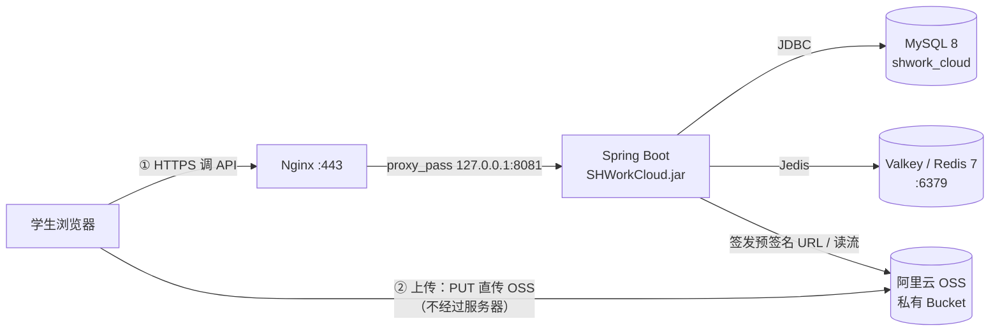

# SHWorkCloud 部署运维手册（Ubuntu 26.04 LTS · jar + systemd）

> **适用发行版**：**Ubuntu 26.04 LTS（Resolute）64 位**。
> 手册里所有命令都是 Ubuntu/Debian 系（`apt` + `ufw` + `sites-available`），
> **不要**套用 CentOS/RHEL 的 `dnf`/`firewalld`/`/etc/my.cnf` 写法。
>
> **适用对象**：负责把后端部署到 Linux 云服务器的同学/运维。
> **前提**：你手上已经有（或能打出）`SHWorkCloud-0.0.1-SNAPSHOT.jar` —— 见 §3。
> **配套文档**：`README.md`（本地开发）、`docs/后端接口手册.md`（接口）、
> `docs/SHWordCloud_Standard_v2.0.md`（设计依据）。
>
> ---
>
> ### 本手册的部署基线：**root 运行 + MySQL root**
>
> 本项目**非商用**，为少踩权限的坑，手册统一按下面这套来写：
>
> | 项 | 取值 |
> |----|------|
> | 应用进程 | 以 **root** 运行（systemd `User=root`） |
> | 数据库账号 | 应用直接用 **`root`**（`DB_USERNAME=root`） |
> | 目录属主 | 全部 `root:root` |
>
> **关于"前后端服务"**：本项目只交付后端。Vue 前端是**纯静态文件**，
> 交给同一个 Nginx 托管即可 —— **不需要单独的进程，也不需要 systemd 单元**
> （所以"把前后端都跑起来"实际只有 **一个 Java 服务**）。静态托管配置见 §6.1。
>
> ⚠️ **必须先做一件事**：Ubuntu 的 MySQL 安装后 `root@localhost` 默认用
> **`auth_socket` 插件**，它只认"本机 `mysql` 命令行的 Unix socket"，
> **JDBC 走 TCP 是认证不了的**（会报 `Access denied for user 'root'@'localhost'`）。
> 想用 root 跑应用，**必须先把 root 改成密码认证** —— 见 **§2.3 ③**，这一步不做后面全废。
>
> ⚠️ 顺带一句实话：以 root 跑 Web 服务，意味着**一旦应用被攻破就是整台机器**。
> 本项目有个真实风险点 —— 它会解析学生上传的 `.doc`/`.docx`（正文提取），
> 解析器面对的是不可信文件。非商用、内网、学生作业场景下这个取舍通常可以接受，
> 所以手册按你的要求以 root 写；但**"别把 8081 直接暴露到公网"**（§7）请务必守住，
> 那是成本最低的一道防线。想要更稳妥又想省事，见 §2.6 末尾的"三分钟折中方案"。

---

## 0. 部署拓扑：先搞清楚谁连谁



这个拓扑决定了三件必须知道的事：

| 事项 | 结论 | 依据 |
|------|------|------|
| **上传** | 浏览器拿服务端签发的预签名 URL **直传 OSS**，文件流**不占服务器带宽** | `OssSignService` / `/oss/put-url`、`/oss/multipart/*` |
| **下载/预览** | **经服务器中转**（`oss.openStream` → 响应流），所以下载会吃服务器出网带宽 | `FileService#openTarget` |
| **服务器出网** | 服务器**必须能访问** OSS Endpoint（`oss-cn-beijing.aliyuncs.com`）与 STS，否则签发/下载全废 | `application.yaml` `aliyun.oss.*` |

> ⚠️ **服务器是"控制面"，OSS 是"数据面"。** 上传不占带宽但要占 CPU（签名、commit、写库）；
> 下载占带宽。**内网/私网服务器若无公网出口访问 OSS，系统不可用。**

### 0.1 Ubuntu 26.04 的三个"和别人不一样"

26.04 有几个变化会直接影响部署命令，先记住，后面每处都有详细写法：

| 变化 | 影响 | 本手册对应处 |
|------|------|-------------|
| **默认 JDK 是 OpenJDK 25**（不再是 21/17） | 能跑本项目（17+ 都行），但**建议另装 21**（见下） | §2.2 |
| **Redis 被 Valkey 取代**（Redis 改协议后 Debian/Ubuntu 自 24.10 起换用 Valkey） | `apt install redis-server` 可能装不到；要装 **`valkey-server`** | §2.4 |
| 服务名与配置路径是 Debian 风格 | `mysql.service`、`/etc/mysql/mysql.conf.d/`、`sites-available`、`ufw` | §2.3 / §2.4 / §6 / §7 |

> **Valkey 是 Redis 7.2 的开源分叉，协议完全兼容**：Jedis 客户端、`spring.data.redis.*`
> 配置、6379 端口、`requirepass` 全部照旧，**应用代码零改动**。

---

## 1. 服务器规格与环境要求

### 1.1 规格建议

| 场景 | CPU | 内存 | 系统盘 | 带宽 |
|------|-----|------|--------|------|
| 校内 ≤ 200 人同时在线 | 2 核 | 4 GB | 40 GB SSD | 5 Mbps |
| 800 人规模（800×2GB 配额） | 4 核 | 8 GB | 60 GB SSD | 10 Mbps+ |

- **磁盘不用大**：文件实体都在 OSS，服务器只存 jar + 日志（系统盘 40GB 足够）。
- **带宽看下载**：上传不经服务器，但"下载作业"全部走服务器。若教师批量收作业，出网带宽是瓶颈。
- 应用自身很轻：Hikari 连接池 20、Jedis 池 16（`application.yaml`），2 核 4GB 起步即可。

### 1.2 软件版本要求

| 组件 | 版本 | 说明 |
|------|------|------|
| 操作系统 | **Ubuntu 26.04 LTS (Resolute) 64 位** | 本手册基线 |
| **JDK** | **推荐 21 LTS**；17 亦可；26.04 默认的 25 可用但建议先验证 | `pom.xml` → `<java.version>17</java.version>`；Boot 4.1.1 要求 17+ |
| **MySQL** | **8.0 / 8.4 LTS** | 需 `utf8mb4` + `default-time-zone='+08:00'` |
| **Valkey（或 Redis）** | **7.2+** | ⚠️ **必需，不是可选**（见下）。26.04 用 `valkey-server` |
| Nginx | 1.24+（`apt` 自带） | 反向代理 + HTTPS + 隐藏 8081 |
| 阿里云 OSS | — | **私有** Bucket + RAM 子用户 AK/SK + STS 角色 |

> ⚠️ **关于 JDK 选哪个**：26.04 的 `default-jre` 指向 **OpenJDK 25**。
> 本项目在 **17** 上构建（字节码 17，能跑在任何 ≥17 的 JVM 上），
> 但**JDK 25 太新**：Hutool / POI / 阿里云 SDK 里若碰到 `sun.misc.Unsafe` 之类的
> 内部 API，在 25 上可能报警告甚至失败。**求稳就装 `openjdk-21-jre-headless`**
> —— 同为 LTS、支持到 2031 年，与 Spring Boot 4 的组合验证最广。
> 想用系统默认的 25 也完全可以，但**务必先按 §5.1 前台试跑一遍**再上 systemd。

> ⚠️ **Valkey/Redis 是硬依赖，不要省。** 代码里有 5 处直接用它：
> `UserCache`（**每个已登录请求都会读**）、`RateLimiter`、`CaptchaService`、
> `EmailCodeService`、`UploadTokenService`。
> **它挂了 = 所有需要登录的接口全部报错**，不是"降级"，是整体不可用。

> ⚠️ **时区必须端到端统一为北京时间**，三处都要：
> ① 操作系统时区；② JVM 时区（systemd 参数）；③ MySQL `default-time-zone`。
> **云服务器默认多为 UTC**，只改一处会出现"作业截止时间差 8 小时"、
> 以及**定时任务在错误的钟点跑**（§9.2 的 3/4/5/6 点任务用的是 JVM 时区）。

---

## 2. 环境准备（逐项照做）

> 以下命令假设你有 `sudo` 权限（Ubuntu 云镜像默认的 `ubuntu` 用户在 `sudo` 组里）。

### 2.1 时区与 locale（**第一件事**）

```bash
# ① 系统时区
sudo timedatectl set-timezone Asia/Shanghai
timedatectl                      # 确认 Time zone: Asia/Shanghai (CST, +0800)

# ② locale：Ubuntu 默认是 C.UTF-8（本身就是 UTF-8，JDK 17+ 能正确识别），
#    一般不用动；想更规范就装上 en_US.UTF-8。
locale                            # 看 LANG / LC_ALL
locale -a | grep -i utf            # 看已生成哪些 UTF-8 locale

# 需要时生成（通常已存在，无需执行）
sudo apt update && sudo apt install -y locales
sudo locale-gen en_US.UTF-8
sudo update-locale LANG=en_US.UTF-8
```

> 即使 locale 是 `C.UTF-8` 也不用慌 —— 它报告的就是 UTF-8。
> 真正的保险是 §5.2 里的 `-Dfile.encoding=UTF-8`。

### 2.2 安装 JDK

**第一步：先看仓库里有哪些版本可选**（26.04 默认 25，但 21/17 通常也在）

```bash
sudo apt update
apt-cache policy openjdk-21-jre-headless openjdk-17-jre-headless default-jre-headless
apt-cache search --names-only '^openjdk-.*-jre-headless$'
```

**方式 A：装 OpenJDK 21（推荐，最稳）**

```bash
sudo apt install -y openjdk-21-jre-headless
java -version        # 期望 openjdk version "21.x"
readlink -f "$(which java)"      # 记下真实路径，例如 /usr/lib/jvm/java-21-openjdk-amd64/bin/java
```

**方式 B：用 26.04 自带的默认版本（OpenJDK 25）**

```bash
sudo apt install -y default-jre-headless      # 26.04 上即 OpenJDK 25
java -version
```

> 选 B 的话请务必先做 §5.1 的前台试跑。若启动日志里出现
> `WARNING: A terminally deprecated method in sun.misc.Unsafe has been called`
> 或干脆启动失败，就退回方式 A 装 21。

**方式 C：离线 tar 包（内网机器 / 想精确锁定 17）**

```bash
# 在能联网的机器下载 jdk-21_linux-x64_bin.tar.gz（或 17）后传到服务器
sudo mkdir -p /usr/local/java
sudo tar -zxf jdk-21_linux-x64_bin.tar.gz -C /usr/local/java
echo 'export JAVA_HOME=/usr/local/java/jdk-21.0.x' | sudo tee /etc/profile.d/java.sh
echo 'export PATH=$JAVA_HOME/bin:$PATH'            | sudo tee -a /etc/profile.d/java.sh
source /etc/profile.d/java.sh
java -version
readlink -f "$(which java)"
```

> ⚠️ systemd **不会**加载 `/etc/profile.d/*`。
> §5.2 的 `ExecStart` 必须写 java 的**绝对路径**
> （`apt` 装的 JDK 一般是 `/usr/bin/java`，这是 alternatives 软链，可以直接用）。

### 2.3 安装并初始化 MySQL 8

```bash
# --- 安装 ---
sudo apt install -y mysql-server
sudo systemctl enable --now mysql.service
systemctl status mysql.service --no-pager

# 看看实际装到哪个版本（26.04 可能是 8.0 或 8.4 LTS，两者都满足要求）
apt-cache policy mysql-server | head -5
mysql --version

# --- 安全加固 ---
sudo mysql_secure_installation      # 删匿名用户、禁 root 远程（root 密码那步在 ③ 统一处理）
```

> Debian/Ubuntu 的 MySQL 默认用 `auth_socket` 认证 root，
> 所以**装完直接 `sudo mysql` 就能进**（不用密码）。
> `mysql_secure_installation` 里若提示设 root 密码，设不设都行 ——
> **③ 会用 `ALTER USER` 显式把插件定成密码认证**，这一步才是决定应用能否连上的关键。

**① 改时区与字符集（写进配置文件持久生效）**

```bash
sudo tee /etc/mysql/mysql.conf.d/zz-shworkcloud.cnf > /dev/null <<'EOF'
[mysqld]
default-time-zone    = '+08:00'
character-set-server = utf8mb4
collation-server     = utf8mb4_0900_ai_ci
EOF

sudo systemctl restart mysql.service
```

> - Ubuntu 的 MySQL 配置目录是 **`/etc/mysql/mysql.conf.d/`**（不是 RHEL 的 `/etc/my.cnf`）；
>   新建 `zz-` 前缀文件可保证最后加载、覆盖前面。
> - 用**偏移量** `'+08:00'` 而不是 `'Asia/Shanghai'`：命名时区依赖 MySQL 的时区表
>   （需 `mysql_tzinfo_to_sql` 导入），偏移量开箱即用。

**② 执行初始化脚本（建库 + 建表 + 索引 + 时区自检）**

```bash
# 把项目里的 src/main/resources/init_sql/init.sql 传到服务器
# 此时 root 还是 auth_socket：以 root 身份 sudo 进，不需要密码
sudo mysql < init.sql

# 校验建库结果 + 时区
sudo mysql -e "USE shwork_cloud; SHOW TABLES;
  SELECT @@global.time_zone, @@session.time_zone, NOW();"
```

- 脚本**可重复执行**（全部 `IF NOT EXISTS`），不会覆盖已有数据；
- ⚠️ 它**不会**插入超管 —— 超管由应用启动时按 `ADMIN_INIT_PASSWORD` 幂等创建（§4），
  这样初始密码不会躺在 SQL 文件里；
- ⚠️ 它**不会**预置验证码题库 —— 生产环境预置题目等于把答案公开在源码里；
- `init.sql` 用的是 `utf8mb4_0900_ai_ci`，MySQL 8.0/8.4 都支持；
- 若你的库是 v2.0 时期建的，改用增量脚本：
  `sudo mysql shwork_cloud < init_sql/migration_v2.1.sql`（若已做过 ③ 则用 `mysql -uroot -p shwork_cloud < ...`）。

**③ 让应用的 root 账号能通过 TCP 登录（⚠️ 不做这步应用连不上库）**

Ubuntu 装完 MySQL 后，`root@localhost` 用的是 **`auth_socket`** 插件：

```bash
# 验证当前 root 用的什么插件
sudo mysql -e "SELECT user, host, plugin FROM mysql.user WHERE user='root';"
# 典型输出：root | localhost | auth_socket
```

`auth_socket` 靠"连接进程的 Unix 凭据"认人，**只在本机 `mysql` 命令行可用**；
JDBC 走的是 TCP 3306，没有 socket 凭据 → 必然 `Access denied`。

改成密码认证（本项目非商用，直接让应用用 root）：

```bash
# 此时 root 还是 auth_socket，用 sudo 执行这条（把密码换成你自己的）
sudo mysql -e "ALTER USER 'root'@'localhost' IDENTIFIED WITH caching_sha2_password BY '换成强密码';
               FLUSH PRIVILEGES;"
```

```bash
# 立刻验证两件事：① TCP 能连 ② 密码生效
mysql -h127.0.0.1 -P3306 -uroot -p -e "SELECT CURRENT_USER(), @@port;"
# 期望输出 root@localhost 与 3306

# 再次确认插件已变
mysql -uroot -p -e "SELECT user, host, plugin FROM mysql.user WHERE user='root';"
# 期望：caching_sha2_password
```

> ⚠️ **改完插件后 `sudo mysql` 就不通了**（auth_socket 已失效），
> 往后一律用 `mysql -uroot -p`。这是正常的，不是把库搞坏了。
>
> - 若你已经跑过 `mysql_secure_installation` 并设过 root 密码，插件可能已经是
>   `caching_sha2_password`，那就不用改，**直接做上面的 TCP 验证**即可。
> - 若改了插件、密码也对，却仍报 `Access denied`：说明这台 MySQL 开了
>   `skip_name_resolve`（不做反向解析），`root@localhost` 匹配不上 `127.0.0.1` 来的连接。
>   再补一个 IP 形式的账号即可（本项目非商用，这样最省事）：
>   ```bash
>   sudo mysql -e "CREATE USER IF NOT EXISTS 'root'@'127.0.0.1'
>                  IDENTIFIED WITH caching_sha2_password BY '同一个强密码';
>                  GRANT ALL PRIVILEGES ON *.* TO 'root'@'127.0.0.1' WITH GRANT OPTION;
>                  FLUSH PRIVILEGES;"
>   ```
> - MySQL 8.4 起默认不再启用 `mysql_native_password`；本项目用 Connector/J 走
>   `caching_sha2_password`，**无需任何额外参数**。
> - ⚠️ **`root` 拥有全部权限**，应用用它意味着 SQL 注入类问题的后果被放大。
>   非商用可接受；`init.sql` 末尾自带一段"最小权限账号"的可选块，
>   哪天想换回去，取消注释后把 `/etc/shworkcloud/env` 里的 `DB_USERNAME` 一改即可（§4.2）。

### 2.4 安装 Valkey（26.04 上的 "Redis"）

**先确认你该装哪个包**（26.04 用 Valkey；24.04 及更早还是 Redis）

```bash
apt-cache policy valkey-server redis-server
systemctl list-unit-files | grep -Ei 'valkey|redis'
```

- 能查到 **`valkey-server`** → 按下面「A. Valkey」走（**26.04 的默认情况**）；
- 只有 `redis-server` → 按「B. Redis」走，配置项名字**完全一样**。

**A. Valkey（Ubuntu 26.04）**

```bash
sudo apt install -y valkey-server
sudo systemctl enable --now valkey-server.service

# 确认配置文件与 CLI 的真实位置（不同小版本可能略有差异）
dpkg -L valkey-server | grep -E '\.conf$'
which valkey-cli redis-cli
```

```conf
# 编辑上一步查到的配置文件（通常是 /etc/valkey/valkey.conf）
bind 127.0.0.1 -::1          # 只监听本机：绝不要把 6379 暴露到公网
protected-mode yes
requirepass 换成强密码        # 必须设！否则任何能连上的人都能读上传令牌/验证码
appendonly yes               # AOF 持久化：减少重启后上传令牌/验证码集体失效
maxmemory 512mb
maxmemory-policy noeviction  # ⚠️ 关键：这里存的不是"可丢弃的缓存"
```

```bash
sudo systemctl restart valkey-server.service
valkey-cli -a '你的密码' ping                       # 期望 PONG
valkey-cli -a '你的密码' config get maxmemory-policy
```

**B. Redis（若你的源里只有 redis-server）**

```bash
sudo apt install -y redis-server
sudo systemctl enable --now redis-server.service
# 配置文件 /etc/redis/redis.conf，配置项与上面完全相同
sudo systemctl restart redis-server.service
redis-cli -a '你的密码' ping
```

> ⚠️ **`maxmemory-policy` 不要用 `allkeys-lru`。** 这里存着
> **正在使用的上传令牌**、一次性邮箱验证码、登录失败计数 —— 被 LRU 淘汰会让
> "传了一半的作业"直接失败，或让限流计数凭空清零。用 `noeviction`，内存告警时扩容/排查。

> **应用侧零改动**：`application.yaml` 里就是 `spring.data.redis.host/port/password`，
> Valkey 与 Redis 协议一致，Jedis 连哪个都一样。

### 2.5 阿里云 OSS 侧准备（**最容易漏的一步**）

在阿里云控制台完成 4 件事：

| # | 事项 | 要点 |
|---|------|------|
| 1 | **Bucket** | 读写权限必须是**私有**；地域与 `OSS_REGION` 一致（默认 `cn-beijing`） |
| 2 | **RAM 子用户** | 只授 OSS 读写该 Bucket 的策略，生成 **AK/SK** → 填 `STS_AK`/`STS_SK` |
| 3 | **STS 角色** | 建一个允许该 RAM 用户 `AssumeRole` 的角色，角色 ARN → 填 `STS_ROLE_ARN` |
| 4 | **跨域 CORS** | ⚠️ **必须配**，否则浏览器直传会被浏览器拦下（见下） |

**CORS 规则（浏览器直传必需）**

来源填你的前端站点（如 `https://homework.example.com`），方法勾
`GET / PUT / POST / HEAD`，允许 Headers 填 `*`，
**暴露 Headers 必须包含 `ETag`**：

```
Access-Control-Expose-Headers: ETag
```

> ⚠️ 分片上传时，浏览器要读每个分片 PUT 响应里的 `ETag` 才能完成 `complete`。
> 不给 `Expose-Headers: ETag`，浏览器**读不到**这个响应头，分片上传会卡在最后一步 ——
> 这是 OSS 直传最经典的坑，且报错信息很不直观。

**可选：生命周期规则**：给 `homework/` 前缀配"碎片（Part）自动清理"，
减少分片上传中断留下的碎片占用（`OssReconcileService` 只清理对象，不清理未完成分片的碎片）。

### 2.6 目录规划（root 运行）

```bash
# 目录布局
sudo mkdir -p /opt/shworkcloud/app            # 放 jar
sudo mkdir -p /opt/shworkcloud/logs           # 放日志（若启用文件日志）
sudo mkdir -p /etc/shworkcloud                # 放环境变量文件（含密钥）
sudo mkdir -p /opt/backup                     # 放数据库备份

# 全部归 root（应用也以 root 跑，无需额外建账号、无需 chown 给他人）
sudo chown -R root:root /opt/shworkcloud /opt/backup
sudo chmod 750 /etc/shworkcloud
# ⚠️ 这条等 §4.2 把 env 文件写出来之后再执行（文件还不存在时会报 No such file）
sudo chmod 600 /etc/shworkcloud/env           # 密钥文件：只允许 root 读写
```

> **想更稳妥又不想折腾？"三分钟折中方案"**（可选，不改则完全按上面的 root 跑）：
> 只给应用建一个系统账号，systemd 里改两行即可 —— 数据库仍可用 root。
> ```bash
> sudo useradd -r -s /usr/sbin/nologin shworkcloud
> sudo chown -R shworkcloud:shworkcloud /opt/shworkcloud
> sudo chgrp shworkcloud /etc/shworkcloud/env && sudo chmod 640 /etc/shworkcloud/env
> # 然后 systemd 里 User=shworkcloud / Group=shworkcloud（§5.2）
> ```
> 这样应用被攻破时拿不到整台机器，而你的日常操作、数据库账号都不用改。
> **两种都行，手册其余部分对二者都成立**（差异只在 `User=` 与环境文件属主）。

---

## 3. 打包可执行 jar（**必须在能联网的机器上做**）

### 3.1 为什么不能"直接在本机打"

`pom.xml` 已说明：本机离线，且**本地仓库缺 `spring-boot-loader-tools` 的 jar**
（只有 `.pom`），因此 `spring-boot:repackage` 跑不了 → **打不出可执行 fat jar**。

| 操作 | 当前离线机器 | 说明 |
|------|:---:|------|
| `mvn compile` / `mvn test` | ✅ | 已验证（120 个测试） |
| `mvn package` 的普通 jar | ✅ | 但**不能** `java -jar`（没有内嵌 Tomcat 与 Boot 启动器） |
| **`spring-boot:repackage`（可执行 fat jar）** | ❌ | **需要联网一次** |

**所以：找一台能访问 Maven 仓库的机器（或用 IDEA 的联网环境）打一次包，产物拷到服务器。**
打包机器用 JDK 17 或 21 都行（`<java.version>17</java.version>` 决定字节码版本）。

### 3.2 打包命令

```bash
git clone <你的仓库> && cd SHWorkCloud

# 一次联网构建：编译 + 跑测试 + 打可执行 jar
mvn clean package

# 想跳过测试（不推荐首次部署这么做）
mvn clean package -DskipTests
```

产物：

```
target/SHWorkCloud-0.0.1-SNAPSHOT.jar            ← 可执行 fat jar（要的就是它）
target/SHWorkCloud-0.0.1-SNAPSHOT.jar.original   ← 原始 jar，忽略
```

> 若这台机器也报了 `Non-resolvable parent POM ... spring-boot-starter-parent:4.1.1`，
> 那是 `settings.xml` 的 `<localRepository>` 指错了目录，见 `README.md` §3.2。

### 3.3 校验产物（**上传前先验**）

```bash
# 1) 必须是 fat jar：能看到 Boot 启动器与 BOOT-INF
unzip -l target/SHWorkCloud-0.0.1-SNAPSHOT.jar | grep -E "BOOT-INF/|JarLauncher" | head
#    期望看到：BOOT-INF/classes/、BOOT-INF/lib/、org/springframework/boot/loader/JarLauncher.class

# 2) 确认打进去的配置里没有密钥（这几行应全是 ${...} 占位符）
unzip -p target/SHWorkCloud-0.0.1-SNAPSHOT.jar BOOT-INF/classes/application.yaml | grep -nE '\$\{|password'
unzip -p target/SHWorkCloud-0.0.1-SNAPSHOT.jar BOOT-INF/classes/application-prod.yaml
#    ⚠️ 如果这里看到了真实的 AK/SK/数据库密码 —— 立刻停下来清理配置重新打包！

# 3) 记录指纹，方便回滚时核对
sha256sum target/SHWorkCloud-0.0.1-SNAPSHOT.jar | tee shworkcloud.jar.sha256
```

### 3.4 上传到服务器

```bash
# 建议带版本地放置，便于回滚（§9.4）
scp target/SHWorkCloud-0.0.1-SNAPSHOT.jar root@<服务器IP>:/opt/shworkcloud/app/SHWorkCloud-20260911.jar
scp shworkcloud.jar.sha256                root@<服务器IP>:/opt/shworkcloud/app/

# 服务器上校验传输完整 + 建软链
cd /opt/shworkcloud/app
sudo sha256sum -c shworkcloud.jar.sha256
sudo ln -sfn /opt/shworkcloud/app/SHWorkCloud-20260911.jar /opt/shworkcloud/app/current.jar
sudo chown -R root:root /opt/shworkcloud/app
```

> 之后 systemd 指向 `current.jar`（§5.2），**回滚只需换软链 + 重启**。

---

## 4. 配置：环境变量清单

应用**完全由环境变量驱动**：`application.yaml` 里没有任何密钥，全是 `${ENV:默认值}` 占位；
`application-prod.yaml` 则把敏感项写成**没有默认值**的 `${ENV}` —— 缺了就**启动失败**（刻意的 fail-fast）。

### 4.1 变量清单

**必填（prod 下不填 = 起不来）**

| 变量 | 示例 | 说明 |
|------|------|------|
| `SPRING_PROFILES_ACTIVE` | `prod` | ⚠️ 默认是 `local`。**必须显式设为 `prod`** |
| `DB_PASSWORD` | `******` | 数据库密码 |
| `MAIL_USERNAME` | `123456@qq.com` | QQ 邮箱账号 |
| `MAIL_AUTH_CODE` | `abcdefghijklmnop` | QQ 邮箱 **SMTP 授权码**（不是登录密码） |
| `OSS_BUCKET_NAME` | `sakura-4826` | 私有 Bucket 名 |
| `STS_AK` | `LTAI******` | RAM 子用户 AccessKeyId |
| `STS_SK` | `******` | RAM 子用户 AccessKeySecret |
| `STS_ROLE_ARN` | `acs:ram::1234567890:role/oss-homework-role` | STS 角色 ARN |
| `ADMIN_INIT_PASSWORD` | 强密码 | 超管初始密码（见 §4.4 的重要提醒） |

**常用可选（有默认值）**

| 变量 | 默认 | 说明 |
|------|------|------|
| `DB_HOST` / `DB_PORT` / `DB_NAME` | `localhost` / `3306` / `shwork_cloud` | |
| `DB_USERNAME` | `root` | 本手册基线就是用 root（§2.3 ③）；想换最小权限账号见 §2.3 ③ 末尾 |
| `REDIS_HOST` / `REDIS_PORT` / `REDIS_PASSWORD` | `localhost` / `6379` / 空 | 连 Valkey 也是这三项；密码与 §2.4 一致 |
| `SERVER_PORT` | `8081` | |
| `SERVER_ADDRESS` | 空（监听全部网卡） | 配合 Nginx 时建议设 `127.0.0.1`（§7） |
| `OSS_ENDPOINT` | `oss-cn-beijing.aliyuncs.com` | 与 Bucket 地域一致 |
| `OSS_REGION` | `cn-beijing` | |
| `IMPORT_DEFAULT_PASSWORD` | 空 | 名单导入学生初始密码；空则按规则生成 |
| `ADMIN_USERNAME` / `ADMIN_EMAIL` | `admin` / 空 | 超管账号/邮箱 |
| `LOGGING_FILE_NAME` | 空 | 设了才写日志文件，如 `/opt/shworkcloud/logs/app.log` |
| `APP_SECURITY_TRUST_PROXY` | `true` | ⚠️ **直连暴露时必须设 `false`**（§4.4） |
| `SPRING_CONFIG_ADDITIONAL_LOCATION` | 空 | 想让外部 yaml 覆盖时用，如 `file:/etc/shworkcloud/` |

> `OSS_BASE_URL`（自定义 CDN 域名）当前代码里仅有取值接口、未被业务使用，留空即可。

### 4.2 环境变量文件 `/etc/shworkcloud/env`

```bash
# /etc/shworkcloud/env      ⚠️ chmod 600, chown root:root
SPRING_PROFILES_ACTIVE=prod
SERVER_ADDRESS=127.0.0.1
SERVER_PORT=8081

DB_HOST=127.0.0.1
DB_PORT=3306
DB_NAME=shwork_cloud
DB_USERNAME=root
DB_PASSWORD="换成强密码"

REDIS_HOST=127.0.0.1
REDIS_PORT=6379
REDIS_PASSWORD="换成强密码"

OSS_ENDPOINT=oss-cn-beijing.aliyuncs.com
OSS_REGION=cn-beijing
OSS_BUCKET_NAME="你的Bucket"
STS_AK="你的AK"
STS_SK="你的SK"
STS_ROLE_ARN="acs:ram::你的账号ID:role/oss-homework-role"

MAIL_USERNAME="123456@qq.com"
MAIL_AUTH_CODE="你的SMTP授权码"

ADMIN_USERNAME=admin
ADMIN_INIT_PASSWORD="换成强密码"

# 想在文件里看日志就打开（否则走 journald，见 §9.1）
# LOGGING_FILE_NAME=/opt/shworkcloud/logs/app.log
```

> ⚠️ **systemd 的 `EnvironmentFile` 不是 shell 脚本**：
> - **不要写 `export`**，直接 `KEY=value`；
> - 值里含空格/`#`/`$` 时**用引号包起来**（`#` 不引会被当成注释，密码被截断且**不会报错**，
>   表现为"密码错误"这种极难排查的现象）；
> - 不确定时用 §8 的验收清单能否登录成功来反证。
>
> 若密钥里有难以处理的字符，改用外部 yaml 更省心：
> 把 `EnvironmentFile` 换成
> `Environment=SPRING_CONFIG_ADDITIONAL_LOCATION=file:/etc/shworkcloud/`
> 并放一个 `/etc/shworkcloud/application-prod.yaml`（同样 640 权限）写真实值 —— 外部配置优先级高于 jar 内。

### 4.3 fail-fast：启动就会被拒的三种情况

| 情况 | 结果 | 出处 |
|------|------|------|
| prod 下任一必填变量缺失 | 启动失败（`Could not resolve placeholder`） | `application-prod.yaml` |
| prod 下 `app.register.mail-enabled=false` | 启动失败（防止验证码只写日志，任何人都能用别人邮箱注册） | `StartupSafetyValidator` |
| 库中无超管且 `ADMIN_INIT_PASSWORD` 为空 | 启动失败（拒绝空密码初始化超管） | `SuperAdminInitializer` |

> 这是**设计如此**：宁可起不来，也不要带着一个公开后门跑起来。日志里会写明是哪一项。

### 4.4 三个上线前必须确认的开关

**① `APP_SECURITY_TRUST_PROXY`**

基座配置里默认 `app.security.trust-proxy: true`，含义是"我信任反向代理传来的 `X-Forwarded-For`"。
`ClientIpUtil` 会**取该请求头的第一跳**当作客户端 IP，登录限流、IP 锁定、公网限流全依赖它。

| 你的部署方式 | 应设 | 原因 |
|------|:---:|------|
| 前面有 Nginx（推荐） | `true` | 由 Nginx 覆盖写入真实 IP（§6 的配置**必须**用 `$remote_addr` 覆盖） |
| **直接暴露 8081** | **`false`** | 否则任何人加一个 `X-Forwarded-For: 1.2.3.4` 就能**伪造 IP、绕过全部限流** |

**② `app.register.*`（自助注册）**

默认 `enabled: true`、`require-image-captcha: false` —— 全新部署、题库为空时学生也能注册。
公网环境建议改为**要求图片验证码**，否则容易被脚本批量注册：

```bash
# 需先在后台题库上传题目；题库为空时开这个开关会把所有人挡在 40104
APP_REGISTER_REQUIRE_IMAGE_CAPTCHA=true
```

机房场景更稳妥的做法是**关掉自助注册，用名单导入批量开户**（学生 = 学号 + 初始密码）。

**③ `ADMIN_INIT_PASSWORD` 不要从 env 文件里删**

`application-prod.yaml` 写的是无默认值的 `${ADMIN_INIT_PASSWORD}`，
所以**每次启动都必须能解析到它**，否则起不来。但 `SuperAdminInitializer` 是幂等的
（库里已有超管就跳过），所以首次启动改完密码后，这个值**不再被使用**。
不想让真实密码长期留在文件里，可以改成占位值：

```bash
ADMIN_INIT_PASSWORD="unused-after-first-boot"
```

> 代价：万一超管记录被误删/回滚到旧备份，重建出来的超管密码就是这个占位值。
> 更稳的做法是**保留真实值**并把文件权限设成 600（§2.6）。

---

## 5. 启动

### 5.1 先手工前台试跑（**排查期必做**）

```bash
cd /opt/shworkcloud
set -a; . /etc/shworkcloud/env; set +a      # 把 env 文件加载进当前 shell（root 下无需 sudo）

java -Xms512m -Xmx1024m \
  -Duser.timezone=Asia/Shanghai \
  -Dfile.encoding=UTF-8 \
  -jar app/current.jar \
  --spring.profiles.active=prod
```

看到 `Tomcat started on port 8081` 与 `已存在超级管理员，跳过初始化`
（或首次的 `已初始化超级管理员 username=admin`）即成功。**Ctrl+C 停止**，然后交给 systemd。

> 这一步也是**验证 JDK 25 兼容性**的地方：若日志出现
> `sun.misc.Unsafe` 相关警告或直接异常退出，就按 §2.2 方式 A 装 OpenJDK 21。

### 5.2 systemd 单元 `/etc/systemd/system/shworkcloud.service`

```ini
[Unit]
Description=SHWorkCloud 作业云盘后端
Documentation=file:/opt/shworkcloud/app/README.md
After=network-online.target
Wants=network-online.target
# Ubuntu 的服务名是 mysql.service / valkey-server.service（不是 mysqld / redis）
# 若数据库在别的主机，这两行会被 systemd 忽略，无副作用
After=mysql.service valkey-server.service

# ⚠️ 限制重启风暴：默认 Restart=on-failure + RestartSec=10 是「永久重试」，
# 配置写错之类的固定性错误会让它无限重启（实测见过 restart counter 到 276）。
# 这里表示：300 秒内最多起 5 次，超了就停下并置为 failed ——
# 好处是日志不被刷掉、CPU 不被白烧，且 systemctl status 一眼能看到失败。
StartLimitIntervalSec=300
StartLimitBurst=5

[Service]
Type=simple
# 本手册基线：以 root 运行（非商用，省去权限折腾）。
# 若改用了 §2.6 的专用账号，这里换成 User=shworkcloud / Group=shworkcloud 即可。
User=root
Group=root
WorkingDirectory=/opt/shworkcloud

# 所有配置来自这里（root 运行时权限 600 即可）
EnvironmentFile=/etc/shworkcloud/env

# ⚠️ java 必须写绝对路径：systemd 不加载 /etc/profile.d
#    apt 装的 JDK 用 /usr/bin/java 即可；tar 包装的写 /usr/local/java/jdk-21.x/bin/java
# ⚠️ -Duser.timezone 与 -Dfile.encoding 不要省（§1.2 / §2.1）
ExecStart=/usr/bin/java \
    -Xms512m -Xmx1024m \
    -Duser.timezone=Asia/Shanghai \
    -Dfile.encoding=UTF-8 \
    -XX:+HeapDumpOnOutOfMemoryError \
    -XX:HeapDumpPath=/opt/shworkcloud/logs \
    -jar /opt/shworkcloud/app/current.jar

# 应用已开启 server.shutdown=graceful，SIGTERM 会优雅停机（等在途请求结束）
KillSignal=SIGTERM
TimeoutStopSec=40
SuccessExitStatus=143

Restart=on-failure
RestartSec=10

# 日志默认进 journald（§9.1）；若 env 里设了 LOGGING_FILE_NAME 则会同时写文件
StandardOutput=journal
StandardError=journal

# ---------- 安全加固 ----------
NoNewPrivileges=true
PrivateTmp=true
ProtectSystem=full
ProtectHome=true
ReadWritePaths=/opt/shworkcloud/logs

[Install]
WantedBy=multi-user.target
```

```bash
sudo systemctl daemon-reload
sudo systemctl enable --now shworkcloud.service
```

> 若你装的是 Redis 而非 Valkey，把 `After=` 那行改成 `After=mysql.service redis-server.service`。
> 想确认服务名：`systemctl list-unit-files | grep -Ei 'valkey|redis'`。

### 5.3 常用命令

```bash
sudo systemctl start   shworkcloud      # 启动
sudo systemctl stop    shworkcloud      # 停止（优雅停机）
sudo systemctl restart shworkcloud      # 重启
systemctl status  shworkcloud --no-pager  # 状态 + 最近日志
systemctl is-active shworkcloud         # active / failed
journalctl -u shworkcloud -f            # 实时看日志
journalctl -u shworkcloud --since "10 min ago" -p warning   # 最近 10 分钟的警告以上
```

### 5.4 JVM 参数说明

| 参数 | 为什么 |
|------|--------|
| `-Xms512m -Xmx1024m` | 4GB 机器够用；堆不必大（大文件不经过堆，是流式转发） |
| `-Duser.timezone=Asia/Shanghai` | **业务正确性**：截止时间判断 + 3/4/5/6 点的定时任务 |
| `-Dfile.encoding=UTF-8` | 防止中文日志乱码（Ubuntu 默认 `C.UTF-8` 时其实已 OK，加上更保险） |
| `-XX:+HeapDumpOnOutOfMemoryError` | OOM 时留证据，便于事后定位 |

> 若 800 人规模且下载并发高，把 `-Xmx` 提到 `2048m`；但**下载走的是连接而非堆**，
> 真正先到瓶颈的通常是**网卡带宽**而不是内存。

---

## 6. Nginx 反向代理与 HTTPS

Ubuntu 的 Nginx 用 `sites-available` + `sites-enabled`（不是 RHEL 的 `conf.d`）。

```bash
sudo apt install -y nginx
sudo systemctl enable --now nginx.service

# 关掉默认站点，避免它抢先响应 80
sudo rm -f /etc/nginx/sites-enabled/default
```

**第 1 步：先只配 80 端口，让站点跑通**
（⚠️ 这一步**不要**写 `listen 443 ssl` 和证书路径 —— 证书还不存在，
`nginx -t` 会直接失败，nginx 起不来）

```nginx
# /etc/nginx/sites-available/shworkcloud
server {
    listen 80;
    server_name homework.example.com;

    # 只有头像(≤5MB)与题库图片走服务器；学生作业是直传 OSS，不经这里
    # 应用侧 spring.servlet.multipart.max-request-size = 20MB
    client_max_body_size 25m;

    location /api/ {
        # ⚠️ 末尾不要加 "/"，否则会把 /api 前缀吃掉，全部接口 404
        proxy_pass http://127.0.0.1:8081;

        proxy_http_version 1.1;
        proxy_set_header Host              $host;
        proxy_set_header X-Real-IP         $remote_addr;

        # ⚠️⚠️ 必须"覆盖"而不是"追加"！
        # ClientIpUtil 取 X-Forwarded-For 的第一跳。
        # 若用 $proxy_add_x_forwarded_for（追加），学生自带一个
        # "X-Forwarded-For: 1.2.3.4" 就会被当成真实 IP，从而绕过全部限流。
        proxy_set_header X-Forwarded-For   $remote_addr;
        proxy_set_header X-Forwarded-Proto $scheme;

        # 下载/在线预览是流式响应：关掉缓冲，避免大文件先落盘再转发
        proxy_buffering off;
        proxy_request_buffering off;
        proxy_read_timeout 300s;
        proxy_send_timeout 300s;
    }
}
```

```bash
sudo ln -s /etc/nginx/sites-available/shworkcloud /etc/nginx/sites-enabled/
sudo nginx -t                      # 必须 syntax is ok / test is successful
sudo systemctl reload nginx.service

# 确认 80 能通（此时还没有 HTTPS）
curl -s -H 'Host: homework.example.com' http://127.0.0.1/api/auth/register-config
```

**第 2 步：签证书（certbot 会自动给上面这个文件补出 443 与跳转）**

```bash
sudo apt install -y certbot python3-certbot-nginx
sudo certbot --nginx -d homework.example.com      # 提示是否跳转时选 Redirect
sudo systemctl status certbot.timer --no-pager    # 自动续期已由 apt 包装好
sudo certbot renew --dry-run                      # 验证续期可用
```

> ⚠️ **顺序很重要**：一定是"**先 80 跑通 → 再 certbot**"。
> certbot 需要先用 80 端口完成 HTTP-01 校验；反过来先写死 443 与不存在的证书，
> `nginx -t` 会报 `cannot load certificate ... No such file or directory`，站点直接起不来。
> 域名必须**已经解析到本机公网 IP**，且 §7 的 80 端口已放行。

**第 3 步：certbot 执行完后的最终形态（供核对，不用手抄）**

```nginx
# certbot 会把它改造成下面这样（新增 443 段 + 顶部 80 跳转）
server {
    listen 80;
    server_name homework.example.com;
    return 301 https://$host$request_uri;
}

server {
    listen 443 ssl;
    http2 on;                    # nginx ≥ 1.25.1 的写法；旧版为 listen 443 ssl http2;
    server_name homework.example.com;

    ssl_certificate     /etc/letsencrypt/live/homework.example.com/fullchain.pem;
    ssl_certificate_key /etc/letsencrypt/live/homework.example.com/privkey.pem;
    include             /etc/letsencrypt/options-ssl-nginx.conf;
    ssl_dhparam         /etc/letsencrypt/ssl-dhparams.pem;

    client_max_body_size 25m;

    # ⚠️ 用 ^~ 而不是普通前缀：这样接口块优先于上面的静态资源正则，
    #    加了 §6.1 的前端后必须这么写
    location ^~ /api/ {
        proxy_pass http://127.0.0.1:8081;      # 注意：末尾没有 "/"
        proxy_http_version 1.1;
        proxy_set_header Host              $host;
        proxy_set_header X-Real-IP         $remote_addr;
        proxy_set_header X-Forwarded-For   $remote_addr;   # 覆盖，不是追加
        proxy_set_header X-Forwarded-Proto $scheme;
        proxy_buffering off;
        proxy_request_buffering off;
        proxy_read_timeout 300s;
        proxy_send_timeout 300s;
    }
}
```

> **HTTPS 是刚需，不只是好看**：非安全上下文（纯 http）下浏览器没有 `crypto.subtle`，
> 前端无法做本地 MD5 秒传/分片哈希，会退化成每次全量上传。`README.md` 也把这条列为机房适配项。

> ⚠️ **不要给 `/api/user/avatar/{userId}` 之类加 `proxy_cache`**：头像响应带
> `Cache-Control: private`，且涉及越权风险，交给浏览器缓存即可。

### 6.1 前端静态文件（如果有前端）

前端**不是一个服务**，只是静态文件，交给同一个 Nginx 托管。把构建产物
（`homework-web` 的 `dist/`，或你自己前端的产物）传到 `/var/www/shworkcloud`：

```bash
sudo mkdir -p /var/www/shworkcloud
# 本地构建后上传（Vue 项目：cd homework-web && npm run build，产物在 dist/）
scp -r dist/* root@server:/var/www/shworkcloud/
sudo chown -R root:root /var/www/shworkcloud
```

在 §6 那个 `server { }`（443 段）里**加一个 `location /`**：

```nginx
    # 前端静态文件：直接由 Nginx 返回，不经过 Java 服务
    root /var/www/shworkcloud;
    index index.html;

    location / {
        # SPA 路由回退：/files/123 这类前端路由要回 index.html，
        # 否则刷新页面会 404
        try_files $uri $uri/ /index.html;
    }

    # 静态资源缓存（index.html 不要缓存，否则发版后用户拿到旧页面）
    location ~* \.(js|css|png|jpg|jpeg|gif|svg|woff2?|ttf|ico)$ {
        root /var/www/shworkcloud;
        expires 30d;
        add_header Cache-Control "public, immutable";
    }

    # ⚠️ location /api/ 必须仍然存在且优先匹配（前缀匹配天然先于 / 命中）
```

> - **同源部署是关键**：前端页面与 `/api` 由同一个域名提供 →
>   **不存在跨域问题**，前端不需要配 `baseURL` 的绝对域名，也不用给后端加 CORS。
> - 若前端与后端**不同域名**部署，那才需要处理 CORS；本项目后端没有全局 CORS 配置，
>   跨域要另加 Nginx 头（不推荐，容易配错）。
> - ⚠️ **加了正则 location 之后，请把接口块改成 `location ^~ /api/`**。
>   Nginx 的匹配顺序是"`^~` 前缀 → 正则 → 普通前缀"：上面那条
>   `\.(js|css|png…)$` 是**正则**，如果接口路径恰好以这些后缀结尾
>   （例如某些以 `.png` 结尾的下载路径），就会被静态规则抢走。
>   用 `^~` 明确告诉 Nginx"命中 `/api/` 就不要再试正则"。
> - SPA 回退只回退到 `/index.html`，**别写成 `try_files ... /api/index.html`**。

```bash
sudo nginx -t && sudo systemctl reload nginx.service
```

> 前端改了只需重新覆盖 `/var/www/shworkcloud` 里的文件，**不用重启任何服务**。

---

## 7. 防火墙与安全组

Ubuntu 用 **ufw**（不是 firewalld），而且云镜像上 ufw 常常是**未启用**状态 ——
**真正生效的第一道门是云平台的"安全组"**，两边都要看。

| 端口 | 谁可以访问 | 说明 |
|------|-----------|------|
| **443 / 80** | 公网（0.0.0.0/0 或校园网段） | 唯一对外开放的入口 |
| **8081** | **仅本机 127.0.0.1** | 用 Nginx 代理；直接暴露会绕过 HTTPS 与限流 |
| **3306 MySQL** | 仅应用服务器内网 IP | **绝不开放公网** |
| **6379 Valkey/Redis** | 仅应用服务器内网 IP | **绝不开放公网**（未授权访问是重灾区） |
| **22 SSH** | 仅你的运维 IP | 别对全网开放 |

```bash
# ① 看 ufw 当前状态
sudo ufw status verbose

# ② 只放行 SSH 与 Web（⚠️ 先放 SSH 再 enable，否则可能把自己关在门外）
sudo ufw allow OpenSSH
sudo ufw allow 80/tcp
sudo ufw allow 443/tcp
sudo ufw enable
sudo ufw status numbered

# 8081 / 3306 / 6379 一律不加，靠 bind 127.0.0.1 + 安全组兜底
```

> ⚠️ 若你通过云控制台的 VNC/串口登录，ufw 配错还有救；
> 纯 SSH 的话**务必先 `ufw allow OpenSSH` 再 `ufw enable`**。

配合 §5.2 的 `SERVER_ADDRESS=127.0.0.1`，应用**只监听本机**，双保险。

**验证只监听本机：**

```bash
sudo ss -lntp | grep -E '8081|3306|6379'
# 期望 8081 显示 127.0.0.1:8081，而不是 0.0.0.0:8081 或 [::]:8081
```

---

## 8. 部署后验收清单

按顺序做完，全绿才算部署成功。

| # | 检查 | 命令 | 期望 |
|---|------|------|------|
| 1 | 服务在跑 | `systemctl is-active shworkcloud` | `active` |
| 2 | 端口正确 | `sudo ss -lntp \| grep 8081` | `127.0.0.1:8081` |
| 3 | 启动无异常 | `journalctl -u shworkcloud --since "5 min ago" -p err` | 无输出 |
| 4 | **Web 层通** | `curl -s http://127.0.0.1:8081/api/auth/register-config` | `{"code":0,...,"data":{...}}` |
| 5 | **登录链路（DB+Redis+密码哈希）** | 见下方 curl | 返回 `token` |
| 6 | **鉴权链路** | 带 token 调 `/api/user/profile` | `code: 0` + 用户资料 |
| 7 | **Valkey/Redis 通** | 重复调 `/api/auth/email-code` 两次 | 第二次被限流（证明计数生效） |
| 8 | **OSS 通** | 见下方 curl | 返回 `uploadToken` |
| 9 | **时区正确** | `timedatectl` + `SELECT NOW()` | 两者都是北京时间 |
| 10 | 外网入口 | 浏览器访问 `https://homework.example.com/api/auth/register-config` | 与第 4 步一致 |
| 11 | 端到端 | 用 `scripts/api-smoke.ps1`（Windows 侧）跑一遍全流程 | 全绿 |

```bash
# 第 5 步：超管登录（注意字段名是 login，不是 loginName/username）
curl -s -X POST http://127.0.0.1:8081/api/auth/login \
  -H 'Content-Type: application/json' \
  -d '{"login":"admin","password":"<ADMIN_INIT_PASSWORD>"}'
# 期望：{"code":0,"message":"ok","data":{"token":"...","mustChangePassword":true,...}}
# 首次登录必须改密，否则后续接口返回 MUST_CHANGE_PASSWORD

# 第 6 步：带 token 调受保护接口
curl -s http://127.0.0.1:8081/api/user/profile -H "Authorization: <token>"

# 第 8 步：申请上传凭证（验证 OSS/STS 配置）
curl -s -X POST http://127.0.0.1:8081/api/oss/ticket \
  -H "Authorization: <token>" -H 'Content-Type: application/json' \
  -d '{"name":"t.txt","size":10,"contentType":"text/plain"}'
```

> ⚠️ 本项目**没有引入 `spring-boot-actuator`**，所以没有 `/api/actuator/health` 之类的标准健康端点
> （`SaTokenConfigure` 里预留了白名单但实际不存在）。
> 第 4 步的 `/api/auth/register-config` 是**无需 token 的公开接口**，最适合当存活探测。
> 若要接入 K8s/监控探针，建议后续引入 actuator —— 目前请用第 4 步的 URL 做 HTTP 探针。

---

## 9. 日常运维

### 9.1 日志

默认输出到 **journald**（无文件、自动轮转）：

```bash
journalctl -u shworkcloud -n 200          # 最近 200 行
journalctl -u shworkcloud -f              # 实时
journalctl -u shworkcloud --since today -p warning
```

> Ubuntu 的 journald 默认把日志放在 `/var/log/journal/`（持久化）。若发现重启后日志丢失，
> 说明用的是 volatile 模式：`sudo mkdir -p /var/log/journal && sudo systemd-tmpfiles --create --prefix /var/log/journal`
> 后 `sudo systemctl restart systemd-journald`。
> 限制 journal 占用上限：`/etc/systemd/journald.conf` 里设 `SystemMaxUse=1G`。

想落文件（便于归档/给他人看）就在 env 里加：

```bash
LOGGING_FILE_NAME=/opt/shworkcloud/logs/app.log
```

然后配 logrotate（**否则日志会把系统盘写满**）：

```conf
# /etc/logrotate.d/shworkcloud
/opt/shworkcloud/logs/app.log {
    daily
    rotate 14
    compress
    missingok
    notifempty
    copytruncate        # Spring Boot 不响应 USR1，用 copytruncate 最省事
}
```

> 日志是 root 写的、logrotate 也以 root 跑，所以**不需要 `su` 指令**
> （若你改用了 §2.6 的专用账号，才需要加 `su shworkcloud shworkcloud`）。

```bash
sudo logrotate -d /etc/logrotate.d/shworkcloud    # -d 干跑，先看有没有报错
```

> 日志里需要留意的关键字：`OssReconcile` / `StorageReconcile`（对账结果）、
> `已初始化超级管理员`、`无法解析该 .doc`、`SignatureDoesNotMatch`（OSS 签名）。

### 9.2 ⚠️ 定时任务与「必须单实例部署」

应用内有 4 个 `@Scheduled` 任务（`AsyncConfig` 开启 `@EnableScheduling`）：

| 时间（**JVM 时区**，即北京时间） | 任务 | 作用 |
|------|------|------|
| 03:00 | `RecycleCleanJob` | 清理回收站中超过 30 天的记录（`app.recycle.retention-days: 30`） |
| 04:00 | `OrphanObjectJob` | 回收长时未 commit 的孤儿对象 |
| 05:00 | `StorageReconcileJob` | 重算用户已用容量 |
| 06:00 | `OssReconcileJob` | 扫描 OSS 三个前缀，清理无引用对象（24 小时宽限） |

> ⚠️ **不要水平扩展成多实例。** 这些任务没有分布式锁：两个实例同时跑对账，
> 会出现并发删除与容量计算竞争。**当前版本只支持单实例部署。**
> 另外 Sa-Token 会话使用**默认内存 DAO**（本地仓库缺 `sa-token-redis-jackson`），
> 多实例之间会话不共享，负载均衡后会随机掉线。

**由此推出两条运维事实：**

1. **重启应用 = 全体用户掉线**（会话在内存）。所以升级请安排在非上课时间（§9.4）。
2. **Valkey/Redis 重启不会掉线，但上传令牌/验证码会失效**（会话不在 Redis 里）。

### 9.3 备份

| 对象 | 方式 | 频率 |
|------|------|------|
| **MySQL 元数据（最重要）** | `mysqldump` 全库 | 每日 + 升级前必做 |
| OSS 文件实体 | 依赖 OSS 自身多副本；可另配跨区域复制 | 按需 |
| jar / 配置 | 保留历史版本 + `/etc/shworkcloud/env` 单独备份 | 每次发布 |

```bash
# 在 /opt/backup 下建脚本 /usr/local/bin/shworkcloud-backup.sh
#!/usr/bin/env bash
set -euo pipefail
D=$(date +%F)
mysqldump --defaults-extra-file=/etc/mysql/backup.cnf \
  --single-transaction --routines --triggers --default-character-set=utf8mb4 \
  shwork_cloud | gzip > /opt/backup/shwork_cloud_${D}.sql.gz
find /opt/backup -name 'shwork_cloud_*.sql.gz' -mtime +30 -delete
```

```bash
chmod +x /usr/local/bin/shworkcloud-backup.sh
/usr/local/bin/shworkcloud-backup.sh        # 先手工跑一次，确认能出文件
```

```bash
# 密码别写在脚本里：/etc/mysql/backup.cnf（chmod 600, chown root）
[client]
user=root
password=你的密码

# 每日 02:30（避开 03:00 起的应用定时任务）
crontab -e                  # root 身份直接编辑；若你是普通用户则用 sudo crontab -e
30 2 * * * /usr/local/bin/shworkcloud-backup.sh >> /var/log/shworkcloud-backup.log 2>&1

# 验证备份可用（重要！备份没验证过等于没有）
gunzip -c /opt/backup/shwork_cloud_$(date +%F).sql.gz | head -20
```

> ⚠️ **数据库备份是"骨架"，OSS 才是"肉"。**
> 只恢复数据库而不恢复 OSS 对象，会得到一堆"能看不能下"的坏文件记录。
> 反过来 OSS 有对象、数据库丢了，`OssReconcileJob` 会把它们**当垃圾删掉** ——
> 所以**恢复顺序是：先恢复数据库，再恢复 OSS**；并且数据库丢失期间
> 建议先停掉 06:00 的对账任务（`app.storage.reconcile.enabled=false`）再动。

### 9.4 升级与回滚

```bash
# ---- 升级 ----
# 1. 备份数据库（必做）
/usr/local/bin/shworkcloud-backup.sh

# 2. 上传新 jar 并校验
scp SHWorkCloud-0.0.1-SNAPSHOT.jar root@server:/opt/shworkcloud/app/SHWorkCloud-<新日期>.jar
# 服务器上：
cd /opt/shworkcloud/app && sudo sha256sum -c shworkcloud.jar.sha256

# 3. 切软链 + 重启（停机窗口内，会全员掉线）
ln -sfn /opt/shworkcloud/app/SHWorkCloud-<新日期>.jar /opt/shworkcloud/app/current.jar
chown -R root:root /opt/shworkcloud/app      # 改用专用账号时改成 shworkcloud:shworkcloud
systemctl restart shworkcloud.service
journalctl -u shworkcloud -n 50 --no-pager

# 4. 跑一遍 §8 验收清单

# ---- 回滚（分钟级）----
ln -sfn /opt/shworkcloud/app/SHWorkCloud-<旧日期>.jar /opt/shworkcloud/app/current.jar
systemctl restart shworkcloud.service
```

> ⚠️ 若有数据库结构变更（新的 `migration_vX.sql`），**回滚 jar 不能回滚数据结构**。
> 因此结构变更请保证向后兼容（只加列/加表），并在升级前先备份。

### 9.5 常见故障排查

| 现象 | 原因 | 处理 |
|------|------|------|
| 启动即退出，日志 `Could not resolve placeholder 'XXX'` | prod 下必填环境变量缺失 | 按 §4.1 补齐 `/etc/shworkcloud/env` |
| 启动失败：`禁止关闭 app.register.mail-enabled` | prod + `mail-enabled=false` | 设为 `true`（这是防止用别人邮箱注册的保护） |
| 启动失败：`未配置 app.admin.init-password` | 库中无超管且该变量为空 | 设置 `ADMIN_INIT_PASSWORD` |
| 启动异常 / `sun.misc.Unsafe` 警告 | 用了 26.04 默认的 JDK 25 | 按 §2.2 方式 A 装 OpenJDK 21 |
| 启动即崩：`NoClassDefFoundError: com/fasterxml/jackson/databind/jsontype/PolymorphicTypeValidator`，栈里有 `SaTokenPluginForJackson` / `SaBeanInject` | Sa-Token 的 `sa-token-jackson` 插件只认 **Jackson 2**，而 Boot 4 用 **Jackson 3**；Sa-Token 对插件加载异常 fail-fast，不跳过坏插件 | 用修好的 jar（pom 里已 `exclude` 掉 `sa-token-jackson` 并自建 `SaTokenJsonConfig`）。**这是必现的启动失败，改配置救不了**，只能换 jar |
| `systemctl status` 里 restart counter 一直涨、CPU 被烧 | 固定性启动错误 + `Restart=on-failure` 永久重试 | 先 `systemctl stop shworkcloud` 止血；按 §5.2 加 `StartLimitIntervalSec/StartLimitBurst`；再 `journalctl -u shworkcloud -n 100 -p err` 找根因 |
| **`Access denied for user 'root'@'localhost'`**（密码明明是对的） | root 还是 `auth_socket` 插件，**JDBC 走 TCP 认证不了** | §2.3 ③：`ALTER USER ... IDENTIFIED WITH caching_sha2_password BY '密码'`，然后用 `mysql -h127.0.0.1` 验证 |
| `Communications link failure` | MySQL 没起 / 端口 / 安全组 / 密码错 | `systemctl status mysql`、`mysql -h127.0.0.1 -uroot -p` 手测 |
| 所有接口 500 / 报 Redis 连接错 | Valkey/Redis 挂了或密码不对 | `valkey-cli -a ... ping`；这是**硬依赖**，不是可降级项 |
| `apt install redis-server` 装不上 | 26.04 已改用 Valkey | 装 `valkey-server`（§2.4），应用零改动 |
| 登录一直"密码错误"，明明密码是对的 | env 文件里密码含 `#` 未加引号被截断 | 给值加引号（§4.2） |
| **时间差 8 小时** | 三处时区没统一 | §1.2：系统 + `-Duser.timezone` + MySQL `default-time-zone` |
| 定时任务在下午跑 | 服务器是 UTC，任务跟随 JVM 时区 | 同上 |
| 上传 `SignatureDoesNotMatch` | 客户端没按服务端返回的 `contentType` 发送 | 后端已在 `/oss/put-url`、`/oss/multipart/part-urls` 返回签名用的 `contentType`，客户端**必须原样发送** |
| 分片上传最后一步失败 | OSS CORS 没暴露 `ETag` | 按 §2.5 配 `Access-Control-Expose-Headers: ETag` |
| 前端跨域报错 | 只有直连 8081 才会跨域 | 用 §6 的 Nginx 同源代理，不要让前端跨端口访问 |
| 限流很容易被绕过 | `trust-proxy=true` 但没走代理，或 Nginx 用了 `$proxy_add_x_forwarded_for` | §4.4 + §6：Nginx **覆盖**写 `X-Forwarded-For $remote_addr` |
| 网页上传大文件无反应 | Nginx `client_max_body_size` 太小 | §6 设 `25m`（学生作业是直传 OSS，不受此项限制） |
| `nginx -t` 报错 / 站点不生效 | 忘了建 `sites-enabled` 软链，或没删 `default` | §6 两条命令 |
| `nginx -t` 报 `cannot load certificate ... No such file or directory` | **先写了 443 段但证书还没签**（顺序反了） | §6：先只配 80 跑通，再 `certbot --nginx` 自动补 443 |
| `apt install openjdk-21-*` 装不上 | 该版本不在你的源里 | 用 `default-jre-headless`（26.04 即 25），或按 §2.2 方式 C 用 tar 包 |
| 磁盘满 | 日志没轮转 | §9.1 配 logrotate；或限制 journald `SystemMaxUse` |
| `ufw` 开了但外网还是连不上 | 云平台**安全组**没放行 443 | ufw 与安全组是两道门，都要放行（§7） |

---

## 10. 部署前必读的已知限制

| # | 限制 | 影响 | 规避 |
|---|------|------|------|
| 1 | **只支持单实例**（定时任务无分布式锁 + Sa-Token 会话在内存） | 不能水平扩容 | 用更强的单机；后续补 `sa-token-redis-jackson` 并给任务加分布式锁 |
| 2 | **重启 = 全体掉线** | 升级要挑时间 | 安排在非上课时间；`sa-token.timeout` 4 小时、空闲 30 分钟 |
| 3 | **无 actuator**，无标准健康端点 | 监控探针要用业务接口 | 用 `/api/auth/register-config`（§8 第 4 步） |
| 4 | **下载经服务器中转** | 吃服务器出网带宽 | 监控带宽；必要时后续改签名 URL 直下 |
| 5 | `ADMIN_INIT_PASSWORD` **每次启动都必须存在** | 从 env 删掉会启动失败 | 保留真实值（文件 600），或改占位值（§4.4 ③） |
| 6 | 旧版 `.ppt` 不支持在线预览；`.doc` 的解析器是自研的 | 只能下载 / 极端 `.doc` 可能解析不佳 | 见 `docs/后端接口手册.md` §6.1 |
| 7 | 本项目**从未在真实 MySQL/Valkey/OSS 上跑过** | 首次部署可能踩到联调问题 | 严格按 §8 验收清单逐项验证，别跳过 |
| 8 | 仓库当前**零提交** | 无版本可回滚 | **先提交代码**，再谈部署 |
| 9 | **以 root 运行 + 数据库用 root**（本手册基线，非商用取舍） | 应用被攻破 = 整台机器沦陷；SQL 注入类问题后果放大 | 成本最低的兜底：**不要把 8081 暴露到公网**（§7），只经 Nginx 走 443；想再稳一点用 §2.6 的"三分钟折中方案" |

---

## 附：Ubuntu 26.04 最小可用部署流程（TL;DR）

```bash
# ============ 服务器：一次性环境准备 ============
sudo timedatectl set-timezone Asia/Shanghai

sudo apt update
sudo apt install -y mysql-server nginx

# JDK：优先 21（最稳）。若 apt 报「无法定位软件包」，就改用系统默认的 25：
#   sudo apt install -y default-jre-headless     # 26.04 上即 OpenJDK 25
# 装完务必按 §5.1 前台试跑一次确认能起来
sudo apt install -y openjdk-21-jre-headless
java -version

# 缓存/会话：26.04 用 Valkey 代替 Redis（`apt install redis-server` 装不上就是这个原因）
sudo apt install -y valkey-server
# 若源里只有 redis-server，就装它，配置项完全一样
apt-cache policy valkey-server redis-server

sudo systemctl enable --now mysql.service valkey-server.service nginx.service

# ---- MySQL：时区 + 建库 ----
sudo tee /etc/mysql/mysql.conf.d/zz-shworkcloud.cnf > /dev/null <<'EOF'
[mysqld]
default-time-zone    = '+08:00'
character-set-server = utf8mb4
collation-server     = utf8mb4_0900_ai_ci
EOF
sudo systemctl restart mysql.service

sudo mysql < init.sql

# ⚠️ 关键一步：让 root 能走 TCP 登录（默认 auth_socket 会让应用连不上，见 §2.3 ③）
sudo mysql -e "ALTER USER 'root'@'localhost' IDENTIFIED WITH caching_sha2_password BY '强密码'; FLUSH PRIVILEGES;"
mysql -h127.0.0.1 -uroot -p -e "SELECT CURRENT_USER();"      # 必须能连通再往下走

# ---- Valkey：只监听本机 + 密码 ----
# 编辑 /etc/valkey/valkey.conf：bind 127.0.0.1 -::1 / requirepass 强密码 /
#   appendonly yes / maxmemory 512mb / maxmemory-policy noeviction
sudo systemctl restart valkey-server.service

# ---- 目录（root 运行，全部归 root）----
sudo mkdir -p /opt/shworkcloud/{app,logs} /etc/shworkcloud /opt/backup
sudo chown -R root:root /opt/shworkcloud /opt/backup
# 写 /etc/shworkcloud/env（§4.2，其中 DB_USERNAME=root），然后：
sudo chmod 600 /etc/shworkcloud/env

# ---- 放 jar + systemd（§5.2）----
# （jar 从联网机器 scp 过来，放到 /opt/shworkcloud/app/ 并建 current.jar 软链）
sudo systemctl daemon-reload && sudo systemctl enable --now shworkcloud.service

# ---- 防火墙（先放 SSH！）----
sudo ufw allow OpenSSH && sudo ufw allow 80/tcp && sudo ufw allow 443/tcp && sudo ufw enable

# ============ 本地（联网机器）============
mvn clean package
sha256sum target/SHWorkCloud-0.0.1-SNAPSHOT.jar
scp target/SHWorkCloud-0.0.1-SNAPSHOT.jar root@server:/opt/shworkcloud/app/current.jar

# ============ 服务器：验收 ============
curl -s http://127.0.0.1:8081/api/auth/register-config     # 期望 code:0
journalctl -u shworkcloud -n 50 --no-pager
```
